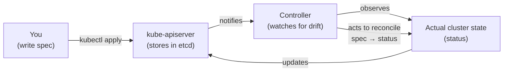
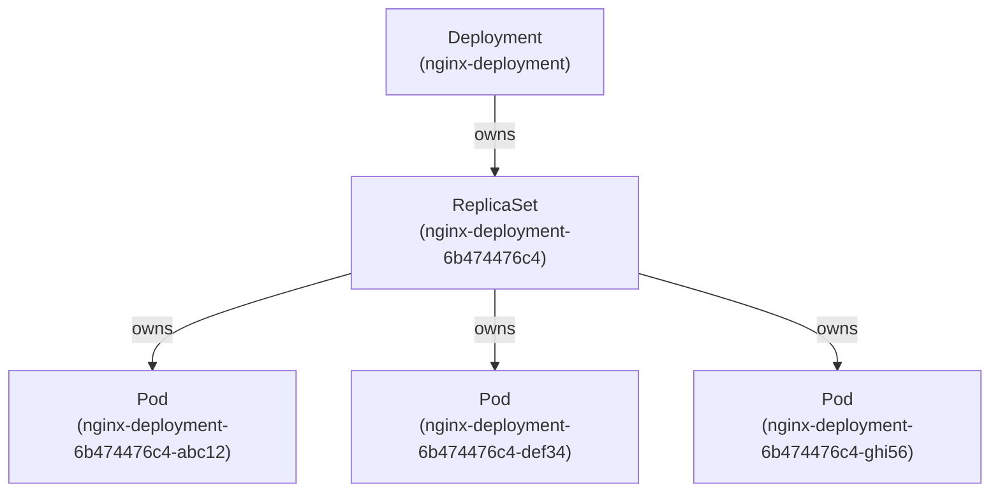

# Kubernetes Objects

## What Is a Kubernetes Object?

A Kubernetes object is a **persistent record of intent**. When you create one, you're telling Kubernetes: *"I want this thing to exist in this state."* Kubernetes stores it in **etcd** and then works continuously to make reality match that intent.

Every object is defined in YAML (or JSON) and submitted to the `kube-apiserver` as an HTTP payload. Once stored, it becomes the source of truth for that resource.

Object names are **unique per kind within a namespace**. Two Deployments can't share a name in the same namespace. UIDs are globally unique across the entire cluster and across time — even if you delete and recreate an object with the same name, it gets a new UID.

---

## spec vs status — The Heart of Kubernetes

Every object has two main sections:

- **spec** — the desired state. You write this. It's what you want.
- **status** — the current state. Kubernetes writes this. It's what exists right now.

This distinction is the foundation of how Kubernetes works. The system is always trying to close the gap between spec and status. This is called the **reconciliation loop** (or control loop).



For example: you set `replicas: 3` in a Deployment spec. If one Pod crashes, the status drops to 2 running pods. The controller notices the drift (spec says 3, status shows 2) and creates a new Pod. It never stops watching — this loop runs continuously.

This is why Kubernetes is called a **declarative system**. You declare the desired state; Kubernetes figures out how to get there and stay there.

---

## Top-Level Fields

Every Kubernetes object has four required top-level fields:

```yaml
apiVersion: apps/v1       # Which API schema version to use
kind: Deployment          # What type of object this is
metadata:                 # Identity and metadata
  name: nginx-deployment
  namespace: production
  labels:
    app: nginx
spec:                     # Desired state — you write this
  replicas: 2
  ...
```

**apiVersion** — tells the API server which version of the schema to use for validation. Looks like `v1`, `apps/v1`, `networking.k8s.io/v1`. The prefix before the slash is the API group (empty = core group). This ensures the client and server agree on the shape of the object.

**kind** — the object type. `Pod`, `Deployment`, `Service`, `ConfigMap`, etc.

**metadata** — identity information: name, namespace, labels, annotations, UID, resourceVersion, ownerReferences, and finalizers.

**spec** — the desired state. Shape varies completely by kind.

There is a fifth field you don't write but see in responses:

**status** — the current observed state, written by Kubernetes. Never set this yourself.

---

## Controllers — What Makes Objects Come Alive

An object in etcd is just data. What actually acts on it is a **controller**.

A controller is a control loop that:
1. Watches the API server for objects of a specific kind
2. Compares the current state (status) to the desired state (spec)
3. Takes action to close the gap
4. Repeats forever

Every core Kubernetes object has a dedicated controller. The Deployment controller watches Deployments and manages ReplicaSets. The ReplicaSet controller watches ReplicaSets and manages Pods. The Node controller watches Nodes and marks them unreachable when they stop heartbeating.

This is also how custom resources work — you define a CRD (CustomResourceDefinition) to teach Kubernetes a new object type, and you ship a custom controller that knows how to reconcile it.

> Objects are passive data. Controllers are the active agents. Together they implement the reconciliation loop.

---

## Imperative vs Declarative

Three ways to manage objects in Kubernetes:

**Imperative commands** — tell Kubernetes what to do right now:
```bash
kubectl create deployment nginx --image=nginx:1.14.2
kubectl scale deployment nginx --replicas=3
kubectl delete pod nginx-abc123
```
Fast for one-off tasks and debugging. Not repeatable, not auditable, not Git-friendly. Never use in production.

**Imperative object configuration** — use a file, but imperatively:
```bash
kubectl create -f nginx-deployment.yaml   # fails if already exists
kubectl replace -f nginx-deployment.yaml  # fails if doesn't exist
```
Better than pure imperative, but still brittle. `create` fails if the object exists, `replace` fails if it doesn't.

**Declarative object configuration** — let Kubernetes figure out the diff:
```bash
kubectl apply -f nginx-deployment.yaml
kubectl apply -f ./k8s/                  # apply entire directory
```
`apply` works whether the object exists or not. It computes a three-way diff between the last applied config, the current live state, and the new config — and applies only what changed. **This is the production standard.** It's idempotent, Git-friendly, and works with CI/CD pipelines.

### `apply` vs `replace` — the key difference

`replace` does a full replacement — it deletes and recreates the object. This can cause downtime and loses any fields set by controllers (like `status` or dynamically assigned values). `apply` does a surgical merge — only changes what you specified. Always prefer `apply`.

---

## Labels and Selectors

Labels are **key-value pairs attached to objects** used to express identity and group membership.

```yaml
metadata:
  labels:
    app: nginx
    env: production
    version: v1.4
```

Labels are **low-cardinality, identifying metadata** — they define what something *is*. They are indexed and queryable. Kubernetes uses them internally for critical wiring: a Service finds its backing Pods via label selectors, a ReplicaSet finds its owned Pods via label selectors.

### Selectors

Two types of selectors:

**Equality-based** — exact match:
```bash
kubectl get pods -l app=nginx
kubectl get pods -l env!=staging
```

**Set-based** — membership:
```bash
kubectl get pods -l 'env in (production, staging)'
kubectl get pods -l 'version notin (v1.0, v1.1)'
```

In YAML (used by Deployments, Services, etc.):
```yaml
selector:
  matchLabels:
    app: nginx          # equality-based
  matchExpressions:
    - key: env
      operator: In
      values: [production, staging]   # set-based
```

**One critical rule**: the label selector on a Service or ReplicaSet is **immutable after creation**. You cannot change which pods a ReplicaSet manages after it's been created. If you need to change it, you must delete and recreate the resource.

---

## Annotations

Annotations are also key-value pairs on objects, but they serve a different purpose than labels.

- **Labels** — define identity, used for querying and selection by Kubernetes itself
- **Annotations** — carry metadata for **tools and controllers**, not for querying

Annotations are not indexed. You can't use `kubectl get pods -a annotation=value`. They exist to pass configuration to controllers, admission webhooks, ingress controllers, monitoring tools, and other automation.

```yaml
metadata:
  annotations:
    nginx.ingress.kubernetes.io/rewrite-target: /
    nginx.ingress.kubernetes.io/proxy-read-timeout: "60"
    nginx.ingress.kubernetes.io/ssl-redirect: "true"
    prometheus.io/scrape: "true"
    prometheus.io/port: "9090"
```

**Annotation vs Label in one line:**
> Labels define identity and drive selection. Annotations configure behaviour.

Annotations can hold much larger values than labels (up to 256KB total per object). This is why deployment tools like Helm store the last-applied state as an annotation.

---

## Field Selectors

Field selectors filter objects based on their **actual field values** — not labels, but the object's own fields like `status.phase` or `spec.nodeName`.

```bash
kubectl get pods --field-selector status.phase=Running
kubectl get pods --field-selector spec.nodeName=node-1
kubectl get pods --field-selector status.phase=Running,spec.nodeName=node-1
```

Field selectors are more limited than label selectors — not all fields are supported, and they can't do set-based matching. Think of them as a quick filter when you know the exact field value you're looking for.

**Label selector vs Field selector:**
| | Label Selector | Field Selector |
|---|---|---|
| What it queries | User-defined labels | Object's actual fields |
| Indexed | ✅ Yes | ❌ No (server-side scan) |
| Used by K8s internally | ✅ Yes (Services, ReplicaSets) | ❌ No |
| Set-based matching | ✅ Yes | ❌ No |

---

## Namespaces

Object names are unique per kind within a namespace. But in a real cluster, multiple teams share the same cluster — which creates name collision risk and makes access control harder.

**Namespaces** provide a logical partition inside a cluster. Each team or environment gets its own namespace, and objects inside it are scoped to it.

```bash
kubectl get pods -n production
kubectl get pods -n staging
kubectl get all -n monitoring
```

Some resources are **cluster-scoped** — namespaces don't apply to them:
- `Nodes`
- `PersistentVolumes`
- `Namespaces` themselves
- `ClusterRoles`, `ClusterRoleBindings`

Namespaces also integrate with RBAC (grant permissions per namespace), NetworkPolicies (isolate traffic per namespace), and ResourceQuotas (limit resource usage per namespace).

### Default Namespaces

Kubernetes ships with four:
- `default` — where objects go if no namespace is specified
- `kube-system` — Kubernetes internal components (CoreDNS, kube-proxy, etc.)
- `kube-public` — publicly readable, rarely used
- `kube-node-lease` — node heartbeat objects

---

## Owners, Dependents, and Finalizers

### Ownership — The Object Hierarchy

Kubernetes uses **ownerReferences** to track parent-child relationships between objects. When you create a Deployment, Kubernetes automatically sets up this chain:

```
Deployment → owns → ReplicaSet → owns → Pods
```



The ownerReference is stored in the child object's metadata:

```yaml
metadata:
  ownerReferences:
  - apiVersion: apps/v1
    kind: ReplicaSet
    name: nginx-deployment-6b474476c4
    uid: d9607e19-f88f-11e6-a518-42010a800195
    controller: true
    blockOwnerDeletion: true
```

**Cascading deletion**: when you delete a Deployment, Kubernetes garbage collection automatically deletes the ReplicaSet, which cascades to delete the Pods. You can control this with `--cascade=orphan` if you want to delete the parent but keep the children.

### Finalizers — Controlled Deletion

Normally, deleting an object removes it immediately. **Finalizers** are deletion blockers that give controllers time to do cleanup first.

When an object has finalizers:
1. You run `kubectl delete`
2. Kubernetes sets `deletionTimestamp` on the object — marking it for deletion — but does **not** remove it
3. Controllers watching for this object see the `deletionTimestamp` and perform their cleanup (e.g. delete cloud resources, release IPs, flush state)
4. Each controller removes its finalizer from the list when done
5. When the finalizers list is empty, Kubernetes removes the object

```yaml
metadata:
  finalizers:
    - kubernetes.io/pvc-protection    # prevents PVC deletion while a pod is using it
```

Finalizers are just strings — identifiers, not a list of things to delete. The controller that owns that string knows what cleanup to do when it sees the `deletionTimestamp`.

**Common gotcha**: if a controller crashes or is deleted while an object has a finalizer, the object will hang in `Terminating` state forever. The fix is to manually patch the finalizers list:

```bash
kubectl patch pvc my-pvc -p '{"metadata":{"finalizers":[]}}' --type=merge
```

---

## Interview Gotchas

### 1. `kubectl apply` stores state as an annotation

When you run `kubectl apply`, Kubernetes stores the last-applied configuration as an annotation (`kubectl.kubernetes.io/last-applied-configuration`). This is how it computes the three-way diff on the next apply. If you mix `apply` with `edit` or `replace`, this annotation can get out of sync and cause unexpected diffs.

### 2. Deleting a namespace hangs — always check finalizers

Namespace deletion waits for all objects inside to be deleted first. If any object is stuck in `Terminating` due to a finalizer whose controller is gone, the namespace hangs. Always check:

```bash
kubectl get all -n stuck-namespace
kubectl api-resources --verbs=list --namespaced -o name | \
  xargs -I{} kubectl get {} -n stuck-namespace 2>/dev/null
```

### 3. Labels are immutable on some selectors

The `selector` field on a ReplicaSet and Service is immutable after creation. If you need to change which pods a Service targets, you must delete and recreate the Service. This is a common source of confusion during rolling migrations.

### 4. resourceVersion and optimistic concurrency

Every object has a `resourceVersion` field in its metadata. When you update an object, Kubernetes checks that the `resourceVersion` you sent matches the one in etcd. If another process updated it between your read and your write, the versions won't match and your update is rejected. This is **optimistic concurrency** — no locks, just version checks. `kubectl apply` handles this automatically with retries.

### 5. The spec/status split applies to your thinking too

When debugging, always check both:
```bash
kubectl get deployment nginx -o yaml   # see both spec and status
kubectl describe deployment nginx      # human-readable status + events
```
The `status.conditions` field tells you exactly why the current state doesn't match the desired state — it's the first place to look when something isn't working.
