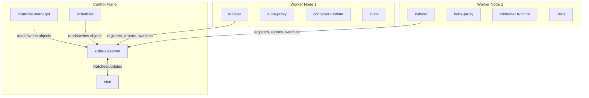
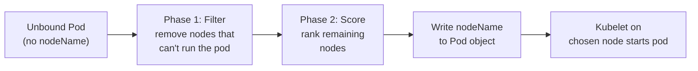
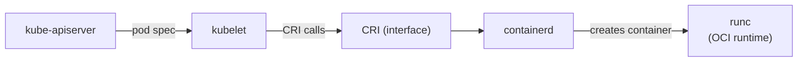
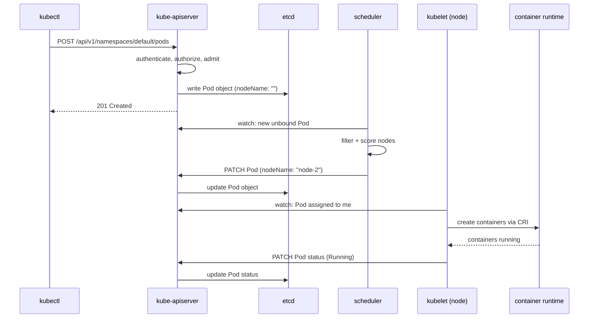
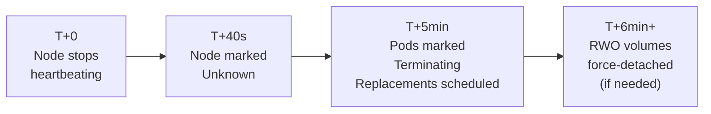
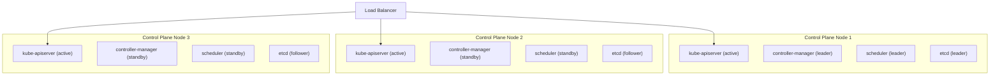

# Kubernetes Architecture

## Cluster Topology

A Kubernetes cluster has two types of machines:

- **Control Plane** — the brain. Manages cluster state, makes scheduling decisions, runs reconciliation loops. Never runs your application workloads.
- **Worker Nodes** — the muscle. Run your actual application Pods.



---

## Control Plane Components

### kube-apiserver — The Single Entry Point

The API server is the **only component that talks to etcd**. Everything else — controllers, scheduler, kubelet, kubectl — talks to the API server. Nothing reads or writes etcd directly.

This is a deliberate design choice. The API server:
- Validates and authenticates every request
- Enforces authorization (RBAC)
- Runs admission controllers (mutating and validating webhooks)
- Provides a consistent, versioned API surface
- Serialises concurrent writes to etcd safely

When you run `kubectl apply`, you're making an HTTP request to the API server. When the scheduler assigns a node to a Pod, it's patching a Pod object via the API server. When a kubelet reports node status, it's writing to the API server. **The API server is the cluster.**

The API server is also the only control plane component that is **stateless** — it holds no data itself. All state lives in etcd. This makes it easy to run multiple API server replicas for high availability.

### etcd — The Source of Truth

etcd is a distributed **key-value store** that holds the entire state of the cluster — every object, every status, every config. If etcd is lost and you have no backup, the cluster is gone. The workloads keep running (worker nodes don't need etcd to run pods), but you lose all ability to manage them.

**How etcd handles distributed consistency — Raft consensus**

etcd uses the **Raft consensus algorithm** to stay consistent across multiple nodes. In Raft:
- One node is elected **leader** — all writes go through the leader
- The leader replicates the write to a **majority of nodes (quorum)** before acknowledging success
- If the leader dies, a new election happens among the remaining nodes

This is why etcd must have an **odd number of nodes** (3, 5, 7). With 3 nodes, quorum is 2 — you can lose 1 node and still write. With 4 nodes, quorum is still 3 — you can still only lose 1 node, but now you're running an extra node for no additional fault tolerance. Odd numbers are always optimal.

| etcd nodes | Quorum needed | Can lose |
|---|---|---|
| 1 | 1 | 0 nodes |
| 3 | 2 | 1 node |
| 5 | 3 | 2 nodes |
| 7 | 4 | 3 nodes |

**What happens if quorum is lost?** etcd goes read-only. The API server can still serve reads (from cache), but no writes go through — no new pods, no config changes, nothing. The cluster freezes in its last known state.

**Backup etcd regularly.** The standard tool is `etcdctl snapshot save`. In managed clusters (EKS, GKE, AKE), the provider handles this. On self-managed clusters, it's your responsibility.

```bash
ETCDCTL_API=3 etcdctl snapshot save snapshot.db \
  --endpoints=https://127.0.0.1:2379 \
  --cacert=/etc/kubernetes/pki/etcd/ca.crt \
  --cert=/etc/kubernetes/pki/etcd/server.crt \
  --key=/etc/kubernetes/pki/etcd/server.key
```

### controller-manager — The Reconciliation Engine

The controller-manager is a single binary that runs **many individual controllers** in one process. Each controller is a independent reconciliation loop watching a specific object type:

- **Node Controller** — tracks node health, marks nodes `NotReady`, triggers pod eviction
- **Deployment Controller** — ensures ReplicaSets match the Deployment spec
- **ReplicaSet Controller** — ensures the right number of Pods exist
- **Job Controller** — watches Jobs and tracks completion
- **ServiceAccount Controller** — creates default ServiceAccounts in new namespaces
- **Namespace Controller** — handles namespace deletion and cleanup

They're bundled together for operational simplicity but are logically independent. Each one:
1. Watches the API server for its object type
2. Compares spec to status
3. Takes action (creates, updates, or deletes objects via the API server)
4. Repeats

No controller ever writes to etcd directly — always through the API server.

### scheduler — Two Phases: Filter then Score

The scheduler watches for **unbound Pods** — Pods that exist as objects but have no `nodeName` assigned. When it finds one, it runs a two-phase process:

**Phase 1 — Filtering (hard constraints)**

Eliminate nodes that cannot run this Pod:
- Not enough CPU or memory (`resources.requests`)
- Node has a taint the Pod doesn't tolerate
- Node affinity rules that must be satisfied
- Pod anti-affinity rules (can't be on same node as another pod)
- Volume topology constraints (PV must be in same zone)

**Phase 2 — Scoring (soft preferences)**

Rank the remaining nodes:
- Spread pods across nodes for availability
- Pack pods on fewer nodes to save cost
- Prefer nodes where the image is already cached
- Custom weights via `priorityClassName`

The scheduler picks the highest-scoring node and writes `nodeName` to the Pod object via the API server. It doesn't start the container — that's the kubelet's job.



---

## Worker Node Components

### kubelet — The Node Agent

The kubelet is an agent that runs on every worker node. It is the **bridge between the API server and the container runtime**.

The kubelet:
1. Registers the node with the API server on startup
2. Watches the API server for Pods assigned to its node
3. Instructs the container runtime to start/stop containers via **CRI (Container Runtime Interface)**
4. Runs liveness and readiness probes
5. Reports node status and pod status back to the API server
6. Mounts volumes into pods

The CRI is a standard interface — the kubelet doesn't care if you're using `containerd`, `CRI-O`, or any other runtime. As long as it speaks CRI, kubelet can use it.



### kube-proxy — Traffic Routing

kube-proxy runs on every node and maintains iptables (or IPVS) rules for Service routing. When a Service is created, kube-proxy programs DNAT rules so traffic to the ClusterIP gets forwarded to a backing Pod IP.

Covered in depth in the networking notes — kube-proxy, DNAT, Endpoint Slices.

### Container Runtime

The software responsible for the full container lifecycle — pulling images, creating namespaces, starting processes, managing cgroups. Any runtime that implements the **CRI (Container Runtime Interface)** can be used.

- **containerd** — the most common. Extracted from Docker, now a CNCF project.
- **CRI-O** — lightweight runtime built specifically for Kubernetes.

Docker is no longer supported directly as a runtime (removed in Kubernetes 1.24). Docker-built images still work fine — the image format (OCI) is separate from the runtime interface (CRI).

---

## Pod Creation Flow

What actually happens when you run `kubectl create -f pod.yaml`:



Key insight: the Pod object is created in etcd **before** any container runs. The object and the running workload are separate things — the object is the desired state, the running container is the actual state.

---

## Node Health — Heartbeats and Conditions

### Node Conditions

The Node Controller continuously tracks four conditions on every node:

| Condition | What it means |
|---|---|
| `DiskPressure` | Available disk is critically low |
| `MemoryPressure` | Available memory is critically low |
| `PIDPressure` | Too many processes running on the node |
| `Ready` | Node is healthy and accepting pods |

### Heartbeats — Two Types

Kubelet sends two kinds of signals to report node health:

**Lease object (availability heartbeat)** — a lightweight object updated every **10 seconds**. Just says "I'm alive." Stored in `kube-node-lease` namespace.

```json
{
  "kind": "Lease",
  "apiVersion": "coordination.k8s.io/v1",
  "metadata": {
    "name": "node-name",
    "namespace": "kube-node-lease"
  },
  "spec": {
    "holderIdentity": "node-name",
    "leaseDurationSeconds": 10,
    "renewTime": "2023-01-01T00:00:05Z"
  }
}
```

**Node status update** — a heavier object containing CPU, memory, disk usage, and condition states. Updated every **40 seconds**. This is what you see in `kubectl describe node`.

The two-heartbeat design is intentional — updating the full status object every 10 seconds at scale (thousands of nodes) would flood etcd. The lightweight lease handles liveness; the status update handles detail.

---

## What Happens When a Node Dies

This is one of the most commonly asked interview scenarios for SRE/platform roles. The timeline:

**T+0** — node stops sending heartbeats (kubelet crashes, network partition, node powers off)

**T+40s** — Node Controller notices the lease hasn't been renewed. Marks node condition as `Unknown`.

**T+5min (default)** — `pod-eviction-timeout` expires. Node Controller marks all Pods on the node as `Terminating` and schedules replacements on healthy nodes.

**Important nuance**: the Pods on the dead node don't actually terminate — the node is gone, so no one can run the stop command. They're marked `Terminating` in the API server, but the containers may still be running on the node (if the node comes back). This is why Kubernetes waits — it doesn't want to run two copies of the same pod if the node is just temporarily unreachable.

**T+6min (with RWO volumes)** — an extra wait happens if the Pod had a ReadWriteOnce volume attached. Kubernetes must be sure the old pod has released the volume before attaching it to the replacement pod. If the node never comes back, an admin may need to manually force-detach the volume.



---

## High Availability Control Plane

In production, you run multiple control plane nodes to avoid a single point of failure.

**API server** — stateless, so you can run as many replicas as you want behind a load balancer. All kubelets and kubectl point to the load balancer, not individual API server IPs.

**etcd** — runs as a cluster (typically 3 or 5 nodes). Uses Raft for consensus. Can be co-located on control plane nodes (stacked topology) or run on dedicated nodes (external topology). External is more resilient but more complex.

**controller-manager and scheduler** — only one instance is **active** at a time, even if you run multiple replicas. They use a **leader election** mechanism (via a Lease object in the API server) to decide who is active. If the active instance dies, another wins the election and takes over within seconds.



---

## Node-to-Control-Plane Communication

Nodes talk to the control plane exclusively through the **kube-apiserver** over secure HTTPS. This communication is protected using **mutual TLS (mTLS)**:

- Each node has its own private key and certificate
- When a node joins the cluster, its certificate is signed by the cluster's CA (Certificate Authority)
- When the kubelet connects to the API server, it presents this certificate to prove its identity
- The API server also presents its certificate, so the node can verify it's talking to the real API server — not an impersonator

This is bootstrapped via **TLS bootstrapping** — a new node starts with a bootstrap token, uses it to get a temporary credential, and then gets a proper signed certificate issued via the CSR (CertificateSigningRequest) API.

---

## Interview Gotchas

### 1. Nothing talks to etcd except the API server

A common interview question: *"Can the scheduler read from etcd directly?"* No. Everything goes through the API server. This is a hard architectural rule, not a convention.

### 2. Scheduler assigns nodes, kubelet starts containers — they are separate steps

The scheduler writes `nodeName` to the Pod object. It does not start any container. The kubelet on that node notices the assignment and starts the container. If the kubelet is down, the pod stays in `Pending` forever even though it has a node assigned.

### 3. controller-manager and scheduler use leader election — only one is active

Running 3 control plane nodes doesn't mean 3 schedulers are making decisions. Only the leader is active. The others are hot standbys. This avoids split-brain — two schedulers assigning the same node to two different pods simultaneously.

### 4. Losing etcd quorum freezes the cluster

If you lose quorum (more than half your etcd nodes), the cluster goes read-only. Existing workloads keep running — kubelet doesn't need etcd to manage its local pods. But nothing new can be created or changed. Recovery requires restoring from a snapshot.

### 5. The pod eviction timeout is 5 minutes by default — plan for it

In production, if a node dies, your pods aren't rescheduled for 5 minutes. For stateless workloads this is fine — just slow. For stateful workloads with RWO volumes, it can be longer. If your SLA requires faster recovery, you need to tune `--pod-eviction-timeout` or use node problem detector + node auto-repair.

### 6. Managed vs self-managed — know the difference

On EKS, GKE, AKS:
- The control plane is managed by the cloud provider — you don't see or manage etcd, API server, or controller-manager nodes
- etcd backups are handled for you
- Control plane HA is automatic

On self-managed (kubeadm, kops):
- You are responsible for etcd backups, certificate rotation, control plane upgrades
- This is where the architecture knowledge above becomes operationally critical
