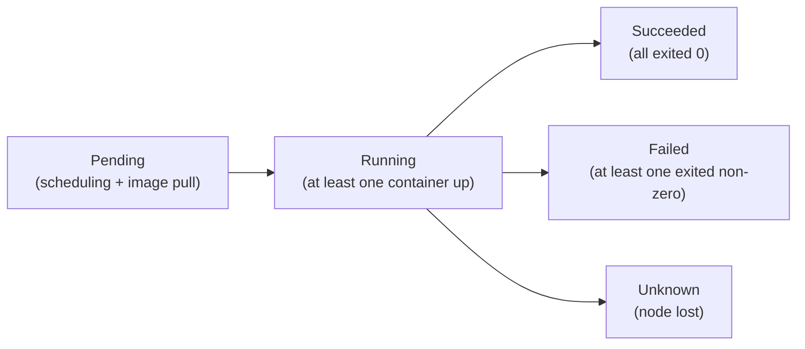
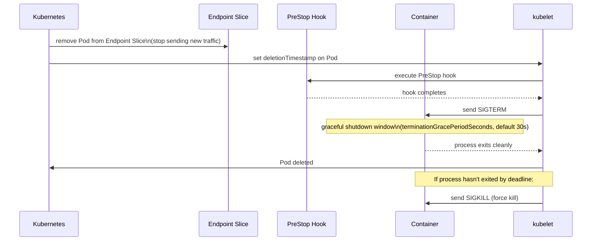

# Kubernetes: Pods and Containers

## Containers and Images

A **container** is a running instance of an **image**. An image is binary data that packages an application and all its dependencies — the code, runtime, libraries, config — into a single artifact. Images are built from a **Dockerfile**, which defines the steps to produce the image layer by layer.

```dockerfile
FROM node:18-alpine          # base image
WORKDIR /app
COPY package*.json ./
RUN npm install              # each RUN creates a new layer
COPY . .
EXPOSE 3000
CMD ["node", "server.js"]    # default command when container starts
```

Images are immutable. When a container writes to the filesystem, it writes to a thin writable layer on top — the image itself is never modified. This is why containers start fast and why the same image runs identically everywhere.

---

## Why Pods Exist

The simplest design would be: Kubernetes schedules containers directly. So why introduce a Pod wrapper?

Because some workloads are naturally **multiple processes that must run together on the same machine** — not because they're the same application, but because they need to share resources at the OS level.

Consider a web server and a sidecar that tails its log files and ships them to a logging backend. They need to share a filesystem. Or an app container and an Envoy proxy that intercepts all its network traffic — they need to share a network interface.

Pods solve this by co-scheduling a group of containers and giving them:
- A **shared network namespace** — all containers share the same IP and port space. They reach each other on `localhost`.
- **Shared storage** — volumes are defined at the Pod level and mounted into individual containers.
- **Shared lifecycle** — they are scheduled together, land on the same node, and are managed as a unit.

The Pod is the unit of scheduling. Kubernetes never splits containers of the same Pod across nodes.

> A Pod is not a process. It's a sandbox environment. The containers inside it are the processes.

Pods are generally created by a higher-level controller — Deployment, StatefulSet, Job — not directly. The Pod template inside these controllers defines what each Pod looks like:

```yaml
apiVersion: batch/v1
kind: Job
metadata:
  name: my-job
spec:
  template:
    spec:                    # This is the Pod spec — called a pod template
      containers:
      - name: my-container
        image: my-image
        command: ["/bin/sh", "-c", "echo Hello World"]
      restartPolicy: Never
```

---

## Container Hooks

Hooks let you run code at specific points in a container's lifecycle.

**PostStart** — executes immediately after the container is created. Runs **concurrently** with the container's entrypoint — not after it. This is a common trap: if your PostStart hook depends on the application being ready, it may run before the app has finished starting.

**PreStop** — executes before the container receives a termination signal. Kubernetes waits for the PreStop hook to complete before sending `SIGTERM`. Use this for graceful shutdown tasks — draining connections, deregistering from a service registry, flushing buffers.

Two handler types:

```yaml
lifecycle:
  postStart:
    exec:
      command: ["/bin/sh", "-c", "echo started >> /tmp/log"]
  preStop:
    httpGet:
      path: /shutdown
      port: 8080
```

**Exec** — runs a command inside the container.
**HTTP** — makes an HTTP GET request to an endpoint on the container.

### Hook Delivery Guarantees and Gotchas

- Hooks are delivered **at least once** — they may run more than once if the node fails during execution.
- If a PostStart hook fails, the container is killed.
- If a PreStop hook takes longer than `terminationGracePeriodSeconds`, it is cut off and the container is killed. Always keep PreStop hooks fast.
- There is no TCP handler for hooks (unlike probes).

---

## Pod Lifecycle

### Pod Phases

A Pod moves through high-level phases:

| Phase | Meaning |
|---|---|
| `Pending` | Accepted by the cluster. Waiting to be scheduled, or containers are being pulled. |
| `Running` | Bound to a node. At least one container is running or starting. |
| `Succeeded` | All containers exited with code 0 and will not be restarted. |
| `Failed` | All containers have exited. At least one exited with a non-zero code. |
| `Unknown` | Node lost contact with API server — node likely dead. |

Phases are coarse. They tell you roughly where the Pod is, but not why it's stuck.

### Pod Conditions — The Detail Layer

Conditions give you the **specific reason** behind a phase. This is what you actually read when debugging.

| Condition | Meaning |
|---|---|
| `PodScheduled` | A node has been assigned |
| `PodReadyToStartContainers` | Sandbox created, network configured |
| `Initialized` | All init containers completed successfully |
| `ContainersReady` | All containers passed their readiness probes |
| `Ready` | Pod is ready to receive traffic (all conditions above are true) |

```bash
kubectl describe pod my-pod   # shows conditions and events — first place to look
```

If a Pod is `Running` but not `Ready`, it's usually a failing readiness probe. If it's `Pending` with `PodScheduled: False`, it's a scheduling failure — check resource requests vs available capacity.



### Container States

Within a Pod, each container has its own state:

| State | Meaning |
|---|---|
| `Waiting` | Not yet running — pulling image, waiting for secrets, init containers still running |
| `Running` | Executing normally |
| `Terminated` | Finished — check `exitCode` and `reason` |

```bash
kubectl get pod my-pod -o jsonpath='{.status.containerStatuses[*].state}'
```

### Restart Policies

Applies to all containers in the Pod:

- **Always** (default) — restart on any exit. Used for long-running services.
- **OnFailure** — restart only on non-zero exit. Used for Jobs.
- **Never** — never restart. Used for one-shot tasks.

---

## Probes

Probes are health checks the kubelet runs against containers. Three types, each solving a different problem.

### Readiness Probe

*"Is this container ready to serve traffic?"*

If it fails, the Pod is removed from the Service's Endpoint Slice — no new traffic is sent to it. The container is **not restarted**. Use this for: waiting for a database connection, waiting for a cache to warm up, temporary overload.

### Liveness Probe

*"Is this container still alive and functional?"*

If it fails repeatedly (based on `failureThreshold`), the container is **restarted**. Use this for: deadlocks, infinite loops, stuck threads — situations where the process is running but no longer doing useful work.

### Startup Probe

*"Has this container finished starting up?"*

Introduced to handle slow-starting containers. While the startup probe is running, liveness and readiness probes are **disabled**. Once startup probe succeeds, it hands off to liveness and readiness. If startup probe fails beyond its threshold, the container is restarted.

Without the startup probe, a slow-starting app would need a very high `initialDelaySeconds` on its liveness probe — and that delay would apply on every restart, not just the first start.

### Probe Configuration Fields

All three probes share the same configuration fields:

```yaml
livenessProbe:
  httpGet:
    path: /healthz
    port: 8080
  initialDelaySeconds: 10   # wait this long before first probe
  periodSeconds: 10         # how often to probe
  timeoutSeconds: 1         # probe times out after this
  failureThreshold: 3       # fail this many times in a row before action
  successThreshold: 1       # succeed this many times to be considered healthy
```

Three handler types (same as hooks, plus TCP):
- `httpGet` — HTTP GET to path/port. Success = 2xx/3xx.
- `exec` — runs a command. Success = exit code 0.
- `tcpSocket` — opens a TCP connection. Success = connection established.

### Tuning Probes — Common Interview Scenario

*"Your pod keeps restarting. What do you check?"*

1. `kubectl describe pod` — look at liveness probe failure events
2. Check `initialDelaySeconds` — is the app getting enough time to start before the first probe?
3. Check `failureThreshold` — is it too low, causing restarts on a transient blip?
4. Check `timeoutSeconds` — is the probe timing out because the endpoint is slow, not broken?
5. Consider adding a startup probe if the app has a slow init phase

---

## Resource Requests and Limits

Not in your original notes but heavily asked. Requests and limits are set per container:

```yaml
containers:
- name: app
  resources:
    requests:
      cpu: "250m"       # 250 millicores = 0.25 CPU cores — minimum guaranteed
      memory: "256Mi"   # minimum guaranteed memory
    limits:
      cpu: "500m"       # maximum CPU before throttling
      memory: "512Mi"   # maximum memory before OOMKill
```

**requests** — what the container is guaranteed. The scheduler uses requests (not limits) to decide which node can fit the Pod. A node with 1 CPU available can fit a pod requesting 250m, but not one requesting 2000m.

**limits** — the ceiling. Behaviour when exceeded:
- **CPU limit exceeded** → container is **throttled** (slowed down). It keeps running.
- **Memory limit exceeded** → container is **OOMKilled** (killed immediately). This is a hard kill, not graceful.

This asymmetry is important — CPU pressure degrades performance, memory pressure kills the container.

### QoS Classes — Who Gets Evicted First

Kubernetes assigns every Pod a QoS (Quality of Service) class based on its requests and limits. When a node runs low on resources, Kubernetes evicts pods in QoS order:

| QoS Class | Condition | Eviction priority |
|---|---|---|
| `Guaranteed` | requests == limits for all containers | Evicted last |
| `Burstable` | requests set, limits higher than requests | Evicted second |
| `BestEffort` | no requests or limits set | Evicted first |

```bash
kubectl get pod my-pod -o jsonpath='{.status.qosClass}'
```

In production, stateful workloads (databases) should be `Guaranteed`. Stateless services can be `Burstable`. Never run important workloads as `BestEffort`.

---

## Pod Termination Flow

Understanding this is critical for zero-downtime deployments. When a Pod is deleted:



Key points:
- The Pod is removed from the Endpoint Slice **before** SIGTERM is sent — new traffic stops before shutdown begins.
- `terminationGracePeriodSeconds` (default 30s) is the total budget for PreStop hook + SIGTERM handling combined.
- If your app needs more than 30s to drain connections, increase `terminationGracePeriodSeconds`.
- If you don't handle SIGTERM in your app, it gets killed after 30s with SIGKILL — no cleanup.

---

## Init, Sidecar, and Ephemeral Containers

### Init Containers

Run and complete **before any app container starts**. They run sequentially — if one fails, it is retried (based on `restartPolicy`) and the next one doesn't start until it succeeds.

Use cases: wait for a database to be ready, run database migrations, pre-populate a shared volume, fetch secrets or config.

```yaml
initContainers:
- name: wait-for-db
  image: busybox
  command: ['sh', '-c', 'until nc -z postgres 5432; do sleep 2; done']
```

Init containers have their own image — they don't need to carry the tools of the main app. A Go binary doesn't need `nc` installed; the init container can use `busybox` for that.

### Sidecar Containers

Run **alongside the main container** for the entire Pod lifecycle. From Kubernetes 1.29, sidecars are a native concept (defined with `restartPolicy: Always` inside `initContainers`). Before 1.29, "sidecar" was just a pattern — a regular container in the pod spec that happened to play a supporting role.

Native sidecars start **before** the main container and are guaranteed to be running when the main container starts. They also stay alive until the main container exits — important for Jobs, where regular containers could exit before the sidecar finished flushing logs.

Use cases: log shipping, metrics collection, service mesh proxy (Envoy/Istio), secrets injection.

```yaml
initContainers:
- name: log-shipper
  image: fluentd:latest
  restartPolicy: Always     # this makes it a native sidecar (K8s 1.29+)
```

### Ephemeral Containers

Temporary containers added to a **running Pod** for debugging. They cannot be defined in the Pod spec and do not restart.

The main use case: your app container doesn't have a shell (distroless images), and you need to exec in to debug. You add an ephemeral container with debugging tools without modifying or restarting the pod.

```bash
kubectl debug -it my-pod --image=busybox --target=my-container
```

`--target` shares the process namespace of the target container — the ephemeral container can see its processes and filesystem.

---

## Interview Gotchas

### 1. OOMKilled — memory limit exceeded

```bash
kubectl describe pod my-pod   # look for: Last State: OOMKilled
```

The container was killed because it exceeded its memory limit. Fix: increase memory limit, or investigate a memory leak. OOMKill is a hard kill — no SIGTERM, no graceful shutdown.

### 2. CrashLoopBackOff — container keeps restarting

The container starts, crashes, and Kubernetes restarts it. The backoff means each restart waits longer than the last (10s → 20s → 40s → up to 5min). Check:

```bash
kubectl logs my-pod --previous   # logs from the last crashed container
kubectl describe pod my-pod      # events and exit codes
```

Common causes: app crashes on startup (bad config, missing env var), liveness probe misconfigured, OOMKilled on startup.

### 3. ImagePullBackOff — can't pull the image

```bash
kubectl describe pod my-pod   # look for: Failed to pull image
```

Common causes: image name or tag is wrong, registry requires authentication (`imagePullSecrets` not configured), private registry not accessible from the cluster.

### 4. Pod stuck in Terminating

A finalizer isn't being cleared, or the node is dead and the kubelet can't run the PreStop hook. Check finalizers:

```bash
kubectl get pod my-pod -o yaml | grep finalizers
```

Force delete as a last resort (data loss risk):
```bash
kubectl delete pod my-pod --force --grace-period=0
```

### 5. PostStart runs concurrently with the entrypoint

PostStart is not "after the app is ready." It runs as soon as the container is created, at the same time as the entrypoint. If you need to wait for the app to be ready before running the hook, add a sleep or a readiness check inside the hook itself.

### 6. Readiness ≠ Liveness — don't use the same probe for both

A common mistake: copy-pasting the same health check endpoint into both probes. If your app is temporarily overloaded, you want the readiness probe to fail (stop sending traffic) but the liveness probe to pass (don't restart it). Use different endpoints or different thresholds for each.
