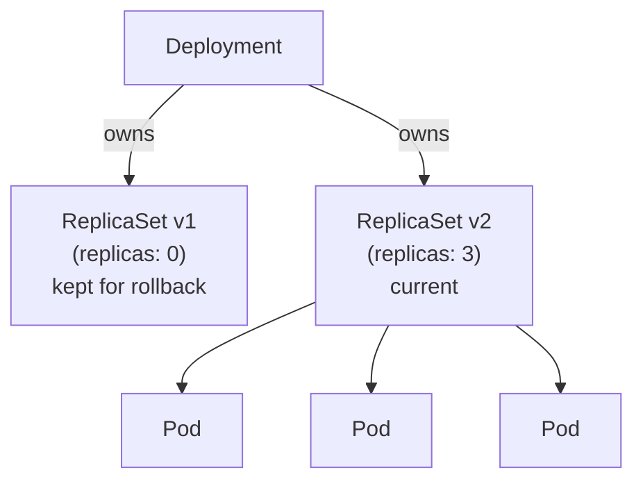
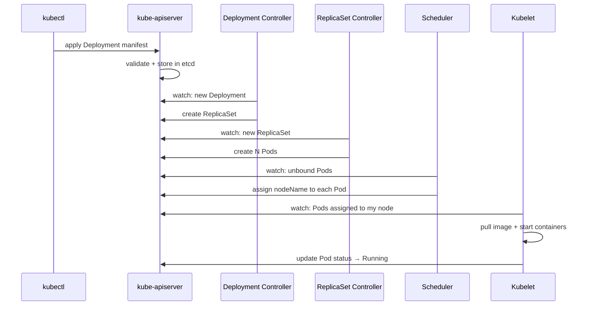

# Kubernetes Workloads

## Overview

A workload is an application running on Kubernetes. Applications ultimately run inside Pods, but you almost never create Pods directly — they're too low-level. Kubernetes provides higher-level workload resources that manage Pods based on the nature of the workload.

| Workload | Use when |
|---|---|
| `Deployment` | Stateless, long-running services. The default choice. |
| `StatefulSet` | Stateful apps that need stable identity, storage, or ordered operations. |
| `DaemonSet` | One pod per node — monitoring agents, log collectors, CNI plugins. |
| `Job` | Run a task once to completion. |
| `CronJob` | Run a task on a schedule. |

`ReplicaSet` is listed here for completeness but you don't use it directly — Deployments manage it for you.

---

## ReplicaSet — The Pod Count Enforcer

A ReplicaSet ensures a specified number of identical Pods are running at any time. If a Pod crashes, the ReplicaSet controller creates a replacement. If you scale down, it deletes the excess.

**You almost never create a ReplicaSet directly.** Deployments create and manage ReplicaSets for you, and give you rollout, rollback, and update history on top. If you create a ReplicaSet directly, you get none of that.

The relationship: a Deployment owns one or more ReplicaSets. At any point, one ReplicaSet is active (desired replicas > 0). Old ReplicaSets from previous rollouts are kept around with 0 replicas — this is what makes rollbacks possible.



The number of old ReplicaSets kept is controlled by `.spec.revisionHistoryLimit` (default: 10).

---

## Deployment

A Deployment manages stateless applications. It owns ReplicaSets and provides:
- Declarative rolling updates
- Rollbacks
- Scaling

### What triggers a new ReplicaSet?

Any change to `.spec.template` — the pod template — creates a **new ReplicaSet**. This includes:
- Changing the container image
- Changing environment variables
- Changing labels on the pod

Changing `.spec.replicas` only scales the **existing** ReplicaSet. It doesn't trigger a rollout.

### Deployment Strategies

**RollingUpdate** (default) — replaces Pods gradually. Old pods are terminated as new ones become ready. Zero downtime if configured correctly.

**Recreate** — terminates all existing Pods first, then creates new ones. Causes downtime. Use when your application cannot run two versions simultaneously — for example, if old and new versions would conflict on a shared database schema.

```yaml
spec:
  strategy:
    type: RollingUpdate          # or Recreate
    rollingUpdate:
      maxSurge: 2
      maxUnavailable: 1
```

### maxSurge and maxUnavailable

These two fields control the pace and safety of a rolling update.

- **maxSurge** — how many extra Pods can exist above the desired count during the update. More surge = faster rollout, more resource usage.
- **maxUnavailable** — how many Pods can be unavailable during the update. Lower = safer, slower.

Kubernetes respects **both constraints simultaneously**.

#### Example: `replicas=10`, `maxSurge=2`, `maxUnavailable=1`

1. Start: 10 old Pods running
2. Create up to 2 new Pods → total = 12
3. Once new Pods are Ready, delete old ones — but availability can only drop by 1
4. Delete 3 old Pods → availability = 9 (12 - 3)
5. Cycle repeats

**Minimum available at any point: 9**

#### `maxSurge=2`, `maxUnavailable=0`

New Pods are created before old ones are deleted. Availability never drops below 10. Needs extra capacity. Best for zero-downtime requirements.

**Minimum available: 10**

#### `maxSurge=0`, `maxUnavailable=2`

Old Pods are deleted first to make room. Availability drops to 8, then new Pods fill the gap. Uses no extra capacity. Has temporary reduction in availability.

**Minimum available: 8**

### Rollouts and Rollbacks

Every time `.spec.template` changes, a rollout starts. Track it:

```bash
kubectl rollout status deployment/my-app       # watch progress
kubectl rollout history deployment/my-app      # see all revisions
kubectl rollout history deployment/my-app --revision=3   # details of a specific revision
```

Roll back to the previous revision:
```bash
kubectl rollout undo deployment/my-app
```

Roll back to a specific revision:
```bash
kubectl rollout undo deployment/my-app --to-revision=2
```

Under the hood, a rollback is just scaling up the old ReplicaSet and scaling down the current one — which is why Kubernetes keeps old ReplicaSets around.

Pause and resume a rollout (useful for canary-style manual control):
```bash
kubectl rollout pause deployment/my-app
kubectl rollout resume deployment/my-app
```

When paused: new Pods already created keep running, old Pods are not terminated, both receive traffic, and no further progress happens until resumed.

### What happens when a Deployment is created?



### Full Deployment YAML

```yaml
apiVersion: apps/v1
kind: Deployment
metadata:
  name: my-app
  namespace: production
spec:
  replicas: 3
  revisionHistoryLimit: 5          # keep last 5 ReplicaSets for rollback
  selector:
    matchLabels:
      app: my-app
  strategy:
    type: RollingUpdate
    rollingUpdate:
      maxSurge: 1
      maxUnavailable: 0            # zero downtime
  template:
    metadata:
      labels:
        app: my-app
    spec:
      containers:
      - name: my-app
        image: my-app:v1.4.2       # always pin to a specific tag, never latest
        ports:
        - containerPort: 8080
        resources:
          requests:
            cpu: "250m"
            memory: "256Mi"
          limits:
            cpu: "500m"
            memory: "512Mi"
        readinessProbe:
          httpGet:
            path: /ready
            port: 8080
          initialDelaySeconds: 5
          periodSeconds: 5
        livenessProbe:
          httpGet:
            path: /healthz
            port: 8080
          initialDelaySeconds: 10
          periodSeconds: 10
```

---

## StatefulSet

StatefulSets are for applications that need **stable, persistent identity** across restarts — databases, distributed systems, message queues.

What a StatefulSet provides that a Deployment doesn't:

| Feature | Deployment | StatefulSet |
|---|---|---|
| Pod names | Random suffix (`app-7d9f4-xk2p`) | Stable ordinal (`mysql-0`, `mysql-1`) |
| Pod DNS | No stable DNS per pod | Stable DNS per pod |
| Storage | Shared or none | One PVC per pod, reattached on restart |
| Startup/shutdown order | Parallel | Ordered (0 → 1 → 2) |
| Update order | Any order | Reverse ordinal (2 → 1 → 0) |

### Stable Identity — Pod Names and DNS

Pods are named `<statefulset-name>-<ordinal>`: `mysql-0`, `mysql-1`, `mysql-2`. These names are stable — when a pod is replaced, it gets the same name.

Combined with a **Headless Service** (`clusterIP: None`), each pod gets a stable DNS entry:

```
<pod-name>.<service-name>.<namespace>.svc.cluster.local
mysql-0.mysql.production.svc.cluster.local
mysql-1.mysql.production.svc.cluster.local
```

This is how replicas discover each other and how you address the master directly. A regular Service's DNS resolves to a single ClusterIP and load-balances — you can't address individual pods. A Headless Service's DNS resolves to individual pod IPs.

```yaml
apiVersion: v1
kind: Service
metadata:
  name: mysql
  namespace: production
spec:
  clusterIP: None           # headless — no load-balancing IP
  selector:
    app: mysql
  ports:
  - port: 3306
```

### Stable Storage — volumeClaimTemplates

StatefulSets use `volumeClaimTemplates` to automatically create one PVC per pod:

```yaml
volumeClaimTemplates:
- metadata:
    name: data
  spec:
    accessModes: [ReadWriteOnce]
    storageClassName: fast-ssd
    resources:
      requests:
        storage: 20Gi
```

This creates: `data-mysql-0`, `data-mysql-1`, `data-mysql-2`.

When `mysql-1` is deleted and recreated, Kubernetes gives the new pod the same name (`mysql-1`) and automatically rebinds it to `data-mysql-1`. The data survives pod restarts and rescheduling.

### Ordered Operations

By default:
- **Startup**: pods start in order 0 → 1 → 2. Each pod must be Ready before the next starts.
- **Shutdown**: pods terminate in reverse order 2 → 1 → 0.
- **Updates**: pods update in reverse order 2 → 1 → 0 (higher ordinals first).

This ordering matters for databases — you want replicas fully running before the master, and you want to drain replicas before the master on shutdown.

### Update Strategies

**RollingUpdate** (default) — updates pods one at a time in reverse ordinal order. Each pod must become Ready before the next is updated.

`partition` field — only update pods with ordinal >= partition. Useful for canary releases:

```yaml
spec:
  updateStrategy:
    type: RollingUpdate
    rollingUpdate:
      partition: 2    # only mysql-2 gets updated; mysql-0 and mysql-1 stay on old version
```

**OnDelete** — pods are only updated when you manually delete them. Full control, fully manual.

### Master/Replica Split — Application Responsibility

For a database like MySQL with one master and multiple read replicas, Kubernetes doesn't decide which pod is master. That's configured at the **application level** — MySQL replication config marks replicas as read-only. You then expose them through **separate Services**:

```
mysql-master Service → selects mysql-0
mysql-replica Service → selects mysql-1, mysql-2
```

### Why Not Use StatefulSet Everywhere?

StatefulSets introduce slower rollouts, strict ordering, and higher operational complexity. For stateless workloads, Deployments are faster, simpler, and more flexible. Only reach for StatefulSet when you genuinely need stable identity or per-pod storage.

---

## DaemonSet

A DaemonSet ensures **exactly one Pod runs on every node** (or a selected subset of nodes). When a new node joins the cluster, the DaemonSet controller automatically schedules the Pod on it. When a node is removed, the Pod is garbage collected.

Typical use cases:
- Log collectors (Fluent Bit, Fluentd)
- Metrics and monitoring agents (Node Exporter, Datadog agent)
- Network plugins (CNI — Calico, Cilium)
- Security agents

```yaml
apiVersion: apps/v1
kind: DaemonSet
metadata:
  name: node-exporter
  namespace: monitoring
spec:
  selector:
    matchLabels:
      app: node-exporter
  template:
    metadata:
      labels:
        app: node-exporter
    spec:
      tolerations:
      - key: node-role.kubernetes.io/control-plane
        effect: NoSchedule
        operator: Exists                   # run on control plane nodes too
      containers:
      - name: node-exporter
        image: prom/node-exporter:latest
        ports:
        - containerPort: 9100
```

### Running on Control Plane Nodes

By default, control plane nodes have a `NoSchedule` taint — regular pods won't be scheduled there. DaemonSets for cluster infrastructure (CNI, monitoring) often need to run on control plane nodes too. Add a toleration for `node-role.kubernetes.io/control-plane` to opt in.

### Node Subset — nodeSelector or affinity

To run on only a subset of nodes:

```yaml
spec:
  template:
    spec:
      nodeSelector:
        node-type: gpu           # only nodes with this label
```

### Update Strategy

**RollingUpdate** (default) — replaces pods one node at a time. `maxUnavailable` controls how many nodes can be without the pod simultaneously.

**OnDelete** — pod is only updated when you manually delete the old one. Useful when you want full control over when each node gets the new version.

---

## Job

A Job runs a Pod (or multiple Pods) to **successful completion**. Unlike a Deployment, once the task finishes, it's done — pods are not restarted.

```yaml
apiVersion: batch/v1
kind: Job
metadata:
  name: db-migration
spec:
  completions: 1          # total successful completions needed
  parallelism: 1          # pods running simultaneously
  backoffLimit: 4         # retry up to 4 times before marking failed
  activeDeadlineSeconds: 300   # kill the job after 5 minutes regardless
  template:
    spec:
      restartPolicy: OnFailure
      containers:
      - name: migrate
        image: my-app:v1.4.2
        command: ["./migrate.sh"]
```

### completions and parallelism

These two fields control batch behaviour:

| `completions` | `parallelism` | Behaviour |
|---|---|---|
| 1 | 1 | Run one pod, succeed once. Default. |
| 5 | 1 | Run pods sequentially, 5 successes needed. |
| 5 | 5 | Run 5 pods in parallel, all must succeed. |
| 5 | 2 | Run 2 at a time until 5 total successes. |

### Failure Handling

**backoffLimit** — number of retries before the Job is marked `Failed`. Default is 6. Retries use exponential backoff (10s, 20s, 40s...).

**activeDeadlineSeconds** — hard time limit for the entire Job. If the Job hasn't completed within this time, all its Pods are terminated and the Job is marked `Failed`. Takes precedence over `backoffLimit`.

**restartPolicy** on the Pod must be `OnFailure` or `Never` — never `Always` (that would make it run forever like a Deployment).

---

## CronJob

A CronJob creates Jobs on a schedule using standard cron syntax.

```yaml
apiVersion: batch/v1
kind: CronJob
metadata:
  name: nightly-backup
spec:
  schedule: "0 2 * * *"          # every day at 2am UTC
  timeZone: "Asia/Kolkata"        # optional, K8s 1.27+
  concurrencyPolicy: Forbid       # don't start new job if previous is still running
  startingDeadlineSeconds: 60     # if missed schedule by 60s, skip this run
  successfulJobsHistoryLimit: 3   # keep last 3 successful job records
  failedJobsHistoryLimit: 1       # keep last 1 failed job record
  jobTemplate:
    spec:
      template:
        spec:
          restartPolicy: OnFailure
          containers:
          - name: backup
            image: my-backup:latest
            command: ["./backup.sh"]
```

### Cron Syntax

```
┌───────────── minute (0-59)
│ ┌─────────── hour (0-23)
│ │ ┌───────── day of month (1-31)
│ │ │ ┌─────── month (1-12)
│ │ │ │ ┌───── day of week (0-6, Sunday=0)
│ │ │ │ │
* * * * *

"0 2 * * *"     → every day at 2:00am
"*/15 * * * *"  → every 15 minutes
"0 9 * * 1"     → every Monday at 9:00am
```

### concurrencyPolicy — The Most Asked Field

Controls what happens if the previous Job is still running when the next schedule fires:

| Policy | Behaviour |
|---|---|
| `Allow` (default) | Start new Job regardless. Multiple jobs can run simultaneously. |
| `Forbid` | Skip new Job if previous is still running. |
| `Replace` | Cancel the running Job and start a new one. |

`Forbid` is the safest for most use cases — if a backup job takes longer than expected, you don't want two backup jobs running simultaneously and corrupting your backup.

### startingDeadlineSeconds — Missed Schedules

If the CronJob controller was down (or the cluster was unavailable) when a schedule was supposed to fire, `startingDeadlineSeconds` controls how late a Job can start:

- If the missed time is within `startingDeadlineSeconds`, the Job starts late.
- If outside the deadline, the run is skipped entirely.

If more than 100 schedules are missed within the deadline window, the CronJob stops scheduling and logs an error. This is a known gotcha — if your cluster was down for a long time, you may need to manually trigger the job.

---

## Interview Gotchas

### 1. Deployment stuck in Progressing

```bash
kubectl rollout status deployment/my-app   # hangs here
kubectl describe deployment my-app         # check conditions
```

Common causes: new pods failing readiness probe (check probe config and app logs), insufficient cluster resources (pods stuck Pending), image pull failure.

A Deployment has a `progressDeadlineSeconds` (default 600s). If the rollout doesn't make progress within this window, the Deployment is marked `False` on its `Progressing` condition. It does **not** automatically roll back — you must do that manually.

### 2. Old ReplicaSets accumulating

If you never set `revisionHistoryLimit`, Kubernetes keeps 10 old ReplicaSets by default. In a cluster with many Deployments and frequent releases, this adds up. Set `revisionHistoryLimit: 3` or so in production to keep it clean.

### 3. StatefulSet pod stuck in Pending after node failure

If a StatefulSet pod had an RWO volume and the node died, the pod can be stuck waiting for the volume to detach from the dead node. Covered in depth in the storage notes — the key point is that you may need to manually force-detach the PVC.

### 4. Job not completing — check completions vs parallelism

```bash
kubectl describe job my-job    # shows completions, active, failed counts
kubectl get pods -l job-name=my-job   # check individual pod states
```

If `backoffLimit` is exhausted, the Job is marked Failed and no more pods are created. Check pod logs from the failed attempts:

```bash
kubectl logs <failed-pod-name>
```

### 5. CronJob creating too many jobs

Caused by `concurrencyPolicy: Allow` (default) combined with a job that runs longer than the schedule interval. The jobs pile up. Switch to `Forbid` for most scheduled tasks. Check existing jobs:

```bash
kubectl get jobs -l <cronjob-label>
```

### 6. CronJob not firing — check startingDeadlineSeconds

If your CronJob has a tight `startingDeadlineSeconds` and the controller missed the window (due to a brief cluster hiccup), the run is silently skipped. Always set `startingDeadlineSeconds` generously (300–600s) unless you have a hard reason not to.

### 7. DaemonSet pod not scheduling on a node

```bash
kubectl describe node <node-name>   # check taints
kubectl describe daemonset <name>   # check nodeSelector and tolerations
```

If the node has a taint the DaemonSet pod doesn't tolerate, the pod won't be scheduled. Add the appropriate toleration.
