# Kubernetes Networking

## How Pods Get IPs — The Foundation

### Your Local Machine First

On your laptop, networking works like this: your OS has a single **network stack** — one routing table, one set of interfaces. Your NIC (`eth0` or `en0`) is attached to it. When you send a packet, the kernel looks up the routing table, finds the right interface, and sends it out through the NIC to the router and onto the internet. Everything on your machine shares this one stack.

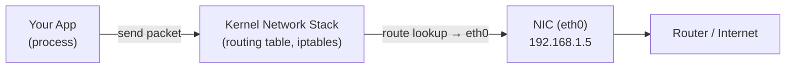

This works fine when there's one thing running. But now imagine running 10 apps on the same machine and you want each one to have its own isolated network — its own IP, its own routing table, no visibility into each other's traffic. Sharing the single kernel stack won't work.

---

### Network Namespaces — Isolated Network Stacks

Linux solves this with **network namespaces**. A network namespace is a completely isolated copy of the network stack — its own interfaces, its own routing table, its own iptables rules. Processes inside a namespace can only see and use what's inside that namespace.

When you create a new network namespace, it starts with no interfaces and no connectivity — completely dark. It can't reach anything yet.

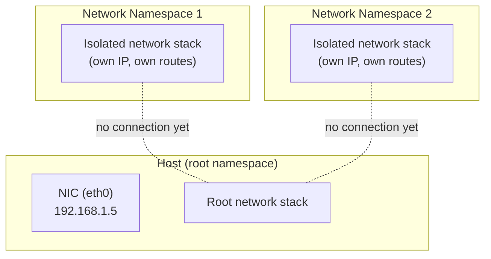

This is what each **Pod** gets — its own network namespace. All containers inside the same Pod share one namespace, which is why they can reach each other on `localhost`. But the namespace starts isolated. Something needs to connect it to the outside world.

---

### veth Pairs — Virtual Ethernet Cables

A **veth pair** is a virtual ethernet cable with two ends. Whatever goes in one end comes out the other — just like a physical cable, except both ends are software interfaces.

The trick: you put **one end inside the namespace** and **keep the other end in the host's root namespace**. Now the namespace has an interface it can use to send traffic, and the host has an interface it can receive that traffic on.

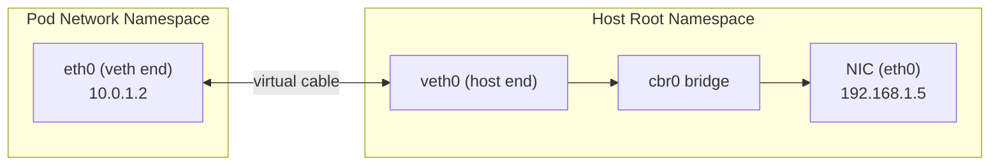

The Pod thinks it has a real ethernet interface (`eth0`) with its own IP. Traffic it sends goes through the veth pair into the host namespace.

The obvious next question: why not just connect the veth's host end directly to the NIC? The reason is that a physical NIC can only be associated with **one network stack at a time**. If you plug a veth directly into the NIC, you're trying to give it two owners — the host and the pod — and the NIC has no concept of multiplexing traffic between them. You'd also have no way to address multiple pods independently, since the NIC has a single MAC address and the physical network only knows about one IP on it.

So you need something in between that can handle multiple veth ends, distinguish traffic between them, and forward packets to the right place. That's the bridge.

But there's still a problem — if you have 10 pods, the host has 10 veth ends just sitting there. How do you connect them all together so they can talk to each other, and route traffic to the right one?

---

### Bridge — The Virtual Switch

A **bridge** (also called `cbr0` or `cni0` depending on the plugin) is a virtual Layer 2 switch inside the host. You plug all the veth host-ends into it. The bridge learns which MAC address is on which veth, and forwards traffic accordingly — exactly like a physical switch in a datacenter.

So the full picture on a single node looks like this:

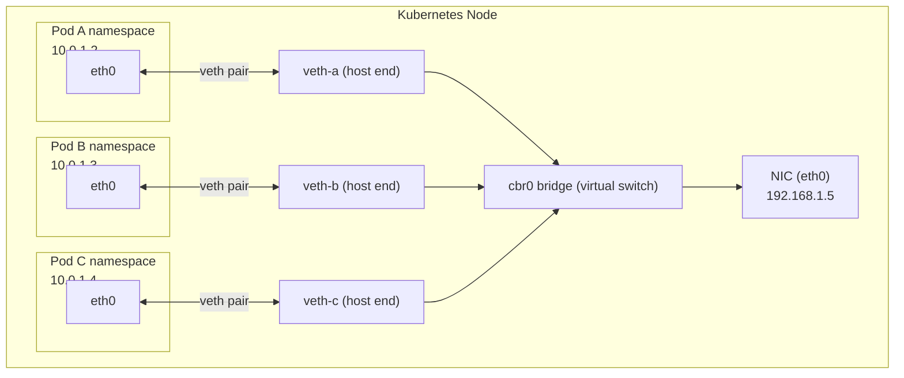

Pod A can now reach Pod B directly through the bridge — no NAT, same node. Traffic leaving the node goes through the bridge to the NIC and out.

---

### Across Nodes — CNI Takes Over

When Pod A on Node 1 wants to reach Pod B on Node 2, the packet leaves Pod A's namespace → veth pair → bridge → NIC. At this point it needs to reach Node 2's network. This is where the **CNI (Container Network Interface)** plugin takes over.

CNI is a standard interface — just like CSI is for storage — that lets Kubernetes delegate cross-node networking to external plugins (Flannel, Calico, Cilium, etc.). Different CNI plugins solve this differently:

- **Flannel** wraps the packet in another UDP packet (overlay/VXLAN) and sends it to the other node, which unwraps it.
- **Calico** uses BGP to advertise Pod CIDRs as routes, so packets are routed natively without wrapping.
- **Cilium** uses eBPF to handle routing directly in the kernel, bypassing iptables entirely.

The end result is the same regardless of plugin: every Pod gets a **unique, routable IP** across the entire cluster — no NAT between pods, even across nodes. This is the fundamental networking guarantee Kubernetes makes, called the **flat network model**.

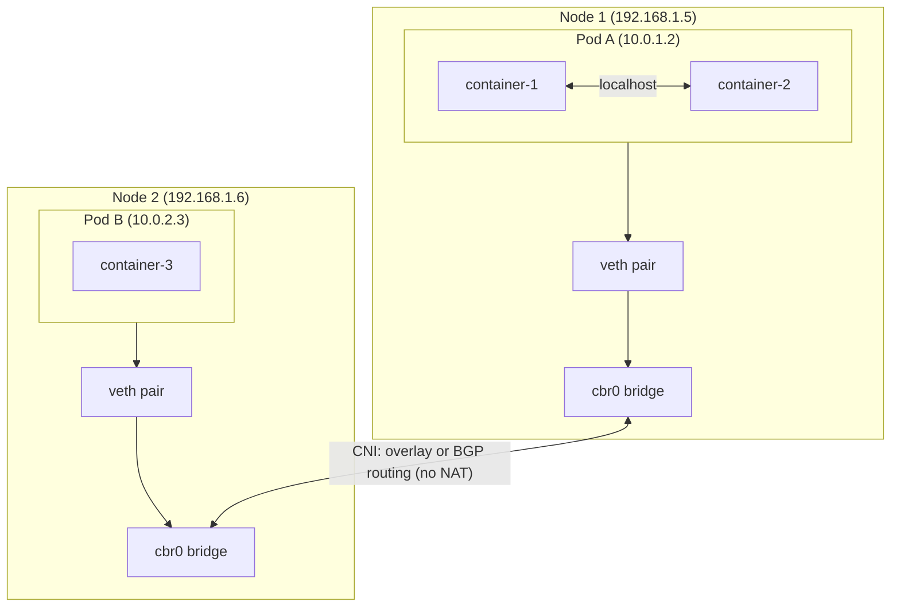

When a Pod is created, the CNI plugin does three things:
1. Creates the veth pair and puts one end in the Pod's namespace.
2. Assigns the Pod an IP from the cluster's Pod CIDR range.
3. Programs routes so other nodes know how to reach this Pod's IP.

---

## The Pod IP Problem → Services

Pods are ephemeral. They get killed, rescheduled, and replaced — and with each replacement, the IP changes. Any component referencing Pod IPs directly would break every time a pod was recreated.

**Services** solve this by providing a stable virtual IP and DNS name for a set of pods.

A Service gets a **ClusterIP** — a virtual IP that never changes — and a DNS name in the form:

```
<service-name>.<namespace>.svc.cluster.local
```

Other pods resolve this DNS name via **CoreDNS** (the cluster's internal DNS server), get back the ClusterIP, and send traffic there. Kubernetes takes care of routing that traffic to a healthy backing pod.

### How Two Pods on Different Nodes Talk

1. Pod A wants to reach Pod B, which sits behind a Service.
2. Pod A resolves the Service DNS name to a ClusterIP using CoreDNS.
3. Pod A sends traffic to the ClusterIP.
4. Kernel networking rules installed by kube-proxy intercept the traffic and select a backend Pod.
5. Traffic is routed to Pod B on its node via the CNI network.
6. Pod B receives the request.

Pod A never knows Pod B's IP directly — it only ever talks to the Service IP.

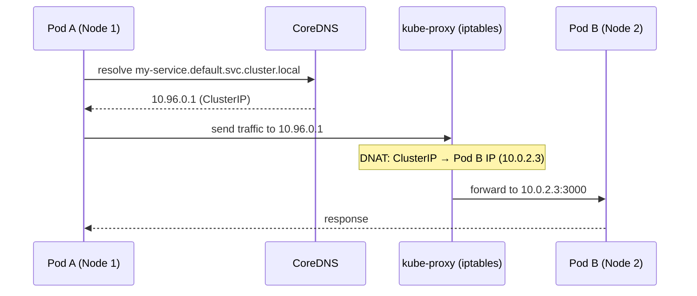

---

## How Services Actually Work — kube-proxy and Endpoint Slices

### Two IPs in Play

At this point there are two kinds of IPs to keep straight:

- **Pod IP** — assigned by CNI when the pod starts. Real, routable. Changes every time the pod is recreated.
- **Service IP (ClusterIP)** — assigned when the Service is created. Stable, never changes. But here's the thing: it is a **virtual IP**. No interface on any node has this IP. No process listens on it. If you SSH into a node and run `ip addr`, you won't find it. It exists only as a rule in the kernel.

So when Pod A sends a packet to the Service IP `10.96.0.1:80`, the packet enters the kernel headed for an address that doesn't physically exist anywhere. Without intervention, the kernel would drop it.

### DNAT — Destination NAT

Before going further, you need to understand **DNAT**. NAT (Network Address Translation) is the practice of rewriting IP addresses on a packet in flight. Your home router does this — it rewrites your laptop's private IP to the router's public IP before sending packets to the internet (that's SNAT, source NAT).

**DNAT is the reverse** — it rewrites the **destination** IP. A packet arrives headed for IP A, and the kernel rewrites it so it's now headed for IP B. The sender never knows. From their perspective, they sent to IP A and got a response back from IP A.

This is exactly what Kubernetes uses. When a packet arrives at the kernel destined for the Service IP (`10.96.0.1`), DNAT rewrites the destination to a real Pod IP (`10.0.2.3`). The packet then gets routed normally via CNI to that pod.

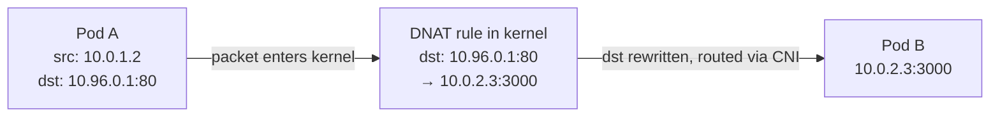

### kube-proxy — Who Installs These Rules?

**kube-proxy** is a component that runs as a DaemonSet — one instance on every node. Its only job is to watch the Kubernetes API for Service changes and translate them into DNAT rules in the node's kernel via **iptables**.

kube-proxy itself is **not in the data path**. It installs the rules once and steps aside. Every packet is handled directly by the Linux kernel using those rules — there's no proxy process sitting between every request. This is why Services add almost no latency overhead.

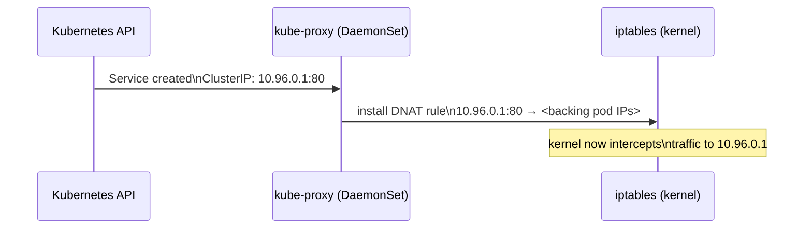

### How Does kube-proxy Know Which Pod IPs to Put in the Rules?

kube-proxy knows the Service IP from the Service object. But to know which Pod IPs are actually backing it, it reads **Endpoint Slices**.

When you create a Service with a `selector`, Kubernetes continuously watches for Pods matching that selector and tracks their IPs and ports in Endpoint Slice objects. So when `pod-1 (10.0.2.3)` and `pod-2 (10.0.2.4)` both match the selector, the Endpoint Slice contains both IPs. kube-proxy reads this and installs DNAT rules for both — traffic to the ClusterIP gets distributed across them.

When a pod dies, it's removed from the Endpoint Slice, kube-proxy updates the iptables rules, and no new traffic is sent to that IP. This is also why a Pod that fails its readiness probe stops receiving traffic — it gets removed from the Endpoint Slice before it's killed.

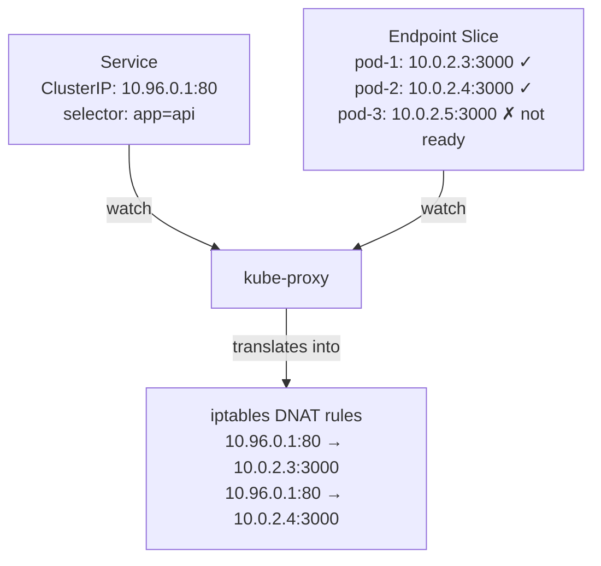

### Endpoint Slices — Why Not Just One List?

The older `Endpoints` object stored all pod IPs for a Service in a **single object**. At scale (say, 1000 pod replicas), any change — one pod restarting — caused that entire object to be rewritten and propagated to every node. Every kube-proxy on every node would receive the update and rewrite its iptables rules, even though 999 pods were untouched.

**Endpoint Slices** shard this into chunks of 100. A single pod change only updates one slice — minimal write, minimal propagation.

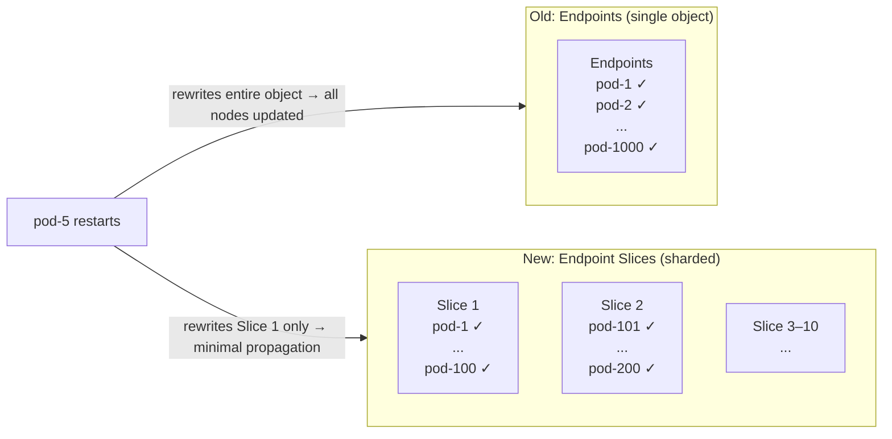

---

## Service Types — A Progression

Kubernetes gives you four Service types. Each one exists because the previous had a limitation.

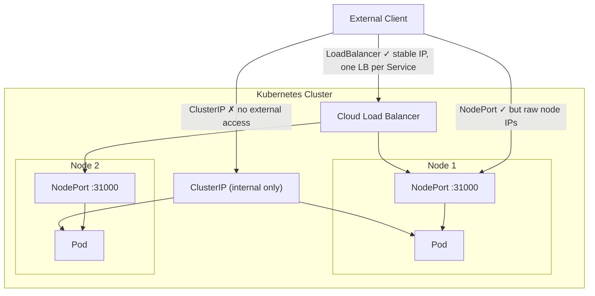

### ClusterIP — Internal Only

The default. The Service gets a virtual IP reachable only inside the cluster. No external access.

```yaml
apiVersion: v1
kind: Service
metadata:
  name: my-app
spec:
  selector:
    app: my-app           # Routes to pods with this label
  ports:
    - port: 80            # Port the Service listens on
      targetPort: 3000    # Port on the Pod to forward to
  type: ClusterIP         # Internal only — not reachable from outside the cluster
```

Use this for anything that shouldn't be exposed externally — internal APIs, databases, caches.

**The gap:** You can't reach this from outside the cluster.

### NodePort — Expose on Every Node's IP

Opens a port (30000–32767) on **every node** in the cluster. External traffic hitting `<any-node-ip>:<node-port>` gets forwarded to the Service and then to a backing pod.

```yaml
spec:
  type: NodePort
  ports:
    - port: 80
      targetPort: 3000
      nodePort: 31000     # Fixed port on every node. Omit to let Kubernetes assign one.
```

**The gap:** You're exposing raw node IPs and high-numbered ports. If a node goes down, clients hitting that node's IP get nothing. You'd need your own load balancer in front of the nodes — which is exactly what the next type provides.

### LoadBalancer — Cloud-Managed Load Balancer

Provisions an external load balancer through the cloud provider (AWS ALB/NLB, GCP Load Balancer, etc.). The load balancer gets a public IP and distributes traffic across nodes, which then forward it to pods via NodePort under the hood.

```yaml
spec:
  type: LoadBalancer
  ports:
    - port: 80
      targetPort: 3000
```

Kubernetes calls the cloud provider's API, a load balancer is created, and its IP is written back to `Service.status.loadBalancer.ingress`.

**The gap:** One LoadBalancer per Service. If you have 10 services that need external access, you're paying for 10 cloud load balancers and managing 10 external IPs. This gets expensive and messy fast. Also, it operates at **Layer 4 (TCP/UDP)** — it can't make routing decisions based on HTTP host or path.

---

## Ingress — One Entry Point, Many Services

Ingress solves the LoadBalancer-per-service problem. Instead of one load balancer per service, you have **one entry point** that routes to many services based on HTTP host and path rules.

Ingress works at **Layer 7** — it understands HTTP. This unlocks:
- Path-based routing (`/api` → service A, `/web` → service B)
- Host-based routing (`api.example.com` → service A, `app.example.com` → service B)
- TLS termination
- Authentication, rate limiting, redirects

### How It Works

An **Ingress object** is just a set of routing rules. It does nothing on its own. An **Ingress Controller** (NGINX, Traefik, AWS ALB Controller, etc.) runs as a pod, watches for Ingress objects, and programs itself to implement those rules. The Ingress Controller is typically exposed via a `LoadBalancer` Service — so there's one cloud load balancer for the entire cluster, not one per service.

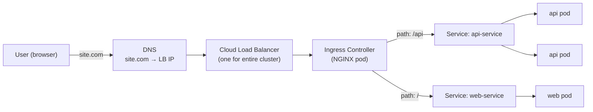

```yaml
apiVersion: networking.k8s.io/v1
kind: Ingress
metadata:
  name: my-ingress
spec:
  rules:
  - host: example.com
    http:
      paths:
      - path: /api
        pathType: Prefix
        backend:
          service:
            name: api-service
            port:
              number: 80
      - path: /
        pathType: Prefix
        backend:
          service:
            name: web-service
            port:
              number: 80
```

### What Happens When a User Types site.com

1. DNS resolves `site.com` to the LoadBalancer IP of the Ingress Controller's Service.
2. The cloud load balancer forwards the request to the Ingress Controller pod.
3. The Ingress Controller reads the Host header and path, matches a rule, and forwards to the correct Service.
4. The Service routes to a backing pod.

User traffic never hits the Kubernetes API server — that's control plane only, not in the data path.

**The gap:** Ingress has serious design problems at scale, covered next.

---

## Gateway API — The Fix for Ingress

### Problems With Ingress

1. **No separation of concerns.** Cluster operators (who manage ports, TLS, certificates) and developers (who manage routing rules) both edit the same Ingress object. This breaks ownership boundaries.
2. **Advanced features via annotations.** Things like timeouts, retries, header manipulation — features every real app needs — weren't in the Ingress spec. Each controller implemented them via custom annotations (`nginx.ingress.kubernetes.io/...`). Write NGINX annotations today, migrate to Traefik tomorrow, rewrite everything.
3. **HTTP/HTTPS only.** No standard way to route TCP or UDP traffic through Ingress.

### The Solution — Gateway API

Kubernetes introduced the Gateway API as the official successor to Ingress, with three separate resources that map to three separate roles:

| Resource | Managed by | Purpose |
|---|---|---|
| `GatewayClass` | Cluster operator | Defines which controller implements the gateway (NGINX, Istio, Envoy, etc.) |
| `Gateway` | Cluster operator | Defines listeners, ports, TLS config — the infrastructure layer |
| `HTTPRoute` / `TCPRoute` / `UDPRoute` | Developer | Defines routing rules — the application layer |

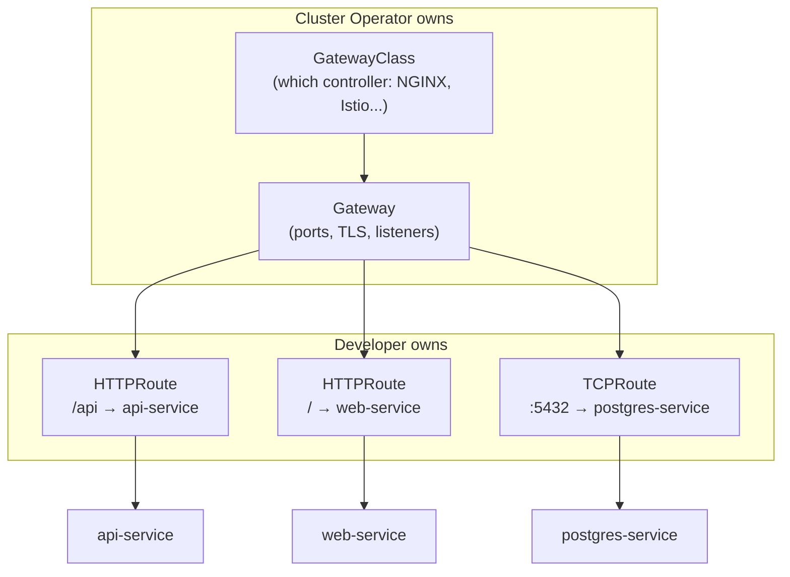

```yaml
# Operator writes this — infrastructure concerns
apiVersion: gateway.networking.k8s.io/v1
kind: Gateway
metadata:
  name: main-gateway
spec:
  gatewayClassName: nginx
  listeners:
    - name: https
      port: 443
      protocol: HTTPS
      tls:
        certificateRefs:
          - name: tls-cert
---
# Developer writes this — routing concerns
apiVersion: gateway.networking.k8s.io/v1
kind: HTTPRoute
metadata:
  name: api-route
spec:
  parentRefs:
    - name: main-gateway
  rules:
    - matches:
        - path:
            type: PathPrefix
            value: /api
      backendRefs:
        - name: api-service
          port: 80
```

The routing rules (HTTPRoute) reference the Gateway, but they're in separate objects. A developer can update routes without touching gateway-level TLS config, and vice versa. Gateway API also supports TCP and UDP routing natively — no annotations needed.

---

## Network Policies — Firewall Rules for Pods

By default, **all pods in a cluster can talk to all other pods** — no restrictions. In a production cluster running multiple services, this is a security problem. A compromised pod could reach your database directly.

**Network Policies** are Kubernetes-native firewall rules that control which pods can send traffic to which other pods (and on which ports).

> Network Policies are enforced by the CNI plugin — not kube-proxy. Not all CNI plugins support them (Flannel doesn't by default; Calico and Cilium do).

### Ingress and Egress

A Network Policy controls two directions:
- **Ingress** — who can send traffic *to* the selected pods
- **Egress** — where the selected pods can send traffic *to*

```yaml
apiVersion: networking.k8s.io/v1
kind: NetworkPolicy
metadata:
  name: allow-api-to-db
  namespace: production
spec:
  podSelector:
    matchLabels:
      app: postgres          # This policy applies to postgres pods
  policyTypes:
    - Ingress
  ingress:
    - from:
        - podSelector:
            matchLabels:
              app: api       # Only pods labelled app=api can reach postgres
      ports:
        - protocol: TCP
          port: 5432
```

This locks down the postgres pods so only the API pods can reach port 5432. Everything else is blocked.

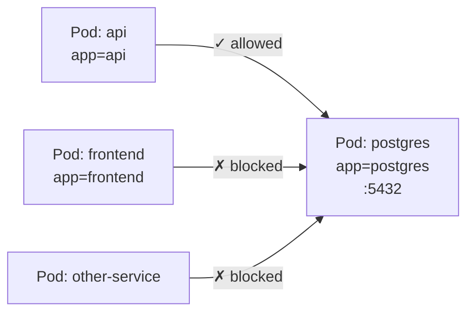

### Default Deny — The Right Starting Point

An empty `podSelector` with no rules creates a **default deny** policy — blocks all traffic to all pods in the namespace. From there, you add explicit allow rules:

```yaml
# Deny all ingress to everything in the namespace
apiVersion: networking.k8s.io/v1
kind: NetworkPolicy
metadata:
  name: default-deny-ingress
  namespace: production
spec:
  podSelector: {}            # Empty = applies to all pods in namespace
  policyTypes:
    - Ingress
```

### Common Interview Gotchas

- **Network Policies are additive** — multiple policies on the same pod are ORed together. There's no explicit deny rule; you deny by not allowing.
- **They are namespaced** — a policy in `production` doesn't affect `staging`.
- **CNI must support them** — if your CNI doesn't enforce Network Policies, the objects exist but do nothing. Calico and Cilium are the safe choices.
- **No ordering** — unlike traditional firewall rules, there's no rule priority. All matching policies apply.

---

## The Full Picture

| Concept | Layer | Purpose |
|---|---|---|
| CNI + veth pairs | L3 | Gives every Pod a unique routable IP |
| CoreDNS | DNS | Resolves Service names to ClusterIPs |
| kube-proxy + iptables | L4 | Routes ClusterIP traffic to backing pods |
| Endpoint Slices | — | Tracks pod IPs behind a Service; scalable replacement for Endpoints |
| ClusterIP | L4 | Stable internal IP for pod-to-pod communication |
| NodePort | L4 | Exposes Service on every node's IP at a fixed port |
| LoadBalancer | L4 | Cloud-managed LB; one per Service |
| Ingress | L7 | One entry point, host/path routing, TLS — but design flaws at scale |
| Gateway API | L7 | Ingress successor; separates infra and routing concerns, supports TCP/UDP |
| Network Policy | L3/L4 | Pod-level firewall rules; enforced by CNI, not kube-proxy |

The same thread as storage: each abstraction exists because the previous one had a gap.
