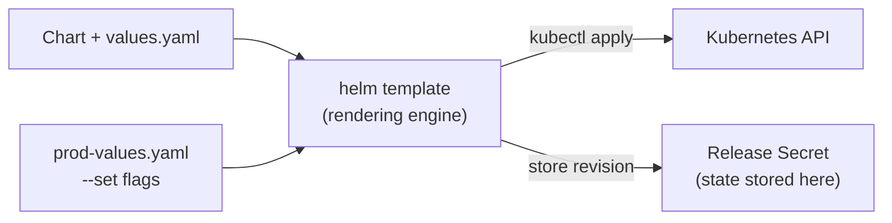

# Kustomize and Helm

## Why Both Exist — The YAML Sprawl Problem

Kubernetes promises declarative infrastructure — but YAML sprawl is the hidden cost most teams discover too late.

As applications grow, so do:
- Environment-specific configs (dev vs staging vs prod)
- Repeated manifests across services
- Subtle differences between clusters
- Risky manual edits that cause drift

The naive solution — copy `deployment.yaml` into `deployment-dev.yaml`, `deployment-staging.yaml`, `deployment-prod.yaml` — works until it doesn't. One fix applied to dev gets forgotten in prod. A label change gets made in two of three files. Six months later, nobody knows what's canonical.

Kustomize and Helm emerged to solve **different parts of the same problem**: how to manage Kubernetes configuration cleanly, safely, and at scale.

- **Kustomize** answers: *"How do I customize existing manifests for different environments without duplicating YAML?"*
- **Helm** answers: *"How do I package, version, configure, and distribute a Kubernetes application?"*

---

## Kustomize — Native Configuration Customization

Kustomize is built into `kubectl` (`kubectl apply -k`). No installation needed. No new language. Your YAML stays valid Kubernetes YAML throughout.

### The Base/Overlay Model

Kustomize is built on two concepts:

**Base** — the common, reusable manifests. Represents the application in its default form. Not environment-specific.

**Overlay** — environment-specific changes layered on top of the base. Only contains what's different.

```
k8s/
├── base/
│   ├── kustomization.yaml
│   ├── deployment.yaml
│   └── service.yaml
├── overlays/
│   ├── dev/
│   │   ├── kustomization.yaml
│   │   └── patch-replicas.yaml
│   ├── staging/
│   │   └── kustomization.yaml
│   └── prod/
│       ├── kustomization.yaml
│       └── patch-replicas.yaml
```

The base `kustomization.yaml` lists the resources:

```yaml
# base/kustomization.yaml
apiVersion: kustomize.config.k8s.io/v1beta1
kind: Kustomization
resources:
  - deployment.yaml
  - service.yaml
```

The overlay `kustomization.yaml` references the base and adds changes:

```yaml
# overlays/prod/kustomization.yaml
apiVersion: kustomize.config.k8s.io/v1beta1
kind: Kustomization
resources:
  - ../../base              # point to base

namePrefix: prod-           # all resources get this prefix
namespace: production       # inject namespace

images:
  - name: my-app
    newTag: v1.4.2          # override image tag without touching deployment.yaml

replicas:
  - name: my-app
    count: 5                # override replica count

patches:
  - path: patch-replicas.yaml
```

Apply it:
```bash
kubectl apply -k overlays/prod/    # native kubectl support
kubectl diff -k overlays/prod/     # preview changes before applying
kustomize build overlays/prod/     # print rendered YAML without applying
```

### Patch Types

Kustomize supports two patch formats:

**Strategic Merge Patch** — looks like a partial Kubernetes manifest. Kubernetes knows the structure and merges intelligently (lists are merged by key, not replaced).

```yaml
# patch-resources.yaml — strategic merge patch
apiVersion: apps/v1
kind: Deployment
metadata:
  name: my-app
spec:
  replicas: 5
  template:
    spec:
      containers:
      - name: my-app           # identifies which container to patch
        resources:
          limits:
            memory: "1Gi"
```

**JSON 6902 Patch** — explicit operations (`add`, `replace`, `remove`) on specific paths. More surgical, more verbose.

```yaml
# kustomization.yaml
patches:
  - target:
      kind: Deployment
      name: my-app
    patch: |-
      - op: replace
        path: /spec/replicas
        value: 5
      - op: add
        path: /spec/template/spec/containers/0/env/-
        value:
          name: ENV
          value: production
```

Use strategic merge for most cases — it's more readable. Use JSON 6902 when you need to remove a field or patch a specific list item.

### Common Transformations

Beyond patches, Kustomize has built-in transformers:

```yaml
# Add prefix/suffix to all resource names
namePrefix: prod-
nameSuffix: -v2

# Add labels to all resources
commonLabels:
  env: production
  team: platform

# Add annotations to all resources
commonAnnotations:
  managed-by: kustomize

# Override image tags across all deployments
images:
  - name: my-app
    newName: gcr.io/my-project/my-app   # optional: change registry too
    newTag: abc1234

# Override replica counts
replicas:
  - name: my-app
    count: 5
```

### Why Kustomize Fits GitOps

In a GitOps workflow (ArgoCD, Flux), the Git repo is the source of truth. Kustomize fits naturally:
- Base manifests are reviewed and stable
- Overlay changes are small diffs — easy to review in PRs
- No external tooling needed in the CD pipeline — ArgoCD and Flux support Kustomize natively
- Output is always deterministic — same input always produces same YAML

---

## Helm — Application Packaging for Kubernetes

Helm is a package manager for Kubernetes. It treats a Kubernetes application as a **versioned, installable package** — similar to how `apt` or `brew` treats software.

If Kustomize is about patching YAML, Helm is about **generating YAML from templates** and managing the full lifecycle of a release.

### Chart Structure

A Helm chart is a directory with a specific layout:

```
my-app/
├── Chart.yaml          # chart metadata — name, version, description
├── values.yaml         # default input values
├── templates/          # Go-templated Kubernetes manifests
│   ├── deployment.yaml
│   ├── service.yaml
│   ├── ingress.yaml
│   ├── _helpers.tpl    # reusable template fragments (partials)
│   └── NOTES.txt       # printed to user after install
└── charts/             # dependencies (sub-charts)
```

**Chart.yaml** — metadata about the chart:

```yaml
apiVersion: v2
name: my-app
description: My application
version: 1.2.0          # chart version — increment when chart changes
appVersion: "2.4.1"     # version of the app being packaged
```

**values.yaml** — default values. Users override these at install time:

```yaml
replicaCount: 2

image:
  repository: my-app
  tag: "latest"
  pullPolicy: IfNotPresent

service:
  type: ClusterIP
  port: 80

ingress:
  enabled: false
  host: ""

resources:
  requests:
    cpu: 100m
    memory: 128Mi
```

### Templating Basics

Templates are standard Kubernetes YAML with Go template directives:

```yaml
# templates/deployment.yaml
apiVersion: apps/v1
kind: Deployment
metadata:
  name: {{ .Release.Name }}-my-app          # release name injected
  labels:
    app: {{ .Chart.Name }}
    version: {{ .Chart.AppVersion }}
spec:
  replicas: {{ .Values.replicaCount }}       # from values.yaml
  template:
    spec:
      containers:
      - name: my-app
        image: "{{ .Values.image.repository }}:{{ .Values.image.tag }}"
        {{- if .Values.resources }}           # conditional block
        resources:
          {{- toYaml .Values.resources | nindent 10 }}
        {{- end }}
```

**Key template objects:**

| Object | What it contains |
|---|---|
| `.Values` | Values from `values.yaml` and overrides |
| `.Release.Name` | Name of the release (set at install time) |
| `.Release.Namespace` | Namespace being installed into |
| `.Chart.Name` | Chart name from `Chart.yaml` |
| `.Chart.Version` | Chart version |

**Common template functions:**

```yaml
# toYaml — convert a value to YAML (with nindent for indentation)
{{- toYaml .Values.resources | nindent 12 }}

# default — use fallback if value is empty
{{ .Values.image.tag | default "latest" }}

# quote — wrap in quotes (important for strings that look like numbers)
{{ .Values.someString | quote }}

# if/else
{{- if .Values.ingress.enabled }}
# ingress manifest here
{{- end }}

# range — loop over a list
{{- range .Values.env }}
- name: {{ .name }}
  value: {{ .value | quote }}
{{- end }}
```

### Lifecycle Commands

```bash
# Install a chart
helm install my-release ./my-app                          # from local chart
helm install my-release my-repo/my-app                    # from repo
helm install my-release my-repo/my-app --version 1.2.0   # pin version

# Override values at install time
helm install my-release ./my-app \
  --set image.tag=v1.4.2 \
  --set replicaCount=5 \
  -f prod-values.yaml                    # -f takes precedence over --set

# Upgrade an existing release
helm upgrade my-release ./my-app -f prod-values.yaml

# Install or upgrade in one command (idempotent — good for CI/CD)
helm upgrade --install my-release ./my-app -f prod-values.yaml

# Roll back to a previous revision
helm rollback my-release 2              # roll back to revision 2
helm rollback my-release 0              # roll back to previous revision

# List releases
helm list -n production
helm list --all-namespaces

# Check release status
helm status my-release -n production

# Uninstall a release
helm uninstall my-release -n production

# Preview rendered YAML without installing
helm template my-release ./my-app -f prod-values.yaml

# Dry run — validate against the cluster
helm install my-release ./my-app --dry-run
```

### The Release Model — How Helm Tracks State

When you install a chart, Helm creates a **release** — a named instance of a chart with specific values. Each `helm upgrade` creates a new **revision** of that release.

Helm stores release state as **Secrets** in the same namespace as the release:

```bash
kubectl get secrets -n production | grep helm
# sh.helm.release.v1.my-release.v1
# sh.helm.release.v1.my-release.v2
# sh.helm.release.v1.my-release.v3
```

Each secret contains the full rendered manifest for that revision, compressed and base64-encoded. This is how `helm rollback` works — it retrieves the old rendered manifest and re-applies it.

**Important implication**: if someone modifies a Helm-managed resource with `kubectl edit` or `kubectl apply`, Helm doesn't know about it. The next `helm upgrade` will overwrite the manual change. Never manually edit resources managed by Helm.



### Values Override Order

When multiple value sources are provided, later sources win:

```
values.yaml (lowest priority)
  ↓
-f values-base.yaml
  ↓
-f prod-values.yaml
  ↓
--set image.tag=abc123 (highest priority)
```

This allows a layered approach: default values in the chart, environment overrides in a values file, one-off overrides via `--set` in CI.

### Helm Hooks — Running Tasks at Release Lifecycle Points

Hooks let you run Jobs at specific points in the release lifecycle. The most common use case is **database migrations before a new version goes live**.

```yaml
# templates/migration-job.yaml
apiVersion: batch/v1
kind: Job
metadata:
  name: {{ .Release.Name }}-migration
  annotations:
    "helm.sh/hook": pre-upgrade          # run before upgrade
    "helm.sh/hook-weight": "0"           # order among multiple hooks
    "helm.sh/hook-delete-policy": before-hook-creation   # clean up old job first
spec:
  template:
    spec:
      restartPolicy: Never
      containers:
      - name: migrate
        image: "{{ .Values.image.repository }}:{{ .Values.image.tag }}"
        command: ["./migrate.sh"]
```

**Hook types:**

| Hook | When it runs |
|---|---|
| `pre-install` | Before any resources are created on first install |
| `post-install` | After all resources are created on first install |
| `pre-upgrade` | Before upgrade resources are applied |
| `post-upgrade` | After upgrade completes |
| `pre-rollback` | Before rollback |
| `post-rollback` | After rollback |
| `pre-delete` | Before uninstall |

Hooks are Jobs — they must complete successfully for the hook phase to pass. If a `pre-upgrade` hook fails, the upgrade is aborted.

---

## Kustomize vs Helm — When to Use Each

| | Kustomize | Helm |
|---|---|---|
| Templating | None — patches only | Go templates |
| Distribution | Not designed for it | Core use case — Helm Hub, OCI registries |
| Lifecycle management | None | Install, upgrade, rollback, uninstall |
| Complexity | Low — just YAML | Higher — templating language to learn |
| GitOps fit | Excellent | Good (with ArgoCD/Flux Helm support) |
| Customizing third-party apps | Awkward | Natural — override `values.yaml` |
| Kubernetes-native | Yes (`kubectl apply -k`) | No — separate CLI |

### The Combined Pattern

In practice, many teams use both together:

- **Helm** to install and manage third-party applications (Prometheus, cert-manager, ArgoCD, ingress-nginx)
- **Kustomize** to manage your own application manifests and handle environment-specific overlays

A common GitOps pattern:

```
apps/
├── base/
│   └── kustomization.yaml   # your app's base manifests
├── overlays/
│   ├── dev/
│   └── prod/
infra/
├── monitoring/
│   └── values-prod.yaml     # Helm values for Prometheus stack
├── ingress/
│   └── values-prod.yaml     # Helm values for ingress-nginx
```

Helm manages the infrastructure layer. Kustomize manages your application layer. ArgoCD or Flux syncs both.

---

## Interview Gotchas

### 1. Helm release stuck in `pending-upgrade`

This happens when a previous `helm upgrade` was interrupted (CI job killed, network failure). Helm locked the release but never unlocked it.

```bash
helm list -n production        # shows STATUS: pending-upgrade
helm rollback my-release -n production   # rolls back AND clears the lock
```

If rollback doesn't work:
```bash
# Last resort — manually delete the stuck release secret
kubectl get secrets -n production | grep helm | grep pending
kubectl delete secret sh.helm.release.v1.my-release.vN -n production
```

### 2. `helm upgrade` overwrites manual kubectl changes

Helm manages resources by re-applying its rendered manifests on every upgrade. Any change made with `kubectl edit` or `kubectl apply` outside Helm will be overwritten on the next upgrade. Always make changes through values or chart updates — never directly on Helm-managed resources.

### 3. Values override order confusion

`--set` always wins over `-f`. Multiple `-f` flags are applied left to right — the last one wins. A common mistake is passing the environment values file before the base values file and wondering why the base values take precedence.

```bash
# WRONG — base-values.yaml overrides prod-values.yaml
helm upgrade my-release ./chart -f prod-values.yaml -f base-values.yaml

# CORRECT — prod-values.yaml wins
helm upgrade my-release ./chart -f base-values.yaml -f prod-values.yaml
```

### 4. Kustomize patch targeting wrong resource

If your patch's `metadata.name` doesn't exactly match the resource in the base, Kustomize silently does nothing — it doesn't error. Always verify with `kustomize build` and check the rendered output.

```bash
kustomize build overlays/prod/ | grep -A 5 "kind: Deployment"
```

### 5. `helm template` vs `--dry-run` — they are different

`helm template` renders manifests locally without contacting the cluster. `--dry-run` sends the rendered manifests to the API server for validation but doesn't apply them. Use `--dry-run` to catch schema errors; use `helm template` for inspecting output in CI pipelines.

### 6. Helm stores state in Secrets — don't delete them

The Secrets that Helm creates (`sh.helm.release.v1.*`) are not just logs — they are the release state. Deleting them orphans all the resources Helm deployed. Helm will think the release doesn't exist and create duplicates on the next install. If you need to clean up, always use `helm uninstall`.
