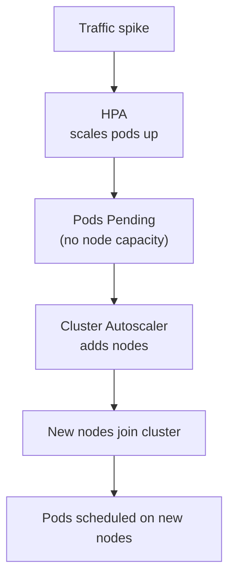
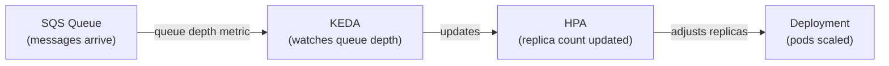
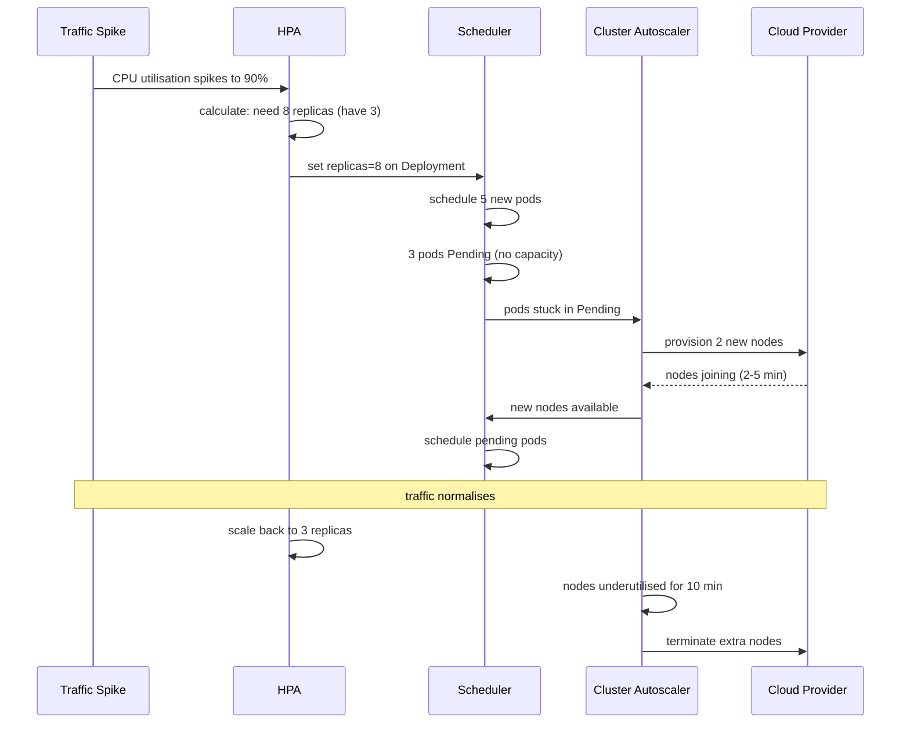
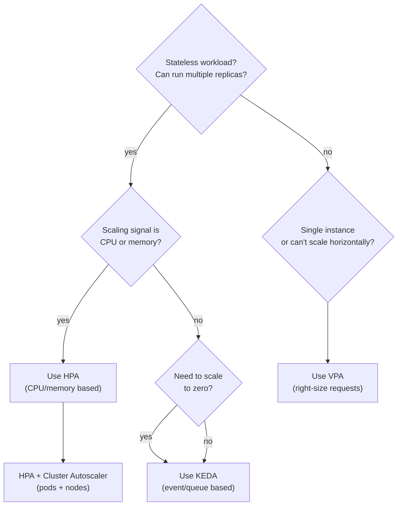

# Kubernetes Autoscaling

## Why Autoscaling Exists

Static resource allocation is wasteful and fragile. If you size your deployment for peak traffic, you overpay 23 hours a day. If you size for average traffic, you get outages during spikes.

Kubernetes solves this with three complementary autoscaling mechanisms:

| Scaler | What it scales | Trigger |
|---|---|---|
| **HPA** (Horizontal Pod Autoscaler) | Number of pod replicas | CPU, memory, custom metrics |
| **VPA** (Vertical Pod Autoscaler) | CPU/memory requests per pod | Historical resource usage |
| **Cluster Autoscaler** | Number of nodes in the cluster | Pods stuck in Pending |

They operate at different levels and solve different problems. In practice, HPA and Cluster Autoscaler are used together constantly. VPA is used more selectively.



---

## HPA — Horizontal Pod Autoscaler

HPA watches a Deployment (or StatefulSet, ReplicaSet) and adjusts the replica count up or down based on observed metrics.

### How It Works

HPA runs as a control loop — every 15 seconds by default, it:
1. Fetches current metric values from the metrics API
2. Calculates the desired replica count
3. Updates the Deployment's `spec.replicas`

The calculation is straightforward:

```
desiredReplicas = ceil(currentReplicas × (currentMetricValue / targetMetricValue))
```

Example: 3 replicas, current CPU = 90%, target CPU = 50%:
```
desiredReplicas = ceil(3 × (90 / 50)) = ceil(5.4) = 6
```

HPA rounds up — it prefers over-provisioning to under-provisioning.

### CPU-Based HPA

The most common setup. Requires `metrics-server` to be installed in the cluster (it collects CPU and memory from kubelets).

```yaml
apiVersion: autoscaling/v2
kind: HorizontalPodAutoscaler
metadata:
  name: my-app-hpa
  namespace: production
spec:
  scaleTargetRef:
    apiVersion: apps/v1
    kind: Deployment
    name: my-app
  minReplicas: 2              # never scale below this
  maxReplicas: 20             # never scale above this
  metrics:
  - type: Resource
    resource:
      name: cpu
      target:
        type: Utilization
        averageUtilization: 60    # target 60% CPU utilisation across all pods
```

**Important**: HPA measures CPU utilisation as a percentage of the pod's **request**, not the node's capacity. If a pod requests `500m` CPU and uses `300m`, utilisation is 60%. This is why setting accurate CPU requests is critical for HPA to work correctly.

### Memory-Based HPA

```yaml
metrics:
- type: Resource
  resource:
    name: memory
    target:
      type: AverageValue
      averageValue: 512Mi       # target average memory usage per pod
```

Memory-based HPA is trickier than CPU because memory doesn't compress — a pod using too much memory gets OOMKilled, not throttled. HPA scaling on memory works best for workloads with predictable memory growth patterns.

### Multiple Metrics

HPA evaluates all metrics and uses the one that requires the **most replicas**:

```yaml
metrics:
- type: Resource
  resource:
    name: cpu
    target:
      type: Utilization
      averageUtilization: 60
- type: Resource
  resource:
    name: memory
    target:
      type: AverageValue
      averageValue: 512Mi
```

If CPU says 6 replicas and memory says 4, HPA scales to 6.

### Scaling Behaviour — Preventing Thrashing

By default HPA scales up fast and scales down slowly. This is intentional — scaling down too aggressively causes oscillation (scale down → traffic spikes → scale up → repeat). You can tune this:

```yaml
spec:
  behavior:
    scaleUp:
      stabilizationWindowSeconds: 0      # scale up immediately (default)
      policies:
      - type: Percent
        value: 100
        periodSeconds: 15                # can double replicas every 15s
    scaleDown:
      stabilizationWindowSeconds: 300    # wait 5 min of sustained low load before scaling down
      policies:
      - type: Pods
        value: 1
        periodSeconds: 60               # remove at most 1 pod per minute when scaling down
```

The `stabilizationWindowSeconds` on scale-down is the most important setting. It prevents HPA from scaling down replicas during a brief traffic lull, only to need them again 30 seconds later.

### Checking HPA Status

```bash
kubectl get hpa -n production
# NAME         REFERENCE           TARGETS   MINPODS   MAXPODS   REPLICAS
# my-app-hpa   Deployment/my-app   45%/60%   2         20        4

kubectl describe hpa my-app-hpa -n production   # shows events, current metrics, decisions
```

---

## Custom and External Metrics with HPA

CPU and memory cover many cases, but product companies often need to scale on application-specific signals — request queue depth, active WebSocket connections, Kafka consumer lag.

### Custom Metrics (from within the cluster)

Custom metrics come from your application via Prometheus (using the `prometheus-adapter`). You expose a metric from your app, Prometheus scrapes it, and the adapter makes it available to HPA.

```yaml
metrics:
- type: Pods
  pods:
    metric:
      name: http_requests_per_second    # metric exposed by your app
    target:
      type: AverageValue
      averageValue: "100"               # target 100 req/s per pod
```

### External Metrics

External metrics come from outside the cluster — SQS queue depth, Pub/Sub message count, etc.

```yaml
metrics:
- type: External
  external:
    metric:
      name: sqs_messages_visible
      selector:
        matchLabels:
          queue: my-queue
    target:
      type: AverageValue
      averageValue: "30"                # scale so each pod handles ~30 messages
```

---

## KEDA — Event-Driven Autoscaling

For custom and external metric scaling, **KEDA (Kubernetes Event-Driven Autoscaler)** is the modern standard. It extends HPA with 50+ built-in scalers for queues, streams, databases, and cloud services — without requiring a custom metrics adapter.

```yaml
apiVersion: keda.sh/v1alpha1
kind: ScaledObject
metadata:
  name: my-app-scaler
  namespace: production
spec:
  scaleTargetRef:
    name: my-app
  minReplicaCount: 0            # KEDA can scale to zero — HPA cannot
  maxReplicaCount: 50
  triggers:
  - type: aws-sqs-queue
    metadata:
      queueURL: https://sqs.us-east-1.amazonaws.com/123456/my-queue
      queueLength: "10"         # scale so each pod handles ~10 messages
      awsRegion: us-east-1
  - type: kafka
    metadata:
      bootstrapServers: kafka:9092
      consumerGroup: my-group
      topic: my-topic
      lagThreshold: "50"        # scale based on consumer lag
```

**Scale to zero** — the key differentiator from standard HPA. KEDA can scale a deployment to 0 replicas when there's no work (empty queue) and back up when work arrives. HPA minimum is 1.

This is critical for batch processing workloads — workers cost nothing when idle.



---

## VPA — Vertical Pod Autoscaler

HPA scales out (more pods). VPA scales up (bigger pods) — it adjusts CPU and memory **requests** on individual pods based on observed usage.

VPA is useful when:
- You don't know the right resource requests for an app
- Your workload can't scale horizontally (single-instance databases, stateful apps)
- You want to right-size pods to reduce waste

### VPA Modes

```yaml
apiVersion: autoscaling.k8s.io/v1
kind: VerticalPodAutoscaler
metadata:
  name: my-app-vpa
  namespace: production
spec:
  targetRef:
    apiVersion: apps/v1
    kind: Deployment
    name: my-app
  updatePolicy:
    updateMode: "Auto"      # Off | Initial | Recreate | Auto
```

| Mode | Behaviour |
|---|---|
| `Off` | Only generates recommendations — doesn't apply them. Use to audit right-sizing. |
| `Initial` | Applies recommendations only when pods are first created. |
| `Recreate` | Applies recommendations by evicting and recreating pods. |
| `Auto` | Same as Recreate today. Will use in-place updates when available. |

### Checking VPA Recommendations

```bash
kubectl describe vpa my-app-vpa -n production
```

Output shows:
```
Recommendation:
  Container Recommendations:
    Container Name: my-app
    Lower Bound:    cpu: 50m,  memory: 100Mi
    Target:         cpu: 200m, memory: 300Mi   ← what VPA wants to set
    Upper Bound:    cpu: 500m, memory: 800Mi
```

Use `Off` mode first to see recommendations before letting VPA modify anything.

### HPA + VPA Conflict

**Do not use HPA (CPU/memory) and VPA together on the same deployment** — they fight each other. VPA changes requests, which changes HPA's utilisation calculation, which changes replica count, which changes VPA's recommendation. The loop is unstable.

The safe combinations:
- HPA on CPU/memory + no VPA
- VPA only (no HPA on CPU/memory)
- HPA on **custom metrics** + VPA (safe because VPA doesn't affect custom metric targets)

---

## Cluster Autoscaler — Scaling the Nodes Themselves

HPA and KEDA scale pods. But if the cluster doesn't have enough nodes to schedule those pods, they stay `Pending`. **Cluster Autoscaler (CA)** adds and removes nodes from the cluster automatically.

### Scale Up

CA watches for pods stuck in `Pending` due to insufficient resources. When it finds them, it:
1. Simulates which node group (instance type, zone) would fit the pod
2. Requests a new node from the cloud provider
3. Waits for the node to join and the pod to be scheduled

Typical time from `Pending` to running: **2–5 minutes** (dominated by node boot time, not CA logic).

### Scale Down

CA continuously looks for underutilised nodes — nodes where all pods could fit on other nodes. When it finds one, it:
1. Checks that no pods would be disrupted (respects PDBs)
2. Cordons the node (marks unschedulable)
3. Drains pods to other nodes
4. Terminates the node

Scale-down is conservative — a node must be underutilised for 10 minutes (default) before CA removes it.

```yaml
# Cluster Autoscaler respects these annotations on nodes
cluster-autoscaler.kubernetes.io/safe-to-evict: "false"  # never evict this pod
```

### Node Groups and Instance Types

CA works with node groups (AWS Auto Scaling Groups, GKE Node Pools). You can have multiple node groups for different instance types:

```
cluster
├── node-group-standard   (m5.xlarge, min:2, max:20)
├── node-group-high-mem   (r5.2xlarge, min:0, max:10)
└── node-group-gpu        (p3.2xlarge, min:0, max:5)
```

CA picks the node group that can fit the pending pod at the lowest cost. It uses pod `nodeAffinity` and `nodeSelector` to determine which groups are eligible.

### CA + HPA Together — The Full Flow



---

## Scaling to Zero with KEDA

Standard HPA cannot scale below 1. KEDA can scale to 0 — completely removing all pods when there's no work, and bringing them back when work arrives.

This matters for:
- **Batch processors** — SQS workers, Kafka consumers idle between jobs
- **Scheduled workloads** — services only needed during business hours
- **Cost optimisation** — non-critical workloads in staging
```yaml
# KEDA scale-to-zero example — SQS worker
spec:
  minReplicaCount: 0          # scale to zero when queue is empty
  maxReplicaCount: 20
  pollingInterval: 10         # check queue every 10 seconds
  cooldownPeriod: 30          # wait 30s after last message before scaling to zero
  triggers:
  - type: aws-sqs-queue
    metadata:
      queueURL: https://sqs.us-east-1.amazonaws.com/123456/jobs
      queueLength: "5"
```

**Cold start latency** — scaling from 0 to 1 takes time (pod scheduling + image pull + app startup). For latency-sensitive workloads, keep `minReplicaCount: 1`. For batch workloads where a few seconds of delay is acceptable, zero is fine.

---

## Choosing the Right Autoscaler



In practice at product companies:
- **Stateless services** → HPA on CPU + Cluster Autoscaler
- **Queue consumers / batch** → KEDA + Cluster Autoscaler
- **Databases, single-instance apps** → VPA in `Off` mode for recommendations
- **All of the above** → Cluster Autoscaler handles the node layer for all of them

---

## Interview Gotchas

### 1. HPA doesn't work without metrics-server

If `metrics-server` is not installed, HPA can't fetch CPU/memory metrics and shows:

```bash
kubectl get hpa
# TARGETS: <unknown>/60%
```

Fix: install `metrics-server`. On managed clusters (EKS, GKE, AKS) it's usually pre-installed.

### 2. HPA measures CPU against requests, not node capacity

If a pod has `requests.cpu: 100m` and uses `80m`, utilisation is 80% — not `80m / (total node CPU)`. Inaccurate requests cause HPA to scale at the wrong threshold. A pod requesting 100m but actually needing 500m will show 500% utilisation and trigger aggressive scale-out even when the node has plenty of capacity.

### 3. HPA and VPA conflict on the same deployment

Never use HPA (CPU/memory) and VPA together. Use KEDA custom metrics + VPA if you need both dimensions.

### 4. minReplicas must be at least 1 for HPA

HPA cannot scale to zero. If your Deployment has `replicas: 0` (manually scaled down), HPA will immediately scale it back up to `minReplicas`. Use KEDA if you need zero.

### 5. Cluster Autoscaler won't remove nodes with non-evictable pods

Pods that block CA scale-down:
- Pods with `PodDisruptionBudget` that would be violated
- Pods with `cluster-autoscaler.kubernetes.io/safe-to-evict: "false"` annotation
- Standalone pods not owned by a controller — CA won't evict them
- Pods using local storage (`emptyDir`, `hostPath`)

```bash
# Check why CA isn't removing a node
kubectl describe configmap cluster-autoscaler-status -n kube-system
```

### 6. Scale-down delay is intentional — don't fight it

HPA's `stabilizationWindowSeconds` for scale-down (default 5 minutes) and CA's underutilisation window (default 10 minutes) exist to prevent oscillation. Reducing them too aggressively causes flapping — constant scale up/down cycles that create latency spikes and waste resources.

### 7. Scaling has a lag — plan for it

End-to-end from "traffic spike detected" to "new pods serving traffic":
- HPA reaction: ~15–30 seconds
- Pod scheduling + startup: 10–60 seconds
- Node provisioning if needed: 2–5 minutes

If traffic spikes faster than this, combine autoscaling with:
- Higher `minReplicas` during known peak periods
- Pre-warming with a KEDA cron trigger
- Faster container startup (smaller images, lazy initialisation)

### 8. Always set minReplicas >= 2 for production services

`minReplicas: 1` means a single pod handles all traffic at low load. One pod restart causes a brief outage. Always run at least 2, combined with `podAntiAffinity` to spread them across nodes.
