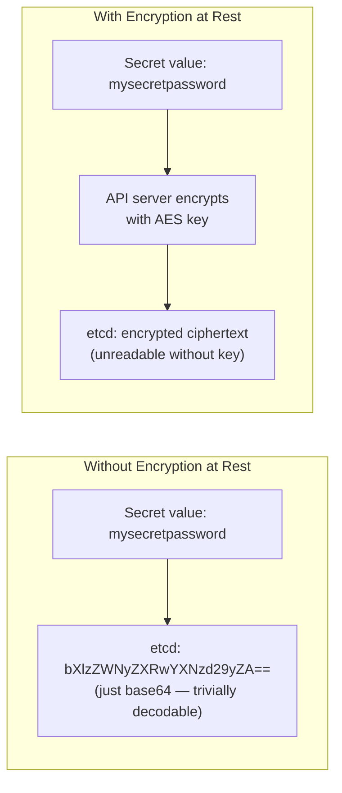
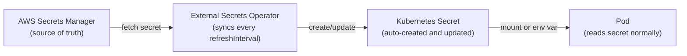
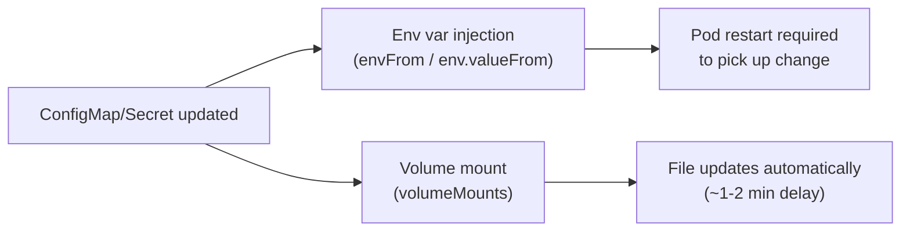

# Kubernetes: ConfigMaps and Secrets

## Why Both Exist — The Environment Parity Problem

Imagine building a containerized application that works perfectly on your laptop. Now deploy it to dev, staging, and production.

The problem:
- Database URLs differ per environment
- Feature flags change frequently
- External service endpoints are not the same
- Credentials must never be hardcoded

If all this is baked **inside the container image**, you're forced to rebuild images for every environment change — and you risk leaking credentials into source control.

> ConfigMaps and Secrets decouple application code from configuration and sensitive data. One image runs everywhere. Configuration is external and injected at runtime.

---

## ConfigMap

A ConfigMap stores **non-sensitive configuration data** as key-value pairs. The values are plain text — human-readable, no encoding.

### Creating a ConfigMap

**From a YAML manifest** (declarative — preferred):

```yaml
apiVersion: v1
kind: ConfigMap
metadata:
  name: app-config
  namespace: production
data:
  APP_ENV: production
  LOG_LEVEL: info
  MAX_CONNECTIONS: "100"          # all values are strings
  DATABASE_HOST: postgres.production.svc.cluster.local
```

**From a config file** — store an entire file as a value:

```yaml
apiVersion: v1
kind: ConfigMap
metadata:
  name: nginx-config
data:
  nginx.conf: |                   # the key is the filename
    server {
      listen 80;
      location / {
        proxy_pass http://localhost:8080;
      }
    }
```

**Imperatively** (useful for quick testing):

```bash
kubectl create configmap app-config \
  --from-literal=APP_ENV=production \
  --from-literal=LOG_LEVEL=info

kubectl create configmap nginx-config \
  --from-file=nginx.conf          # key = filename, value = file contents
```

### Consuming a ConfigMap

**Pattern 1 — Individual environment variables:**

```yaml
spec:
  containers:
  - name: app
    env:
    - name: APP_ENV                    # env var name in the container
      valueFrom:
        configMapKeyRef:
          name: app-config             # ConfigMap name
          key: APP_ENV                 # key inside the ConfigMap
    - name: LOG_LEVEL
      valueFrom:
        configMapKeyRef:
          name: app-config
          key: LOG_LEVEL
```

**Pattern 2 — All keys as environment variables at once:**

```yaml
spec:
  containers:
  - name: app
    envFrom:
    - configMapRef:
        name: app-config              # every key becomes an env var
```

Simpler, but less explicit. If someone adds a key to the ConfigMap, it silently appears as an env var in your container.

**Pattern 3 — Mount as files:**

```yaml
spec:
  containers:
  - name: app
    volumeMounts:
    - name: config-volume
      mountPath: /etc/app/config      # directory inside container
  volumes:
  - name: config-volume
    configMap:
      name: nginx-config              # each key becomes a file
```

Each key in the ConfigMap becomes a file inside `/etc/app/config`. The key `nginx.conf` becomes `/etc/app/config/nginx.conf`. The file content is the value.

**When to use each pattern:**

| Pattern | Use when |
|---|---|
| Individual env vars | You need specific keys, want explicit control |
| `envFrom` | You want all config as env vars, don't mind less explicitness |
| Mounted files | App reads config from a file (nginx, prometheus, etc.) |

---

## Secret

A Secret stores **sensitive data** — passwords, tokens, certificates. It looks similar to a ConfigMap but has important differences in how it's handled.

### Secret Types

Kubernetes has several built-in Secret types. The type controls validation and how the Secret is used:

| Type | Use case |
|---|---|
| `Opaque` | Default. Arbitrary key-value data. Passwords, API tokens, etc. |
| `kubernetes.io/tls` | TLS certificates. Must have `tls.crt` and `tls.key` keys. |
| `kubernetes.io/dockerconfigjson` | Docker registry credentials for pulling private images. |
| `kubernetes.io/service-account-token` | ServiceAccount tokens (auto-created by Kubernetes). |
| `kubernetes.io/ssh-auth` | SSH private keys. |
| `kubernetes.io/basic-auth` | Username and password. |

Most Secrets you create manually are `Opaque`.

### Creating a Secret

Values in Secret manifests must be **base64-encoded** (more on why below):

```bash
echo -n "mysecretpassword" | base64
# bXlzZWNyZXRwYXNzd29yZA==
```

```yaml
apiVersion: v1
kind: Secret
metadata:
  name: db-credentials
  namespace: production
type: Opaque
data:
  DB_PASSWORD: bXlzZWNyZXRwYXNzd29yZA==    # base64-encoded
  DB_USER: cG9zdGdyZXM=                     # base64-encoded "postgres"
```

Or use `stringData` — Kubernetes encodes it for you:

```yaml
apiVersion: v1
kind: Secret
metadata:
  name: db-credentials
type: Opaque
stringData:                     # plain text — Kubernetes base64-encodes on save
  DB_PASSWORD: mysecretpassword
  DB_USER: postgres
```

**Imperatively:**

```bash
kubectl create secret generic db-credentials \
  --from-literal=DB_PASSWORD=mysecretpassword \
  --from-literal=DB_USER=postgres

# TLS secret
kubectl create secret tls my-tls \
  --cert=tls.crt \
  --key=tls.key
```

### Consuming a Secret

Identical patterns to ConfigMap, just different reference types:

**Individual environment variables:**

```yaml
spec:
  containers:
  - name: app
    env:
    - name: DB_PASSWORD
      valueFrom:
        secretKeyRef:
          name: db-credentials
          key: DB_PASSWORD
```

**All keys as environment variables:**

```yaml
spec:
  containers:
  - name: app
    envFrom:
    - secretRef:
        name: db-credentials
```

**Mounted as files** (preferred for sensitive data):

```yaml
spec:
  containers:
  - name: app
    volumeMounts:
    - name: secret-volume
      mountPath: /etc/secrets
      readOnly: true                  # always readOnly for secrets
  volumes:
  - name: secret-volume
    secret:
      secretName: db-credentials
      defaultMode: 0400               # file permissions: owner read-only
```

Each key becomes a file: `/etc/secrets/DB_PASSWORD`. The application reads the file to get the value. This is the preferred pattern for production because:
- The value never appears in `kubectl describe pod` output (env vars do)
- The file can be updated without restarting the pod (more on this below)
- You can set restrictive file permissions

---

## Base64 — Encoding, Not Encryption

The most common misconception about Secrets.

**Base64 is encoding, not encryption.** Anyone who can read the Secret object can decode the value in seconds:

```bash
kubectl get secret db-credentials -o jsonpath='{.data.DB_PASSWORD}' | base64 -d
# mysecretpassword
```

**So why does Kubernetes base64-encode Secrets at all?**

Because Secret values can contain arbitrary binary data — TLS certificates, SSH keys, binary tokens. YAML cannot safely represent raw binary. Base64 converts any binary data into printable ASCII characters that YAML can store without corruption. It is a transport encoding, not a security mechanism.

> Base64 in Secrets is about safe storage of binary data, not confidentiality. Anyone with `kubectl get secret` access can read it in plaintext.

---

## Secrets Are Not Encrypted in etcd By Default

This is the most important security gap most people don't know about.

By default, Kubernetes stores Secrets in etcd as **base64-encoded plaintext**. If an attacker gets access to etcd (or an etcd backup), they can read every Secret in the cluster.

**Encryption at rest** is an optional feature that must be explicitly enabled. When enabled, the API server encrypts Secret values before writing to etcd using a key stored in an `EncryptionConfiguration` file.

```yaml
# /etc/kubernetes/encryption-config.yaml (on the API server node)
apiVersion: apiserver.config.k8s.io/v1
kind: EncryptionConfiguration
resources:
  - resources:
      - secrets
    providers:
      - aescbc:
          keys:
          - name: key1
            secret: <base64-encoded-32-byte-key>
      - identity: {}              # fallback — reads unencrypted secrets
```

On managed clusters (EKS, GKE, AKS), encryption at rest is available but often not enabled by default — check your cluster configuration.



**Defense in depth for Secrets:**
1. Enable encryption at rest in etcd
2. Use RBAC to restrict who can `get`/`list` Secrets
3. Avoid mounting Secrets as env vars in high-security contexts (they appear in `kubectl describe`)
4. Use an external secret manager for the most sensitive credentials

---

## Production Secret Management — External Secrets

For most production systems, storing sensitive credentials directly in Kubernetes Secrets is not enough. The problems:

- Secrets are replicated across etcd nodes — a larger attack surface
- You can't rotate a Secret without updating the Kubernetes object and restarting pods
- Auditing who accessed a Secret is difficult
- Secrets can't be shared across clusters without copying

**External secret managers** (AWS Secrets Manager, HashiCorp Vault, GCP Secret Manager) solve these problems — centralised storage, audit logs, automatic rotation, fine-grained access control.

The **External Secrets Operator (ESO)** bridges external managers and Kubernetes. You define an `ExternalSecret` object that references a secret in AWS/Vault/GCP, and ESO syncs it into a regular Kubernetes Secret:

```yaml
apiVersion: external-secrets.io/v1beta1
kind: ExternalSecret
metadata:
  name: db-credentials
  namespace: production
spec:
  refreshInterval: 1h                  # re-sync from source every hour
  secretStoreRef:
    name: aws-secretsmanager           # which external store to use
    kind: ClusterSecretStore
  target:
    name: db-credentials               # name of the K8s Secret to create
  data:
  - secretKey: DB_PASSWORD             # key in the K8s Secret
    remoteRef:
      key: production/db               # path in AWS Secrets Manager
      property: password               # field inside the secret
```

ESO creates and manages the Kubernetes Secret. Your pods consume it normally — they never know it came from AWS. When the secret is rotated in AWS Secrets Manager, ESO syncs the new value automatically.



---

## Config Updates and Pod Behaviour — A Critical Gotcha

What happens when you update a ConfigMap or Secret that a pod is already using?

**Mounted as files → updates propagate automatically** (with a delay of ~1–2 minutes). The kubelet periodically syncs the volume. Your application needs to watch for file changes and reload — but no pod restart is needed.

**Injected as environment variables → updates do NOT propagate**. Environment variables are set at container start time and are frozen. To pick up the new value, the pod must be restarted.



**Practical implication**: if your application reads config from environment variables (common for 12-factor apps), you need to trigger a rolling restart after a ConfigMap update:

```bash
# Trigger a rolling restart to pick up new env var values
kubectl rollout restart deployment/my-app -n production
```

Some teams add a checksum annotation to the pod template that changes whenever the ConfigMap changes — this forces a rolling restart automatically on `kubectl apply`:

```yaml
spec:
  template:
    metadata:
      annotations:
        checksum/config: {{ include (print $.Template.BasePath "/configmap.yaml") . | sha256sum }}
```

---

## Immutable ConfigMaps and Secrets

Since Kubernetes 1.21, you can mark a ConfigMap or Secret as immutable:

```yaml
apiVersion: v1
kind: ConfigMap
metadata:
  name: app-config
immutable: true             # cannot be changed after creation
data:
  APP_ENV: production
```

Benefits:
- **Performance** — the kubelet stops watching the API server for changes to this object. At scale (thousands of pods), this significantly reduces API server load.
- **Safety** — prevents accidental updates that could silently break running pods.

To change an immutable ConfigMap/Secret, you must delete and recreate it (with a new name), then update the pod spec to reference the new name. This forces a deliberate rollout.

---

## Interview Gotchas

### 1. Base64 is not encryption — anyone with RBAC access can read it

```bash
kubectl get secret db-credentials -o jsonpath='{.data.DB_PASSWORD}' | base64 -d
```

Lock down `get` and `list` on Secrets with RBAC. In particular, `list` on Secrets in a namespace gives access to all secrets in that namespace — treat it as sensitive as `get`.

### 2. Env vars don't update without a pod restart

The single most common ConfigMap/Secret gotcha in interviews. You update the ConfigMap, the pod keeps using the old value. Always restart:

```bash
kubectl rollout restart deployment/my-app
```

### 3. Secrets appear in `kubectl describe pod` output when injected as env vars

```bash
kubectl describe pod my-pod   # env vars are visible in plain text here
```

If a Secret is mounted as a file instead, the value doesn't appear in describe output. For high-security environments, prefer file mounts over env vars.

### 4. Secrets are not encrypted in etcd by default

If someone asks *"are Kubernetes Secrets secure?"* — the correct answer is: *"by default, no. They are base64-encoded in etcd. Encryption at rest must be explicitly enabled, and for production you should use an external secret manager."*

### 5. `stringData` vs `data` — they coexist but behave differently

`data` requires base64-encoded values. `stringData` accepts plain text and Kubernetes encodes it on save. If both are present in the same manifest, `stringData` takes precedence for overlapping keys. When you `kubectl get secret -o yaml`, Kubernetes always returns the `data` field (base64) — `stringData` is write-only.

### 6. Secrets are scoped to a namespace

A pod can only reference a Secret in the same namespace. You cannot mount a Secret from another namespace. If multiple namespaces need the same Secret, you must copy it — or use an external secret manager that syncs to each namespace.
