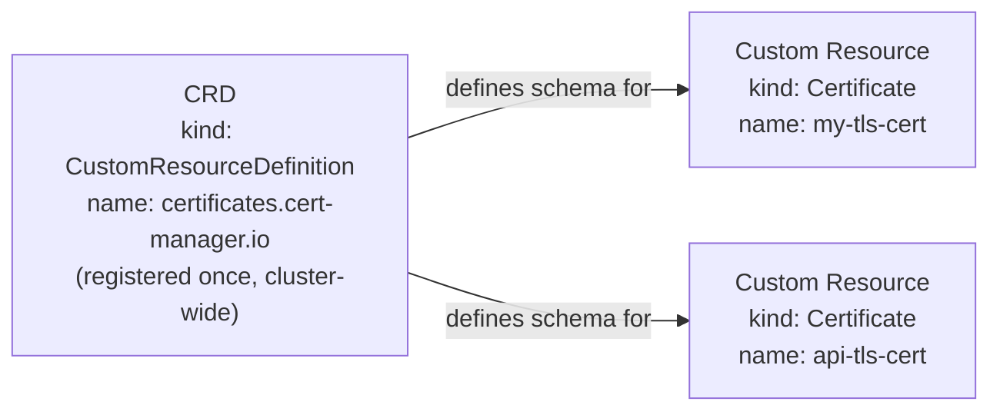
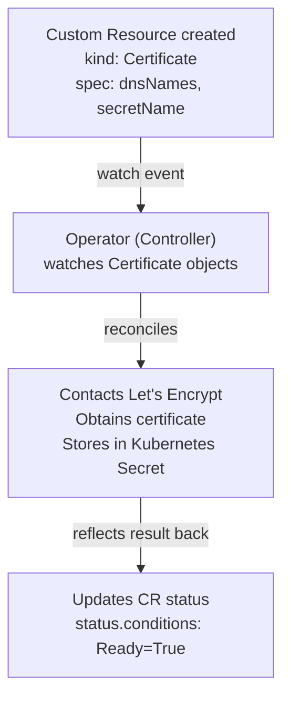
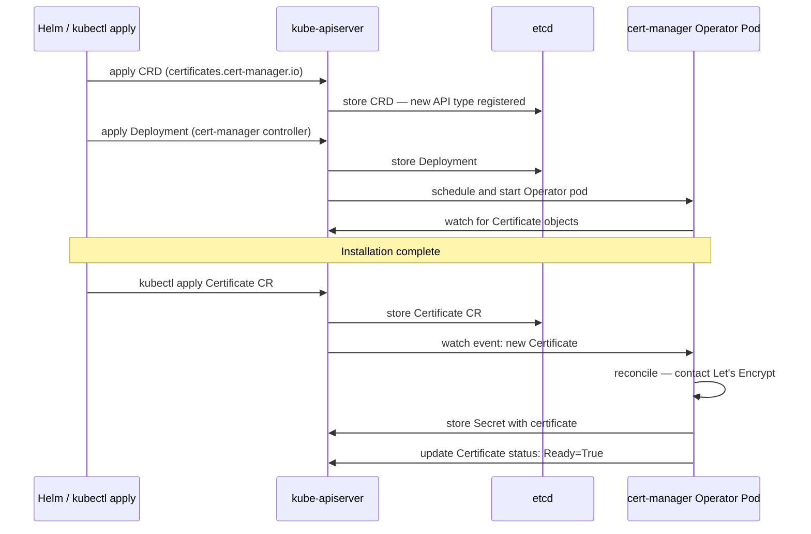
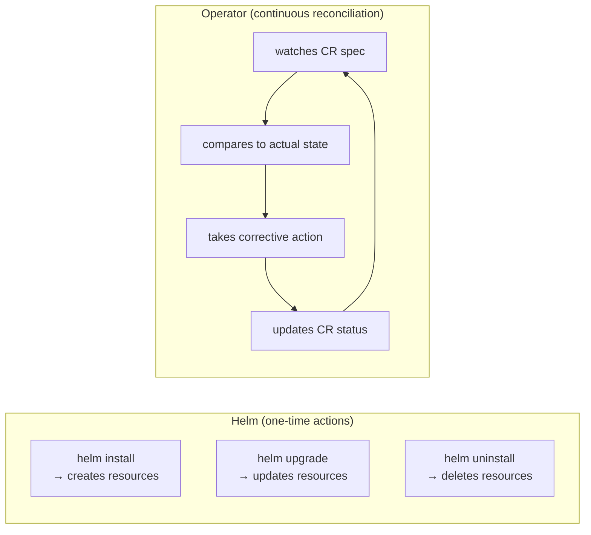
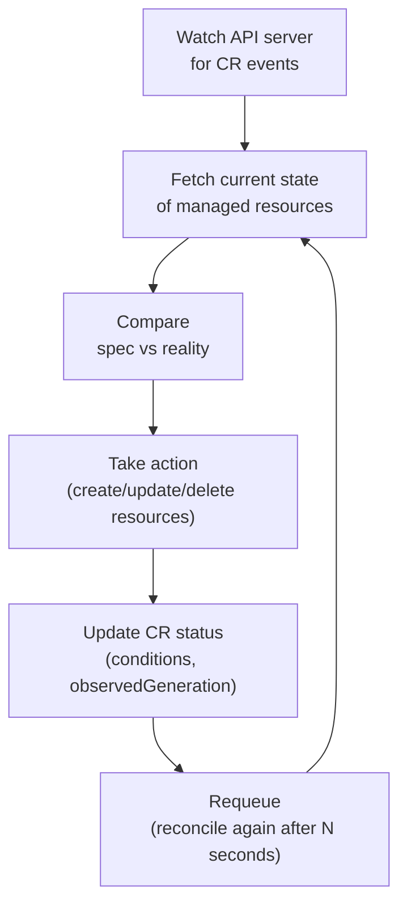

# Kubernetes Custom Resource Definitions (CRDs)

## Why CRDs Exist

Kubernetes ships with a fixed set of built-in resource types — Pods, Deployments, Services, ConfigMaps. These cover most needs, but not all.

What if you want Kubernetes to manage something it doesn't know about natively — a database cluster, a TLS certificate, a message queue consumer group?

You have two options:
1. Manage it outside Kubernetes with separate tooling
2. Teach Kubernetes about it with a **CRD**

A **CRD (CustomResourceDefinition)** extends the Kubernetes API with a new resource type. Once registered, you can create, read, update, and delete instances of your new type using `kubectl` — just like built-in resources.

```bash
# Built-in resources — work out of the box
kubectl get pods
kubectl get deployments

# Custom resources — work after a CRD is installed
kubectl get certificates          # cert-manager CRD
kubectl get externalsecrets       # External Secrets Operator CRD
kubectl get scaledobjects         # KEDA CRD
```

> CRDs let you use Kubernetes as a platform, not just a container scheduler.

---

## CRD vs Custom Resource — The Distinction

These two terms are often confused:

- **CRD (CustomResourceDefinition)** — the schema definition. Tells Kubernetes "this type exists and here's what it looks like." Created once, cluster-wide.
- **Custom Resource (CR)** — an instance of the CRD. The actual object you create, like a specific `Certificate` or `ExternalSecret`.

The relationship is the same as a class and an instance in programming:

```
CRD = class definition  (Certificate type)
CR  = instance          (my-tls-cert of type Certificate)
```



---

## What a CRD Looks Like

You rarely write CRDs yourself — they come bundled with the tool you install (cert-manager, KEDA, ArgoCD). But understanding the structure helps you read and debug them.

```yaml
apiVersion: apiextensions.k8s.io/v1
kind: CustomResourceDefinition
metadata:
  name: certificates.cert-manager.io    # must be <plural>.<group>
spec:
  group: cert-manager.io                # API group — appears in apiVersion
  names:
    kind: Certificate                   # the Kind you use in manifests
    plural: certificates                # used in: kubectl get certificates
    singular: certificate
    shortNames:
    - cert                              # kubectl get cert works too
  scope: Namespaced                     # or Cluster for cluster-scoped resources
  versions:
  - name: v1
    served: true                        # this version is active
    storage: true                       # this version is stored in etcd
    schema:
      openAPIV3Schema:                  # validation schema — rejects invalid CRs
        type: object
        properties:
          spec:
            type: object
            properties:
              dnsNames:
                type: array
                items:
                  type: string
              secretName:
                type: string
            required:
            - secretName               # secretName is mandatory
```

Once this CRD is applied, the API server knows about `Certificate` objects. `kubectl get certificates` works, schema validation is enforced, and RBAC can be applied to it.

---

## Custom Resources — What You Actually Write

Once the CRD is installed, you create custom resources like any other Kubernetes object:

```yaml
# cert-manager Certificate CR
apiVersion: cert-manager.io/v1
kind: Certificate
metadata:
  name: my-tls-cert
  namespace: production
spec:
  secretName: my-tls-secret          # where to store the issued certificate
  dnsNames:
  - example.com
  - www.example.com
  issuerRef:
    name: letsencrypt-prod
    kind: ClusterIssuer
```

```yaml
# KEDA ScaledObject CR
apiVersion: keda.sh/v1alpha1
kind: ScaledObject
metadata:
  name: my-app-scaler
spec:
  scaleTargetRef:
    name: my-app
  triggers:
  - type: aws-sqs-queue
    metadata:
      queueLength: "10"
```

```yaml
# External Secrets Operator CR
apiVersion: external-secrets.io/v1beta1
kind: ExternalSecret
metadata:
  name: db-credentials
spec:
  refreshInterval: 1h
  secretStoreRef:
    name: aws-secretsmanager
    kind: ClusterSecretStore
  target:
    name: db-credentials
  data:
  - secretKey: DB_PASSWORD
    remoteRef:
      key: production/db
      property: password
```

You've already been using CRDs throughout these notes. HPA is a CRD. NetworkPolicy is a CRD. PodDisruptionBudget is a CRD. CRDs are not exotic — they're how Kubernetes is extended in practice.

---

## Operators — CRDs with a Brain

A CRD alone is just a schema. It teaches Kubernetes what a `Certificate` looks like, but nothing happens when you create one. That's where **Operators** come in.

An **Operator** is a controller that watches custom resources and acts on them — it implements the reconciliation loop for your custom type.



The Operator pattern:
1. You declare what you want in the CR spec
2. The Operator figures out how to make it happen
3. The Operator updates the CR status to reflect reality

This is the same reconciliation loop as built-in controllers — just for your custom type. The Operator is just a Pod running in the cluster that watches the API server for its CRD type.

### Real Operators You've Already Used

| Operator | CRDs it manages | What it does |
|---|---|---|
| **cert-manager** | `Certificate`, `ClusterIssuer`, `Issuer` | Requests and renews TLS certs from Let's Encrypt |
| **External Secrets Operator** | `ExternalSecret`, `SecretStore` | Syncs secrets from AWS/Vault into K8s Secrets |
| **KEDA** | `ScaledObject`, `TriggerAuthentication` | Scales deployments based on external metrics |
| **ArgoCD** | `Application`, `AppProject` | Syncs Git repos to cluster state (GitOps) |
| **Prometheus Operator** | `ServiceMonitor`, `PrometheusRule` | Configures Prometheus scraping and alerting rules |

Every time you install one of these tools, you're working with Operators and CRDs.

---

## Interacting with Custom Resources

Custom resources work with all standard kubectl commands:

```bash
# List all CRDs installed in the cluster
kubectl get crds
kubectl get crds | grep cert-manager       # filter by tool

# Inspect a CRD definition (see its schema and versions)
kubectl describe crd certificates.cert-manager.io

# Work with custom resources exactly like built-in resources
kubectl get certificates -n production
kubectl get certificate my-tls-cert -n production -o yaml
kubectl describe certificate my-tls-cert -n production

# Short names work too (if defined in the CRD)
kubectl get cert -n production

# Delete a custom resource
kubectl delete certificate my-tls-cert -n production

# See all custom resources across all CRDs in a namespace
kubectl api-resources --verbs=list --namespaced | awk '{print $1}' \
  | xargs -I{} kubectl get {} -n production 2>/dev/null
```

### The status subresource — where the Operator writes back

The CR status field is written by the Operator, not you. It's how the Operator communicates what actually happened:

```bash
kubectl describe certificate my-tls-cert -n production
```

```
Status:
  Conditions:
    Last Transition Time:  2024-01-15T10:00:00Z
    Message:               Certificate is up to date and has not expired
    Reason:                Ready
    Status:                True
    Type:                  Ready
  Not After:               2024-04-15T10:00:00Z
  Not Before:              2024-01-15T10:00:00Z
  Renewal Time:            2024-03-15T10:00:00Z
```

Always check `kubectl describe` on a custom resource when something isn't working — the `Status.Conditions` is where the Operator tells you what went wrong.

---

## The API Group and Version — How It Fits Together

When you install a CRD, it registers a new API group. The `apiVersion` in your CR manifest is `<group>/<version>`:

```yaml
# cert-manager group: cert-manager.io, version: v1
apiVersion: cert-manager.io/v1
kind: Certificate

# KEDA group: keda.sh, version: v1alpha1
apiVersion: keda.sh/v1alpha1
kind: ScaledObject

# Core group (built-in, no group prefix)
apiVersion: v1
kind: Pod
```

You can see all available API groups in the cluster:

```bash
kubectl api-versions           # list all API groups and versions
kubectl api-resources          # list all resource types with their API groups
kubectl api-resources | grep keda    # see what KEDA registered
```

---

## What Happens When You Install a Tool Like cert-manager

Understanding the install sequence helps when debugging:



If a CR isn't being reconciled, the Operator pod is usually the problem — it's crashed, it lacks RBAC permissions, or it was never installed.

---

## Debugging Custom Resources

When a custom resource isn't working, follow this flow:

### Step 1 — Check the CR status

```bash
kubectl describe <resource-type> <name> -n <namespace>
# Look at Status.Conditions — this is where the Operator writes errors
```

### Step 2 — Check the Operator pod

The Operator is just a Pod. If it's not running, nothing gets reconciled:

```bash
# Find the Operator pod (usually in its own namespace)
kubectl get pods -n cert-manager
kubectl get pods -n keda
kubectl get pods -n external-secrets

# Check Operator logs — this is where reconciliation errors appear
kubectl logs -n cert-manager deploy/cert-manager -f
kubectl logs -n keda deploy/keda-operator -f
```

### Step 3 — Check RBAC

Operators need permissions to read/write resources. If the Operator's ServiceAccount lacks permissions, it silently fails or logs permission errors:

```bash
# Check if the Operator can do what it needs
kubectl auth can-i create secrets \
  --as=system:serviceaccount:cert-manager:cert-manager \
  -n production
```

### Step 4 — Check events

```bash
kubectl get events -n production \
  --field-selector involvedObject.name=my-tls-cert \
  --sort-by='.lastTimestamp'
```

### Step 5 — Check the CRD is installed

If you get `error: the server doesn't have a resource type "certificates"`, the CRD isn't installed:

```bash
kubectl get crds | grep cert-manager
# If empty, cert-manager was never installed or CRDs weren't applied
```

---

## CRD Scope — Namespaced vs Cluster

CRDs can be either namespaced or cluster-scoped:

**Namespaced** — each CR belongs to a namespace. Most CRDs are namespaced:
```yaml
scope: Namespaced   # Certificate, ExternalSecret, ScaledObject
```

**Cluster-scoped** — CRs exist at the cluster level, not in any namespace:
```yaml
scope: Cluster      # ClusterIssuer, ClusterSecretStore, Node, PersistentVolume
```

```bash
# Namespaced — must specify namespace
kubectl get certificates -n production

# Cluster-scoped — no namespace needed
kubectl get clusterissuers
kubectl get clustersecretstores
```

---

## Interview Gotchas

### 1. CRDs are just data without an Operator

Creating a CRD and a CR does nothing on its own. The CR is just stored in etcd. You need an Operator (a controller watching that CRD) to act on it. If you install cert-manager CRDs but not the cert-manager controller, your `Certificate` objects will sit there forever with nothing happening.

### 2. `the server doesn't have a resource type` — CRD not installed

```bash
kubectl get certificates
# error: the server doesn't have a resource type "certificates"
```

The CRD isn't registered. Either the tool wasn't installed, or the CRD installation failed separately from the Operator. Check:

```bash
kubectl get crds | grep cert-manager
```

### 3. CR stuck — always check the Operator logs first

The CR status conditions tell you what the Operator reported. The Operator logs tell you why it failed. Both together give you the full picture. A `Certificate` stuck in `Ready=False` with `Message: failed to create order` is an Operator-level error — check cert-manager logs.

### 4. Deleting a CRD deletes all custom resources of that type

```bash
kubectl delete crd certificates.cert-manager.io
# This also deletes EVERY Certificate object in the cluster — no warning
```

This is why you never delete CRDs without first understanding what depends on them. Uninstalling a Helm chart that manages CRDs (`helm uninstall cert-manager`) will delete the CRDs and all CRs if not handled carefully. cert-manager specifically documents keeping CRDs on uninstall for this reason.

### 5. Status conditions are the Operator's language — learn to read them

Every Operator uses `status.conditions` to communicate. The pattern is always:

```
Type:    Ready / Synced / Healthy / Progressing
Status:  True / False / Unknown
Reason:  short machine-readable reason code
Message: human-readable explanation
```

`kubectl describe` on any CR and scroll to Status — this is always the first place to look when a CR isn't working.

### 6. Finalizers on CRs can cause stuck deletion — same as built-in resources

Operators often add finalizers to CRs to ensure cleanup before deletion. If the Operator is gone, the CR will hang in `Terminating` forever:

```bash
kubectl get certificate my-tls-cert -o yaml | grep finalizers
# finalizers:
# - cert-manager.io/certificate-protection

# Fix: remove the finalizer manually
kubectl patch certificate my-tls-cert \
  -p '{"metadata":{"finalizers":[]}}' --type=merge
```

---

## The Operator Pattern

### Controllers vs Operators — The Distinction

These terms are often used interchangeably but they mean different things:

- **Controller** — any control loop that watches Kubernetes objects and reconciles state. The Deployment controller, ReplicaSet controller, and Node controller are all controllers. They're built into Kubernetes.
- **Operator** — a controller that manages a **complex, stateful, domain-specific** application using CRDs. It encodes human operational knowledge — the kind of knowledge a database administrator would use — into software.

> All Operators are controllers. Not all controllers are Operators.

The Deployment controller knows how to roll out pods. An Operator knows how to do a zero-downtime PostgreSQL major version upgrade, initiate a backup before scaling down, or automatically failover a primary to a replica. That domain-specific knowledge is what makes something an Operator, not just a controller.

### Why Operators Over Helm or Scripts?

A Helm chart can install a database. But it can't:
- Automatically take a backup before an upgrade
- Detect that a replica has fallen behind and re-sync it
- Respond to a primary failure by promoting a replica
- Continuously ensure the cluster is in a healthy topology

Helm is a **one-time action** — install, upgrade, uninstall. An Operator is a **continuous process** — it watches the cluster and keeps taking corrective action as long as it runs.



For stateless apps, Helm is often enough. For stateful, complex systems — databases, message queues, ML pipelines — Operators are the right abstraction.

### The Reconciliation Loop in an Operator

Every Operator implements the same core loop:

```
1. Watch — listen for events on the CRD (create, update, delete)
2. Fetch — get the current state of the world
3. Compare — desired state (spec) vs actual state (status/reality)
4. Act — create, update, or delete resources to close the gap
5. Update status — write the result back to the CR status
6. Repeat
```

The loop is **level-triggered, not edge-triggered**. This means the Operator doesn't just react to events — it periodically re-reconciles even without events, in case something drifted. If someone manually deletes a resource that the Operator manages, the next reconcile cycle will recreate it.



### Operator Maturity Levels

The Operator SDK defines five maturity levels. This is a useful framework for interviews — it shows you understand that "Operator" covers a spectrum:

| Level | Capability | Example |
|---|---|---|
| **Level 1 — Basic Install** | Automated installation and configuration | Installs the app, sets config from CR spec |
| **Level 2 — Seamless Upgrades** | Handles patch and minor version upgrades | Upgrades Postgres 14.1 → 14.2 safely |
| **Level 3 — Full Lifecycle** | Backup, restore, failure recovery | Auto-backup before upgrade, restore from snapshot |
| **Level 4 — Deep Insights** | Metrics, alerts, log processing | Exposes Prometheus metrics, creates alerts |
| **Level 5 — Auto Pilot** | Horizontal/vertical scaling, auto-config tuning | Auto-tunes memory settings based on workload |

Most production Operators sit at Level 2–3. Level 5 is rare and complex.

cert-manager is around Level 2 — it installs certs and handles renewal. The Zalando PostgreSQL Operator is around Level 3–4 — it handles backups, failover, and monitoring.

### When to Use an Existing Operator vs Build Your Own

**Use an existing Operator when:**
- A well-maintained one exists (check OperatorHub.io)
- The software is a well-known stateful system (PostgreSQL, Redis, Kafka, Elasticsearch)
- You don't need custom behaviour beyond what the Operator provides

**Build your own Operator when:**
- You have internal tooling or platforms that need Kubernetes-native management
- You want to automate complex operational procedures that are currently manual runbooks
- You need to manage resources across multiple systems (Kubernetes + cloud APIs)
- No existing Operator fits your needs

**At mid-level, you're almost always using existing Operators, not building them.** Building one is a senior/staff engineering task. But understanding the pattern helps you debug, configure, and trust the Operators you rely on.

### Real Example — How the Prometheus Operator Works

The Prometheus Operator is a good example because you likely interact with it and it illustrates the pattern clearly.

Without the Operator, configuring Prometheus to scrape a new service requires editing Prometheus config files and reloading. In a dynamic Kubernetes environment with services constantly coming and going, this is unmanageable.

With the Prometheus Operator:

1. You create a `ServiceMonitor` CR that says "scrape services with label `app=my-app` on port `metrics`"
2. The Operator watches for `ServiceMonitor` objects
3. When it sees one, it generates the corresponding Prometheus scrape config
4. It reloads Prometheus — no manual intervention

```yaml
# You write this — declarative intent
apiVersion: monitoring.coreos.com/v1
kind: ServiceMonitor
metadata:
  name: my-app-monitor
  namespace: production
spec:
  selector:
    matchLabels:
      app: my-app                  # scrape services with this label
  endpoints:
  - port: metrics                  # on this port
    interval: 30s                  # every 30 seconds
```

The Operator translates this intent into actual Prometheus configuration. You never touch Prometheus config files directly. New services get scraped automatically when they add a `ServiceMonitor`. Deleted services stop being scraped when their `ServiceMonitor` is deleted.

This is the Operator pattern at its best — domain knowledge (how to configure Prometheus) encoded into software, managed declaratively.
