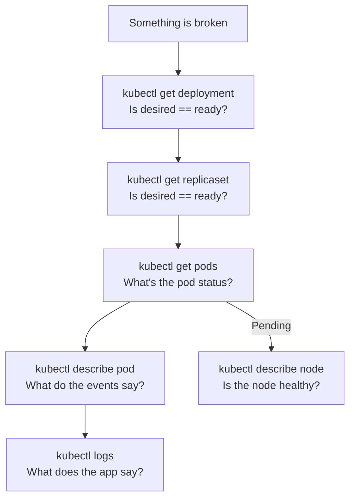

# Kubernetes Observability and Debugging

## Why Observability Matters

Running an application on Kubernetes adds layers of abstraction between you and your code — containers, pods, nodes, controllers, networking. When something breaks, you need to know which layer failed and why.

Observability in Kubernetes has three pillars:

| Pillar | What it tells you | Tools |
|---|---|---|
| **Logs** | What happened inside a container | `kubectl logs`, Fluentd, Loki |
| **Metrics** | How resources are being used over time | Prometheus, metrics-server, Grafana |
| **Traces** | How a request flows through services | Jaeger, Tempo, OpenTelemetry |

In an interview, observability questions are usually scenario-based: *"Your service is returning 503s — walk me through how you'd debug it."* This note covers both the theory and the practical debugging flow.

---

## The Debugging Mindset — Work Top-Down

When something is broken, always start at the highest level and work down:

```
Deployment → ReplicaSet → Pod → Container → Node
```

Don't jump straight to container logs. Check if the pod even exists, is scheduled, and is running first. Half the time the problem is visible before you get to logs.



---

## Essential kubectl Commands

### Viewing Resources

```bash
# Get overview of what's running
kubectl get all -n production
kubectl get pods -n production
kubectl get pods -n production -o wide        # show node name and IP
kubectl get pods -n production -w             # watch for changes in real time

# Filter by label
kubectl get pods -n production -l app=my-app

# Show pod IPs and nodes
kubectl get pods -n production -o wide

# Get raw YAML — see spec AND status
kubectl get pod my-pod -n production -o yaml
kubectl get deployment my-app -n production -o yaml
```

### Describing Resources — The Most Useful Command

`kubectl describe` shows human-readable details including **Events** — the timeline of what Kubernetes did with this object. Always check events first.

```bash
kubectl describe pod my-pod -n production
kubectl describe deployment my-app -n production
kubectl describe node my-node
kubectl describe service my-service -n production
```

The Events section at the bottom of `describe` output tells you exactly what went wrong:

```
Events:
  Type     Reason            Age   Message
  ----     ------            ----  -------
  Warning  FailedScheduling  5m    0/3 nodes available: insufficient memory
  Normal   Scheduled         4m    Successfully assigned to node-2
  Normal   Pulling           4m    Pulling image "my-app:v1.4.2"
  Warning  Failed            3m    Failed to pull image: not found
```

### Logs

```bash
# Basic logs
kubectl logs my-pod -n production

# Follow logs in real time
kubectl logs my-pod -n production -f

# Last N lines
kubectl logs my-pod -n production --tail=100

# Logs from a specific container in a multi-container pod
kubectl logs my-pod -n production -c sidecar-container

# Logs from a previous (crashed) container — critical for CrashLoopBackOff
kubectl logs my-pod -n production --previous

# Logs from all pods matching a label
kubectl logs -n production -l app=my-app --prefix

# Logs since a time window
kubectl logs my-pod -n production --since=1h
kubectl logs my-pod -n production --since-time="2024-01-15T10:00:00Z"
```

### Exec — Shell Into a Running Container

```bash
# Shell into a running pod
kubectl exec -it my-pod -n production -- /bin/sh
kubectl exec -it my-pod -n production -- /bin/bash

# Run a one-off command
kubectl exec my-pod -n production -- curl localhost:8080/healthz
kubectl exec my-pod -n production -- env | grep DATABASE

# Exec into a specific container
kubectl exec -it my-pod -n production -c sidecar -- /bin/sh
```

### Ephemeral Debug Containers — When the Pod Has No Shell

Distroless images have no shell, no curl, no debugging tools. Add an ephemeral container without restarting the pod:

```bash
# Add a debug container sharing the target container's process namespace
kubectl debug -it my-pod -n production \
  --image=busybox \
  --target=my-app          # share process namespace of my-app container

# Create a copy of the pod with a debug container added
kubectl debug my-pod -n production \
  --copy-to=my-pod-debug \
  --image=busybox \
  --share-processes
```

### Port Forwarding — Access a Pod or Service Locally

```bash
# Forward local port 8080 to pod port 8080
kubectl port-forward pod/my-pod 8080:8080 -n production

# Forward to a service (distributes across pods)
kubectl port-forward service/my-service 8080:80 -n production

# Test an endpoint directly, bypassing Ingress and Services
kubectl port-forward pod/my-pod 8080:8080 -n production &
curl localhost:8080/healthz
```

Port forwarding is essential for isolating whether a problem is in the app, the Service, or the Ingress.

### Resource Usage

```bash
# CPU and memory usage for pods (requires metrics-server)
kubectl top pods -n production
kubectl top pods -n production --sort-by=cpu
kubectl top pods -n production --sort-by=memory

# Node resource usage
kubectl top nodes

# Combine with watch
watch kubectl top pods -n production
```

---

## Pod Status Reference — What Each Status Means

| Status | Meaning | First thing to check |
|---|---|---|
| `Pending` | Not scheduled yet | `kubectl describe pod` — events show why |
| `ContainerCreating` | Scheduled, pulling image or setting up volumes | `kubectl describe pod` — image pull events |
| `Running` | At least one container running | Check readiness probe if traffic not flowing |
| `CrashLoopBackOff` | Container keeps crashing | `kubectl logs --previous` |
| `OOMKilled` | Killed by kernel — exceeded memory limit | Increase memory limit or fix memory leak |
| `Error` | Container exited with non-zero code | `kubectl logs` for exit reason |
| `Terminating` | Being deleted | Check finalizers if stuck |
| `ImagePullBackOff` | Can't pull image | Check image name, tag, registry credentials |
| `ErrImagePull` | First image pull failure (before backoff) | Same as above |
| `Completed` | Job/init container finished successfully | Normal — not an error |
| `Unknown` | Node lost contact with API server | Check node health |

---

## Scenario 1 — Pod is Pending

Pod exists but isn't running. Something is blocking scheduling.

```bash
kubectl describe pod my-pod -n production
# Look at Events at the bottom
```

**Common causes and fixes:**

**Insufficient resources:**
```
Events: 0/3 nodes available: insufficient cpu, insufficient memory
```
Check what's available vs what's requested:
```bash
kubectl describe nodes | grep -A 5 "Allocated resources"
kubectl top nodes
```
Fix: scale up node group, reduce pod requests, or add nodes.

**Taint/toleration mismatch:**
```
Events: 0/3 nodes available: node(s) had taint {dedicated: gpu}, pod didn't tolerate
```
Fix: add toleration to pod spec or remove taint from node.

**Node affinity not satisfied:**
```
Events: 0/3 nodes available: node(s) didn't match node affinity
```
Fix: check `nodeAffinity` rules against actual node labels (`kubectl get nodes --show-labels`).

**PVC not bound:**
```
Events: pod has unbound PersistentVolumeClaims
```
Fix: check PVC status (`kubectl get pvc -n production`) — likely a storage provisioning issue.

---

## Scenario 2 — Pod is CrashLoopBackOff

The container starts, crashes, Kubernetes restarts it, it crashes again. Backoff increases each time (10s → 20s → 40s → up to 5min).

```bash
# Step 1: Get logs from the crashed container (not the current one)
kubectl logs my-pod -n production --previous

# Step 2: Check the exit code
kubectl describe pod my-pod -n production
# Look for: Last State: Terminated, Exit Code: 1 (or 137 for OOMKill, 143 for SIGTERM)
```

**Exit code reference:**

| Exit Code | Meaning |
|---|---|
| `0` | Clean exit |
| `1` | Application error |
| `137` | OOMKilled (128 + signal 9) |
| `139` | Segfault (128 + signal 11) |
| `143` | SIGTERM received but not handled (128 + signal 15) |

**Common causes:**
- Application crashes on startup — bad config, missing env var, can't connect to DB
- OOMKilled on startup — memory limit too low for app initialisation
- Liveness probe misconfigured — failing before app is ready, causing restart loop
- Missing file or secret that the app expects at startup

---

## Scenario 3 — Pod is Running but Not Receiving Traffic

Pod is `Running` but requests aren't reaching it. The problem is usually in Service wiring or readiness probes.

```bash
# Step 1: Check if pod is Ready (readiness probe passing)
kubectl get pods -n production
# Look at READY column — 0/1 means readiness probe failing

# Step 2: Check readiness probe details
kubectl describe pod my-pod -n production
# Look for: Readiness probe failed

# Step 3: Check if Service is selecting this pod
kubectl describe service my-service -n production
# Look at: Endpoints — should list pod IPs
# If Endpoints is empty or missing your pod, label selector is wrong

# Step 4: Check endpoint slice
kubectl get endpointslices -n production -l kubernetes.io/service-name=my-service

# Step 5: Test the pod directly (bypass Service)
kubectl port-forward pod/my-pod 8080:8080 -n production &
curl localhost:8080/

# Step 6: Test the Service directly (bypass Ingress)
kubectl port-forward service/my-service 8080:80 -n production &
curl localhost:8080/
```

**Narrowing it down:**

| Test | Result | Conclusion |
|---|---|---|
| Direct pod call works | ✓ | App is fine — problem is in Service/Ingress |
| Direct pod call fails | ✗ | Problem is in the app |
| Service call works | ✓ | Problem is in Ingress config |
| Service call fails | ✗ | Service selector wrong or no ready pods |

---

## Scenario 4 — Service Returns 503 / Intermittent Errors

Partial failure — some requests succeed, some fail. Usually caused by some pods being unhealthy while others are fine.

```bash
# Step 1: Check pod status across replicas
kubectl get pods -n production -l app=my-app
# Look for pods with Restarts > 0 or not Ready

# Step 2: Check which pods are in the endpoint slice
kubectl get endpointslices -n production

# Step 3: Look at events across the deployment
kubectl describe deployment my-app -n production

# Step 4: Check recent logs across all pods
kubectl logs -n production -l app=my-app --tail=50 --prefix

# Step 5: Check if HPA is oscillating
kubectl describe hpa my-app-hpa -n production
```

503s during a rolling deployment are usually caused by:
- `maxUnavailable > 0` with readiness probes not configured
- New pods receiving traffic before they're ready
- Old pods being terminated before new ones are ready

Fix: set `maxUnavailable: 0` and ensure readiness probes are correctly configured.

---

## Scenario 5 — Node is NotReady

A node stopped heartbeating. Pods on it enter `Unknown` state and are eventually rescheduled.

```bash
# Check node status
kubectl get nodes
# NAME       STATUS     ROLES    AGE
# node-1     NotReady   <none>   5d

# Get details on why
kubectl describe node node-1
# Look at: Conditions section — DiskPressure, MemoryPressure, PIDPressure, Ready

# Check node events
kubectl get events -n kube-system --field-selector involvedObject.name=node-1

# Check what's running on the affected node
kubectl get pods -A --field-selector spec.nodeName=node-1
```

**Common causes:**
- Node ran out of disk space (DiskPressure)
- Node ran out of memory (MemoryPressure)
- kubelet crashed or stopped
- Network partition between node and control plane

If the node truly died, pods will be rescheduled after `pod-eviction-timeout` (default 5 minutes). For RWO volumes, there may be an additional wait for force-detach.

---

## Scenario 6 — Deployment Rollout Stuck

```bash
# Check rollout status
kubectl rollout status deployment/my-app -n production
# Waiting for deployment "my-app" rollout to finish: 1 out of 3 new replicas have been updated

# Check what the new pods are doing
kubectl get pods -n production -l app=my-app
# New pods are likely in CrashLoopBackOff or failing readiness probes

# Check deployment conditions
kubectl describe deployment my-app -n production
# Look for: Progressing condition = False
# progressDeadlineSeconds exceeded = deployment gave up

# Roll back if needed
kubectl rollout undo deployment/my-app -n production
kubectl rollout status deployment/my-app -n production   # confirm rollback
```

---

## Kubernetes Events — The Cluster's Audit Log

Events are the most underused debugging tool. Every significant action in the cluster generates an event.

```bash
# All events in a namespace, newest first
kubectl get events -n production --sort-by='.lastTimestamp'

# Events for a specific object
kubectl get events -n production \
  --field-selector involvedObject.name=my-pod

# Watch events in real time
kubectl get events -n production -w

# Events across all namespaces
kubectl get events -A --sort-by='.lastTimestamp'

# Only warnings
kubectl get events -n production --field-selector type=Warning
```

Events are kept for 1 hour by default — if you're debugging something that happened hours ago, events may be gone. This is why centralised logging matters.

---

## Metrics and Resource Monitoring

### metrics-server — In-Cluster Resource Metrics

`metrics-server` collects CPU and memory from each node's kubelet and exposes them via the Metrics API. Used by HPA and `kubectl top`.

```bash
# Pod resource usage
kubectl top pods -n production
# NAME          CPU(cores)   MEMORY(bytes)
# my-app-abc    45m          128Mi

# Node resource usage
kubectl top nodes
# NAME      CPU(cores)   CPU%   MEMORY(bytes)   MEMORY%
# node-1    850m         21%    4Gi             25%

# Sort by resource usage
kubectl top pods -n production --sort-by=memory
```

### Reading Node Capacity vs Allocation

```bash
kubectl describe node my-node
# Capacity:           Total hardware resources
# Allocatable:        Available for pods (minus system reservation)
# Allocated resources:
#   Resource    Requests    Limits
#   cpu         2200m/4000m 4000m/4000m   ← 55% requested, 100% limited
#   memory      6Gi/14Gi    12Gi/14Gi
```

A node where requests are near 100% is "full" from the scheduler's perspective — new pods won't be scheduled here even if actual usage is low. This is the difference between **allocated** (what pods asked for) and **used** (what pods are actually consuming).

### Prometheus and Grafana — Production Monitoring

`metrics-server` only gives you current values. For historical data, alerting, and dashboards, you need **Prometheus** (metrics storage) and **Grafana** (visualisation).

Key metrics to monitor for Kubernetes workloads:

```promql
# Pod restart rate (alerts on CrashLoopBackOff pattern)
rate(kube_pod_container_status_restarts_total[5m]) > 0

# Pod not ready
kube_pod_status_ready{condition="false"} == 1

# Node CPU near capacity
(sum(rate(container_cpu_usage_seconds_total[5m])) by (node))
  / sum(kube_node_status_allocatable{resource="cpu"}) by (node) > 0.85

# Memory near limit (risk of OOMKill)
container_memory_working_set_bytes / container_spec_memory_limit_bytes > 0.9

# HPA at max replicas (can't scale further)
kube_horizontalpodautoscaler_status_current_replicas
  == kube_horizontalpodautoscaler_spec_max_replicas
```

---

## Centralised Logging — Beyond kubectl logs

`kubectl logs` only shows logs from currently running containers. For historical logs, logs from crashed containers (beyond `--previous`), and logs across many pods simultaneously, you need a centralised logging stack.

### Common Stack — Fluentd/Fluent Bit + Elasticsearch/Loki

**Fluent Bit** runs as a DaemonSet on every node, reads container logs from `/var/log/containers/`, and ships them to a backend.

```yaml
# Fluent Bit DaemonSet (simplified)
apiVersion: apps/v1
kind: DaemonSet
metadata:
  name: fluent-bit
  namespace: logging
spec:
  template:
    spec:
      containers:
      - name: fluent-bit
        image: fluent/fluent-bit:latest
        volumeMounts:
        - name: varlog
          mountPath: /var/log          # read container logs from node
      volumes:
      - name: varlog
        hostPath:
          path: /var/log
```

**Loki** (from Grafana) is the lightweight alternative to Elasticsearch — stores logs compressed, indexes only labels not log content. More cost-effective for Kubernetes log volumes.

**The pattern:**
```
Container logs → /var/log/containers/ on node
→ Fluent Bit DaemonSet reads and ships
→ Loki / Elasticsearch stores
→ Grafana / Kibana queries
```

---

## kubectl Useful One-Liners

```bash
# Get all pods not in Running state across all namespaces
kubectl get pods -A --field-selector status.phase!=Running

# Get pods on a specific node
kubectl get pods -A --field-selector spec.nodeName=node-1

# Delete all pods in CrashLoopBackOff (they'll be recreated by ReplicaSet)
kubectl get pods -n production | grep CrashLoopBackOff \
  | awk '{print $1}' | xargs kubectl delete pod -n production

# Get all images running in the cluster
kubectl get pods -A -o jsonpath='{range .items[*]}{.spec.containers[*].image}{"\n"}{end}' | sort -u

# Check resource requests vs limits across all pods in a namespace
kubectl get pods -n production -o custom-columns=\
"NAME:.metadata.name,\
CPU_REQ:.spec.containers[*].resources.requests.cpu,\
MEM_REQ:.spec.containers[*].resources.requests.memory,\
CPU_LIM:.spec.containers[*].resources.limits.cpu,\
MEM_LIM:.spec.containers[*].resources.limits.memory"

# Restart all pods in a deployment without changing anything
kubectl rollout restart deployment/my-app -n production

# Force delete a stuck terminating pod (last resort — risk of data loss)
kubectl delete pod my-pod -n production --force --grace-period=0

# Get the last applied configuration
kubectl get deployment my-app -n production \
  -o jsonpath='{.metadata.annotations.kubectl\.kubernetes\.io/last-applied-configuration}'
```

---

## Debugging Network Issues

When pods can't reach each other or external services:

```bash
# Test DNS resolution from inside a pod
kubectl exec my-pod -n production -- nslookup my-service.production.svc.cluster.local
kubectl exec my-pod -n production -- nslookup kubernetes.default.svc.cluster.local

# Test connectivity to another service
kubectl exec my-pod -n production -- curl http://my-service.production.svc.cluster.local/healthz

# Test connectivity from a temporary debug pod
kubectl run debug --image=busybox --rm -it --restart=Never -- sh
# Inside: wget -O- http://my-service.production.svc.cluster.local

# Check if CoreDNS is running
kubectl get pods -n kube-system -l k8s-app=kube-dns

# Check CoreDNS logs
kubectl logs -n kube-system -l k8s-app=kube-dns

# Check kube-proxy is running on the node
kubectl get pods -n kube-system -l k8s-app=kube-proxy

# Check iptables rules (if you have node access)
iptables -t nat -L KUBE-SERVICES | grep my-service
```

**DNS not resolving inside a pod** — usually CoreDNS is down or overloaded. Check CoreDNS pod status and logs first.

**Service reachable but pod not reachable** — check that the pod IP is in the endpoint slice. If not, readiness probe is failing.

**Pod can't reach external internet** — check NetworkPolicy isn't blocking egress, and that the node has internet access (NAT gateway, VPC routing).

---

## Interview Gotchas

### 1. Always check events before logs

Events show what Kubernetes did. Logs show what the app did. A pod failing to schedule, failing to pull an image, or failing a probe — all show up in events, not logs. `kubectl describe pod` → events section is step one.

### 2. `--previous` is the key flag for CrashLoopBackOff

```bash
kubectl logs my-pod -n production --previous
```

Without `--previous`, you get logs from the current (possibly just-started) container — which may show nothing useful. `--previous` gives you logs from the last crashed container.

### 3. Empty Endpoints means Service isn't selecting any pods

```bash
kubectl describe service my-service -n production
# Endpoints: <none>   ← nothing selected
```

This means either no pods match the Service's `selector`, or matching pods exist but their readiness probe is failing. Check: do the pod labels exactly match the Service selector?

### 4. Allocated ≠ Used — nodes can be "full" with low actual usage

A node at 95% CPU **requests** won't accept new pods — the scheduler treats it as full. But actual CPU **usage** might be 20%. Use `kubectl top nodes` for usage and `kubectl describe node` for allocation. They tell you different things.

### 5. Port forwarding bypasses all networking layers

`kubectl port-forward` connects directly to the pod via the API server tunnel — it bypasses Services, Ingress, NetworkPolicies, and load balancers. If your app works via port-forward but not via the Service, the problem is in the Service layer, not the app.

### 6. Events expire after 1 hour

By default, Kubernetes events are kept for 1 hour. If you're debugging something that happened earlier, the events are gone. This is why centralised logging (Loki, Elasticsearch) is critical in production — `kubectl logs` and `kubectl get events` only give you the last hour.

### 7. kubectl top requires metrics-server

`kubectl top pods` and `kubectl top nodes` require `metrics-server` to be installed. If you see `error: Metrics API not available`, install metrics-server first.

### 8. Describe a node when pods are Pending with no obvious cause

Sometimes all nodes are available and the pod still won't schedule. `kubectl describe node` shows conditions (DiskPressure, MemoryPressure, PIDPressure) and resource allocation that `kubectl get nodes` doesn't surface. A node can show `Ready` but still be under pressure.
