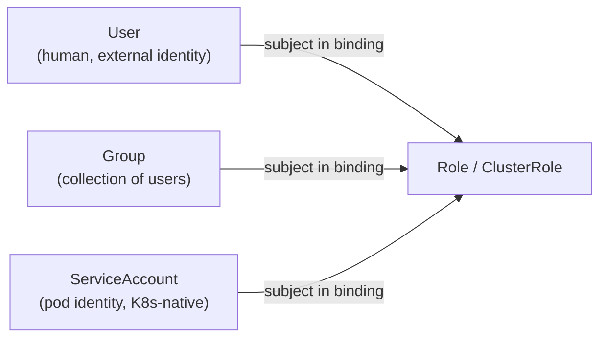
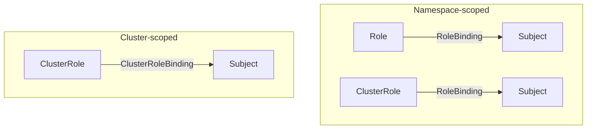

# Kubernetes: RBAC and ABAC

## Why Authorization Matters

Kubernetes is fundamentally an API-driven system. Every action — creating a Pod, reading a Secret, scaling a Deployment — is an API request to the `kube-apiserver`.

In a single-user setup, unrestricted access may appear harmless. In real systems, clusters are shared by multiple teams, automation, and platform tooling.

Without proper authorization:
- Any identity can perform destructive actions
- Mistakes have cluster-wide impact
- Security boundaries do not exist

Authorization answers one question:

> Is this authenticated identity allowed to perform this action on this resource?

---

## Authentication vs Authorization

These are two separate steps that happen in sequence:

- **Authentication** — Who are you? (certificates, tokens, OIDC)
- **Authorization** — What are you allowed to do?

RBAC and ABAC are authorization mechanisms only. They are evaluated **after** authentication succeeds. A request that fails authentication never reaches authorization.

---

## ABAC — Attribute-Based Access Control

### What Is ABAC?

ABAC makes authorization decisions based on attributes of the request:
- User identity
- Resource type
- Namespace
- Request verb

In Kubernetes, ABAC rules are defined in a **static policy file** on the API server node itself.

```json
{
  "apiVersion": "abac.authorization.kubernetes.io/v1beta1",
  "kind": "Policy",
  "spec": {
    "user": "alice",
    "namespace": "dev",
    "resource": "pods",
    "readonly": true
  }
}
```

This allows `alice` to read Pods in the `dev` namespace.

### Why ABAC Failed in Practice

The policy file lives on disk on the API server node. This creates a fundamental operational problem:

- **Every change requires an API server restart** — you can't update policies live
- **No API for managing policies** — you can't use `kubectl`, CI/CD, or GitOps
- **Hard to audit** — policies are scattered JSON in a file, not Kubernetes objects
- **Doesn't scale** — as teams and services grow, the file becomes unmanageable

ABAC is considered legacy. No modern Kubernetes cluster uses it. It's worth knowing it exists and why it was replaced — that's the interview-relevant part.

---

## RBAC — Role-Based Access Control

RBAC fixes every problem ABAC had. Permissions are defined as **Kubernetes API objects** — you manage them with `kubectl`, store them in Git, and apply them without restarting anything.

The core idea: **separate what you can do from who you are.**

- A **Role** defines a set of permissions (what actions on what resources)
- A **Subject** is the identity (who)
- A **Binding** connects them

---

## Subjects — Who Can Be Granted Permissions

Before looking at Roles, you need to understand what a Subject is. In Kubernetes, there are three kinds:

### Users

A human identity. Kubernetes has **no internal user object** — users are external identities managed outside the cluster (certificates, OIDC tokens from an identity provider like Google or Okta). You can't run `kubectl get users`. The username is just a string extracted from the certificate or token by the authentication layer.

### Groups

A collection of users. Also external — Kubernetes doesn't manage group membership. A user's groups come from their certificate or token (e.g. `system:masters` is a group that grants cluster-admin). Useful for granting permissions to an entire team at once.

### ServiceAccounts

This is the important one for SRE/platform roles. A **ServiceAccount** is a Kubernetes-native identity for **processes running inside pods** — not humans.

When your API pod needs to call the Kubernetes API (to list pods, read ConfigMaps, etc.), it authenticates using a ServiceAccount. Unlike users, ServiceAccounts are actual Kubernetes objects that you create and manage:

```yaml
apiVersion: v1
kind: ServiceAccount
metadata:
  name: prometheus
  namespace: monitoring
```

Every namespace gets a `default` ServiceAccount automatically. Every pod that doesn't specify a ServiceAccount gets the `default` one — and by default it has no permissions, but it still gets a token mounted. More on this in the gotchas.



---

## RBAC Core Objects

### apiGroups, Resources, and Verbs

Every RBAC rule is built from three things:

**apiGroups** — which API group the resource belongs to:
- `""` (empty string) = core group: `pods`, `services`, `secrets`, `configmaps`, `namespaces`
- `apps` = `deployments`, `replicasets`, `statefulsets`
- `batch` = `jobs`, `cronjobs`
- `networking.k8s.io` = `ingresses`, `networkpolicies`

**resources** — the object types the rule applies to:
- `pods`, `deployments`, `secrets`, etc.
- Subresources like `pods/log`, `pods/exec`, `pods/portforward` are separate — **permission on `pods` does NOT grant permission on `pods/exec`**. You must list subresources explicitly.

**verbs** — the actions allowed:
- `get`, `list`, `watch` — read operations
- `create`, `update`, `patch`, `delete` — write operations
- `*` — all verbs (avoid in production)

---

### Role — Namespace-Scoped Permissions

A Role defines permissions **within a single namespace**. It cannot grant access to cluster-level resources like Nodes or PersistentVolumes.

```yaml
apiVersion: rbac.authorization.k8s.io/v1
kind: Role
metadata:
  name: pod-reader
  namespace: dev          # Only applies inside the dev namespace
rules:
- apiGroups: [""]
  resources: ["pods"]
  verbs: ["get", "list", "watch"]
```

### RoleBinding — Attach a Role to a Subject

RoleBinding connects a Role to one or more subjects in the **same namespace**.

```yaml
apiVersion: rbac.authorization.k8s.io/v1
kind: RoleBinding
metadata:
  name: pod-reader-binding
  namespace: dev
subjects:
- kind: User
  name: alice
  apiGroup: rbac.authorization.k8s.io
roleRef:
  kind: Role
  name: pod-reader
  apiGroup: rbac.authorization.k8s.io
```

Alice can now `get`, `list`, and `watch` pods — but only in the `dev` namespace.

---

### ClusterRole — Cluster-Scoped Permissions

A ClusterRole defines permissions at the **cluster level**. Use it for:
- Resources that are not namespaced: `nodes`, `persistentvolumes`, `namespaces`, `clusterroles`
- Permissions that need to apply across all namespaces

```yaml
apiVersion: rbac.authorization.k8s.io/v1
kind: ClusterRole
metadata:
  name: node-reader
rules:
- apiGroups: [""]
  resources: ["nodes"]
  verbs: ["get", "list"]
```

### ClusterRoleBinding — Attach a ClusterRole Cluster-Wide

ClusterRoleBinding grants the ClusterRole permissions **across the entire cluster** to a subject.

```yaml
apiVersion: rbac.authorization.k8s.io/v1
kind: ClusterRoleBinding
metadata:
  name: monitoring-node-access
subjects:
- kind: ServiceAccount
  name: prometheus
  namespace: monitoring
roleRef:
  kind: ClusterRole
  name: node-reader
  apiGroup: rbac.authorization.k8s.io
```

Prometheus can now read nodes across the entire cluster.

---

### The Missing Combo — ClusterRole + RoleBinding

This is the pattern interviewers specifically ask about and most notes skip.

You can bind a **ClusterRole** using a **RoleBinding** (not a ClusterRoleBinding). The result: the ClusterRole's permissions apply **only within the namespace** of the RoleBinding.

**Why is this useful?** You want to define a permission set once (e.g. "can read pods and logs") and reuse it across many namespaces — without granting cluster-wide access.

```yaml
# Define permissions once at cluster level
apiVersion: rbac.authorization.k8s.io/v1
kind: ClusterRole
metadata:
  name: pod-and-log-reader
rules:
- apiGroups: [""]
  resources: ["pods", "pods/log"]
  verbs: ["get", "list", "watch"]
---
# Bind it in a specific namespace only
apiVersion: rbac.authorization.k8s.io/v1
kind: RoleBinding
metadata:
  name: alice-pod-reader
  namespace: staging          # ClusterRole permissions scoped to staging only
subjects:
- kind: User
  name: alice
  apiGroup: rbac.authorization.k8s.io
roleRef:
  kind: ClusterRole           # Referencing a ClusterRole, not a Role
  name: pod-and-log-reader
  apiGroup: rbac.authorization.k8s.io
```

Alice gets pod-and-log-reader permissions in `staging` only — not cluster-wide.

---

## The Four Combinations — tldr

```
Role + RoleBinding                  → permissions in one namespace
ClusterRole + ClusterRoleBinding    → permissions cluster-wide
ClusterRole + RoleBinding           → permissions in one namespace, role reusable across namespaces
Role + ClusterRoleBinding           → not valid (ClusterRoleBinding can only reference ClusterRoles)

Subject can be: User, Group, or ServiceAccount
```



---

## Interview Gotchas

### 1. The default ServiceAccount is not safe to ignore

Every pod that doesn't specify a `serviceAccountName` gets the `default` ServiceAccount of its namespace. By default this has no RBAC permissions — but it still gets a token mounted at `/var/run/secrets/kubernetes.io/serviceaccount/token`. If your application is compromised and an attacker finds that token, they can try to use it against the API server.

Best practice: set `automountServiceAccountToken: false` on pods that don't need API access.

```yaml
spec:
  automountServiceAccountToken: false
```

### 2. RBAC is additive — there is no deny

You cannot write a rule that explicitly denies an action. If a subject has no matching allow rule, access is denied by default. If they have multiple bindings, all matching allows are combined (OR logic). There is no way to say "allow everything except X" — you have to enumerate what's allowed.

### 3. Subresources need explicit rules

```yaml
# This grants access to pods
resources: ["pods"]

# This does NOT grant access to:
# pods/log, pods/exec, pods/portforward, pods/status
# Each must be listed explicitly
resources: ["pods", "pods/log", "pods/exec"]
```

This catches people out when they grant `pods` access but their CI can't stream logs.

### 4. `system:masters` bypasses RBAC entirely

Users in the `system:masters` group are cluster-admins and skip the RBAC check completely. The `kubernetes-admin` certificate generated during cluster bootstrap is in this group. Treat it like a root key — don't distribute it.

### 5. Viewing effective permissions

```bash
# Can alice list pods in the dev namespace?
kubectl auth can-i list pods --namespace dev --as alice

# What can the prometheus ServiceAccount do?
kubectl auth can-i --list --namespace monitoring \
  --as system:serviceaccount:monitoring:prometheus
```

`kubectl auth can-i` is the fastest way to debug permission issues in an interview answer or on the job.
