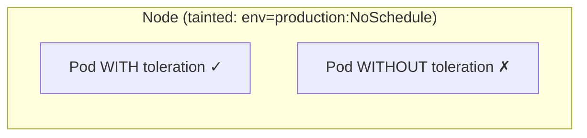
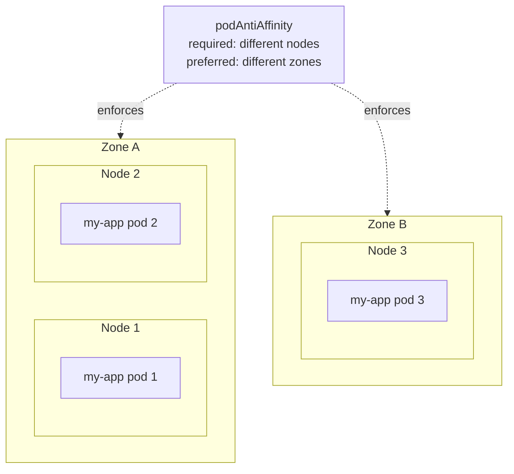
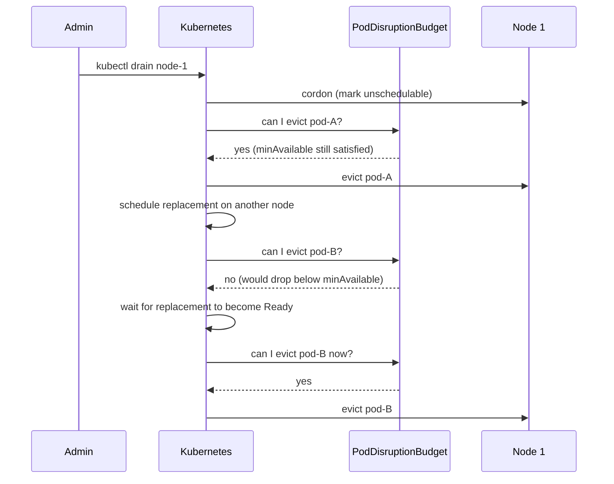
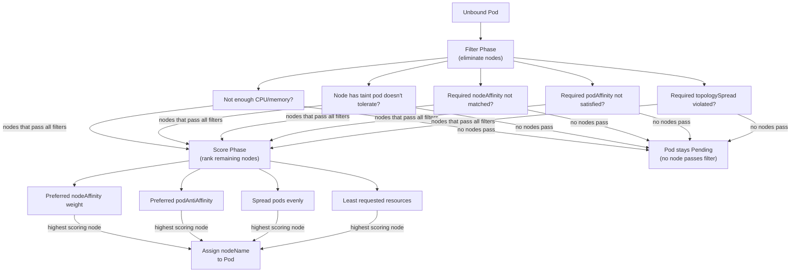

# Kubernetes Scheduling

## What the Scheduler Does

The scheduler's job is simple to state: **assign a node to every unbound Pod**. A Pod is unbound when it exists as an object in etcd but has no `nodeName` set. The scheduler watches for these, picks the best node, and writes `nodeName` to the Pod object. The kubelet on that node then starts the containers.

What makes it complex is the number of constraints that must be respected. Some are hard requirements — a Pod can't go on a node that doesn't have enough memory. Others are soft preferences — prefer to spread pods across availability zones, but don't block scheduling if you can't.

The scheduler runs two phases for every unbound Pod:

1. **Filter** — eliminate nodes that cannot run this Pod (hard constraints)
2. **Score** — rank the remaining nodes (soft preferences)

The highest-scoring node wins. If no node passes filtering, the Pod stays `Pending`.

---

## Resource Requests — The Foundation of Scheduling

The scheduler uses **requests**, not limits, to decide if a node can fit a Pod. Requests represent what the Pod is guaranteed to get. The scheduler looks at each node's allocatable resources minus the sum of all requests already on that node.

```yaml
resources:
  requests:
    cpu: "500m"       # scheduler uses this to find a node with 500m available
    memory: "256Mi"   # scheduler uses this to find a node with 256Mi available
```

If you don't set requests, the scheduler sees the Pod as requesting zero resources and will place it anywhere — which usually means it lands on an already-busy node and gets OOMKilled or throttled. Always set requests.

**Allocatable vs Capacity** — a node with 4 CPUs doesn't have 4 CPUs available for pods. The OS, kubelet, and system daemons reserve some. `kubectl describe node` shows both:

```bash
kubectl describe node my-node
# Capacity:       cpu: 4, memory: 16Gi
# Allocatable:    cpu: 3800m, memory: 14Gi   ← scheduler uses this
# Allocated:      cpu: 2200m, memory: 8Gi    ← already claimed by running pods
# Available:      cpu: 1600m, memory: 6Gi    ← what's left for new pods
```

---

## Taints and Tolerations — Repelling Pods from Nodes

Taints are applied to **nodes** to repel pods. Tolerations are applied to **pods** to allow them onto tainted nodes.

Think of it as: a taint says *"stay away unless you're okay with this"*, and a toleration says *"I'm okay with that"*.

### Taint Effects

| Effect | Behaviour |
|---|---|
| `NoSchedule` | New pods without a matching toleration are not scheduled here. Existing pods stay. |
| `PreferNoSchedule` | Scheduler tries to avoid this node but will use it if no alternatives exist. |
| `NoExecute` | New pods are not scheduled AND existing pods without a toleration are evicted. |

### Adding and Removing Taints

```bash
# Add a taint to a node
kubectl taint nodes node-1 env=production:NoSchedule

# Remove a taint (note the trailing -)
kubectl taint nodes node-1 env=production:NoSchedule-
```

### Adding a Toleration to a Pod

```yaml
spec:
  tolerations:
  - key: "env"
    operator: "Equal"
    value: "production"
    effect: "NoSchedule"
```

Or tolerate any value for a key:

```yaml
spec:
  tolerations:
  - key: "env"
    operator: "Exists"     # matches any value for key "env"
    effect: "NoSchedule"
```

### Real-World Use Cases

**Dedicated nodes** — taint a group of nodes for a specific team or workload. Only their pods tolerate it:

```bash
kubectl taint nodes gpu-node-1 gpu=true:NoSchedule
```

```yaml
# Only GPU workloads get scheduled here
tolerations:
- key: "gpu"
  operator: "Equal"
  value: "true"
  effect: "NoSchedule"
```

**Control plane protection** — control plane nodes have a built-in taint (`node-role.kubernetes.io/control-plane:NoSchedule`) that prevents application pods from landing there. DaemonSets for cluster infrastructure add a toleration to override this.

**Node not ready** — when a node goes `NotReady`, Kubernetes automatically adds `node.kubernetes.io/not-ready:NoExecute`. Pods without a toleration for this are evicted after `tolerationSeconds` (default 300s).



---

## Node Affinity — Attracting Pods to Specific Nodes

Taints/tolerations say "this node repels most pods." Node affinity says "this pod prefers or requires certain nodes." It's the pod's side of the equation.

Node affinity uses **node labels** to express rules.

### Two Types

**requiredDuringSchedulingIgnoredDuringExecution** — hard requirement. Pod won't be scheduled if no node matches.

**preferredDuringSchedulingIgnoredDuringExecution** — soft preference. Scheduler tries to satisfy it but won't block scheduling if it can't. Has a weight (1–100) to rank preferences.

```yaml
spec:
  affinity:
    nodeAffinity:
      requiredDuringSchedulingIgnoredDuringExecution:
        nodeSelectorTerms:
        - matchExpressions:
          - key: topology.kubernetes.io/zone
            operator: In
            values:
            - us-east-1a
            - us-east-1b              # pod must go to one of these zones

      preferredDuringSchedulingIgnoredDuringExecution:
      - weight: 80
        preference:
          matchExpressions:
          - key: node-type
            operator: In
            values:
            - high-memory             # prefer high-memory nodes, but not required
      - weight: 20
        preference:
          matchExpressions:
          - key: spot
            operator: NotIn
            values:
            - "true"                  # prefer non-spot, will use spot if needed
```

**IgnoredDuringExecution** — the second half of the name means: if the node's labels change after the pod is scheduled, the pod is not evicted. It only matters at scheduling time.

### nodeSelector — The Simple Version

For simple cases, `nodeSelector` is a shorthand — exact label match, no operators:

```yaml
spec:
  nodeSelector:
    node-type: gpu          # node must have this exact label
```

Use `nodeSelector` for simple cases. Use `nodeAffinity` when you need `In`, `NotIn`, `Exists`, `Gt`, `Lt` operators or soft preferences.

### Taints vs Node Affinity — The Difference

| | Taints + Tolerations | Node Affinity |
|---|---|---|
| Applied to | Node (taint) + Pod (toleration) | Pod only |
| Direction | Node repels pods | Pod selects nodes |
| Use case | Dedicate nodes, protect nodes | Place pods on specific hardware |
| Hard/Soft | Hard (NoSchedule) or evict (NoExecute) | Both hard and soft |

In practice you often use both together — taint a node to repel everything, and use node affinity on the pods that should go there to actively select it.

---

## Pod Affinity and Anti-Affinity — Pods Relative to Other Pods

Node affinity places pods on specific nodes. **Pod affinity and anti-affinity** place pods relative to **other pods** — on the same node/zone as certain pods, or away from them.

### Pod Affinity — Co-locate Pods

Use when two pods communicate heavily and latency between them matters:

```yaml
spec:
  affinity:
    podAffinity:
      requiredDuringSchedulingIgnoredDuringExecution:
      - labelSelector:
          matchLabels:
            app: cache              # schedule near pods labelled app=cache
        topologyKey: kubernetes.io/hostname   # "near" means same node
```

`topologyKey` defines what "near" means:
- `kubernetes.io/hostname` — same node
- `topology.kubernetes.io/zone` — same availability zone
- `topology.kubernetes.io/region` — same region

### Pod Anti-Affinity — Spread Pods Apart

Use to ensure replicas don't all land on the same node — so a node failure doesn't take down your entire service:

```yaml
spec:
  affinity:
    podAntiAffinity:
      requiredDuringSchedulingIgnoredDuringExecution:
      - labelSelector:
          matchLabels:
            app: my-app
        topologyKey: kubernetes.io/hostname   # no two my-app pods on same node

      preferredDuringSchedulingIgnoredDuringExecution:
      - weight: 100
        podAffinityTerm:
          labelSelector:
            matchLabels:
              app: my-app
          topologyKey: topology.kubernetes.io/zone   # prefer different zones too
```

This is the answer to *"how do you ensure your pods don't all land on the same node?"*



**Cost of required anti-affinity** — if you have 5 replicas and only 4 nodes, the 5th pod stays `Pending` forever. Use `preferred` if you want best-effort spreading without blocking scheduling.

---

## Topology Spread Constraints — Even Distribution

Pod anti-affinity for spreading is blunt — it says "not on the same node" but doesn't balance evenly. **Topology Spread Constraints** give fine-grained control over how pods are distributed across topology domains.

```yaml
spec:
  topologySpreadConstraints:
  - maxSkew: 1                           # max difference between busiest and least-busy domain
    topologyKey: kubernetes.io/hostname
    whenUnsatisfiable: DoNotSchedule     # hard: block if can't satisfy
    labelSelector:
      matchLabels:
        app: my-app
  - maxSkew: 2
    topologyKey: topology.kubernetes.io/zone
    whenUnsatisfiable: ScheduleAnyway    # soft: schedule anyway, minimise skew
    labelSelector:
      matchLabels:
        app: my-app
```

`maxSkew: 1` with 3 nodes and 6 pods → 2-2-2. With 7 pods → 3-2-2. Never more than 1 apart.

`whenUnsatisfiable`:
- `DoNotSchedule` — hard, pod stays Pending if can't satisfy
- `ScheduleAnyway` — soft, still picks the node that minimises skew

Topology spread constraints replace most use cases for pod anti-affinity spreading. They're more flexible and give actual balance rather than just "not on the same node."

---

## PodDisruptionBudget — Protecting Availability During Voluntary Disruptions

A **PodDisruptionBudget (PDB)** ensures a minimum number of pods stay running during **voluntary disruptions** — node drains, cluster upgrades, manual pod deletions by admins.

Voluntary = Kubernetes can plan for it. Involuntary disruptions (node crashes, OOM kills) are not controlled by PDBs.

```yaml
apiVersion: policy/v1
kind: PodDisruptionBudget
metadata:
  name: my-app-pdb
  namespace: production
spec:
  minAvailable: 2             # at least 2 pods must be running at all times
  selector:
    matchLabels:
      app: my-app
```

Or as a percentage:

```yaml
spec:
  maxUnavailable: 25%         # at most 25% of pods can be unavailable
  selector:
    matchLabels:
      app: my-app
```

Use either `minAvailable` or `maxUnavailable`, not both.

### How PDB Works During Node Drain



**Common gotcha** — a PDB that's too strict blocks cluster operations indefinitely. If `minAvailable: 3` and you only have 3 replicas, a drain can never proceed — evicting any pod violates the budget. Always set `minAvailable` to less than your total replica count.

---

## Resource Quotas — Namespace-Level Limits

In a shared cluster, one team can accidentally consume all cluster resources — starving other teams. **ResourceQuotas** cap total resource usage per namespace.

```yaml
apiVersion: v1
kind: ResourceQuota
metadata:
  name: team-quota
  namespace: team-a
spec:
  hard:
    requests.cpu: "10"           # total CPU requests across all pods
    requests.memory: 20Gi        # total memory requests
    limits.cpu: "20"             # total CPU limits
    limits.memory: 40Gi
    pods: "50"                   # max number of pods
    services: "10"
    persistentvolumeclaims: "20"
    secrets: "50"
    configmaps: "50"
```

When a ResourceQuota is set on a namespace, **every pod must have requests and limits set** — otherwise the pod is rejected. This is how ResourceQuotas enforce good behaviour — they make resource requests mandatory.

```bash
kubectl describe resourcequota team-quota -n team-a   # see usage vs limits
```

---

## LimitRange — Per-Pod and Per-Container Defaults

ResourceQuota sets namespace-wide totals. **LimitRange** sets defaults and constraints per individual pod or container.

```yaml
apiVersion: v1
kind: LimitRange
metadata:
  name: team-limits
  namespace: team-a
spec:
  limits:
  - type: Container
    default:                    # applied if container doesn't set limits
      cpu: "500m"
      memory: "256Mi"
    defaultRequest:             # applied if container doesn't set requests
      cpu: "100m"
      memory: "128Mi"
    max:                        # container cannot exceed these
      cpu: "2"
      memory: "2Gi"
    min:                        # container must request at least these
      cpu: "50m"
      memory: "64Mi"
  - type: Pod
    max:
      cpu: "4"
      memory: "4Gi"
```

LimitRange solves two problems:
1. **Defaults** — so pods without explicit requests/limits aren't scheduled as BestEffort (which get evicted first)
2. **Guardrails** — prevents a single pod from requesting 100 CPUs and starving the namespace

### ResourceQuota + LimitRange Together

The typical platform team setup for a multi-tenant cluster:

```
Namespace team-a
├── ResourceQuota: total CPU ≤ 10, total memory ≤ 20Gi, pods ≤ 50
└── LimitRange: default 100m/128Mi per container, max 2CPU/2Gi per container
```

Every pod that lands in `team-a` gets default requests/limits (via LimitRange) and counts against the namespace total (via ResourceQuota). Teams can't starve each other.

---

## Priority Classes — Which Pods Get Scheduled First

When the cluster is full and multiple pods are waiting, **PriorityClasses** decide which pods get scheduled first — and which running pods get evicted to make room.

```yaml
apiVersion: scheduling.k8s.io/v1
kind: PriorityClass
metadata:
  name: high-priority
value: 1000000          # higher number = higher priority
globalDefault: false
description: "For critical production workloads"
---
apiVersion: scheduling.k8s.io/v1
kind: PriorityClass
metadata:
  name: low-priority
value: 1000
globalDefault: false
description: "For batch and non-critical workloads"
```

Assign to a pod:

```yaml
spec:
  priorityClassName: high-priority
```

**Preemption** — if a high-priority pod can't be scheduled because the cluster is full, Kubernetes will **evict lower-priority pods** to make room for it. The evicted pods go back to Pending and are rescheduled when resources free up.

Built-in system priority classes:
- `system-cluster-critical` — used by CoreDNS, kube-proxy (value: 2000000000)
- `system-node-critical` — used by kubelet static pods (value: 2000001000)

Never set your application's priority higher than system classes.

---

## The Full Scheduling Decision

When the scheduler evaluates a pod, all constraints are checked together:



---

## Interview Gotchas

### 1. Pod stuck in Pending — the debugging flow

```bash
kubectl describe pod my-pod    # look at Events section at the bottom
```

Common events and what they mean:

| Event | Cause |
|---|---|
| `Insufficient cpu` | No node has enough CPU requests available |
| `Insufficient memory` | No node has enough memory available |
| `node(s) had taint... pod didn't tolerate` | Taint/toleration mismatch |
| `node(s) didn't match node affinity` | nodeAffinity required rule not satisfied |
| `pod has unbound PersistentVolumeClaims` | PVC not bound — storage issue, not scheduling |
| `0/3 nodes are available` | All nodes filtered out — check all constraints |

### 2. Scheduler uses requests, not limits

If you set `requests.cpu: 100m` and `limits.cpu: 4000m`, the scheduler places the pod as if it only needs 100m. Multiple pods with this profile can land on the same node — and all try to burst to 4000m simultaneously, causing CPU throttling for all of them. Set requests realistically.

### 3. Required anti-affinity with too few nodes causes permanent Pending

With `requiredDuringScheduling` podAntiAffinity on `hostname` and 5 replicas but only 4 nodes, the 5th pod will never schedule. Switch to `preferredDuringScheduling` or increase node count.

### 4. PDB too strict blocks node drain permanently

`minAvailable: N` where N equals your replica count means no pod can ever be evicted. The drain hangs indefinitely. Always set `minAvailable` to at least one less than replica count.

### 5. ResourceQuota enforces requests/limits — pods without them are rejected

Once a ResourceQuota exists on a namespace, pods without `resources.requests` and `resources.limits` are rejected by the API server. Use a LimitRange alongside to set defaults so teams don't have to specify them on every container.

### 6. Taints are not the same as node affinity

Taints are a **push** mechanism — the node pushes away pods. Node affinity is a **pull** mechanism — the pod selects specific nodes. For dedicated nodes, you typically need both: taint the node so everything else stays away, and use node affinity on the workload so it actively selects those nodes. Taint alone prevents others from landing there but doesn't guarantee your pod lands there.
