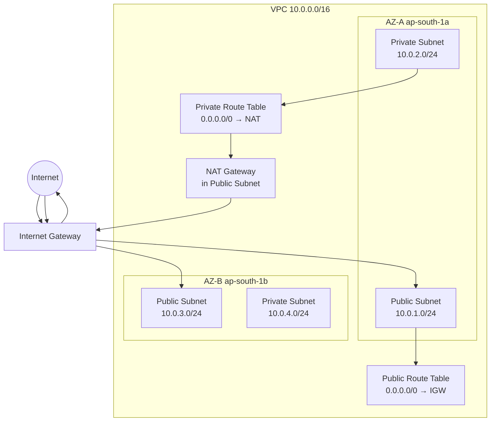
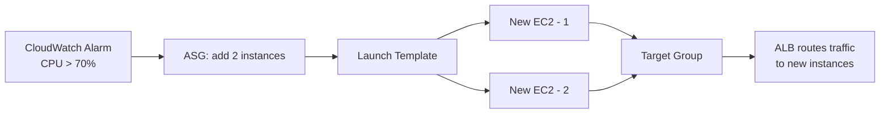

# AWS

---

## 1. IAM — Identity & Access Management

### Why IAM exists

Every AWS API call — whether from your laptop, an EC2 instance, or a Lambda — must be authenticated (who are you?) and authorized (are you allowed to do this?). IAM is the system that answers both questions. Without it, you'd either need to embed long-lived credentials everywhere (dangerous) or have no access control at all.

### The Root Account

The root account is the original account created when you sign up for AWS. It has unrestricted access to everything — including actions no other identity can perform, like closing the account or changing payment methods. The rule is simple: lock it away. Enable MFA on root, generate no access keys for it, and use it only for those handful of root-only tasks. If root credentials are compromised, the blast radius is total.

### Users, Groups, and the Principle of Least Privilege

An IAM User maps one-to-one to a human or a long-lived service identity. A Group is a collection of users — you attach policies to groups, and all members inherit those permissions. Groups cannot contain other groups.

The principle of least privilege means granting only the permissions needed to do the job and nothing more. In practice this means starting with zero permissions and adding incrementally, not starting with broad access and trimming later.

### Policies — The Core of Authorization

A policy is a JSON document that defines what actions are allowed or denied on what resources under what conditions. Every API call in AWS resolves to an allow or deny by evaluating all applicable policies.

```json
{
  "Version": "2012-10-17",
  "Statement": [
    {
      "Effect": "Allow",                         // "Allow" or "Deny"
      "Action": ["s3:GetObject", "s3:PutObject"], // What API calls are permitted
      "Resource": "arn:aws:s3:::my-bucket/*",    // Which resources this applies to
      "Condition": {                              // Optional — add constraints
        "StringEquals": {
          "aws:RequestedRegion": "ap-south-1"    // Only allow from Mumbai region
        }
      }
    }
  ]
}
```

**Policy evaluation logic** — this is heavily asked. AWS evaluates policies in this exact order:

1. If there is an **explicit Deny** anywhere (SCP, resource policy, identity policy) → **DENY**. Full stop. An explicit deny cannot be overridden by any allow.
2. If there is an **explicit Allow** → **ALLOW**.
3. If there is neither → **implicit DENY** (default).

The trap interviewers set: "Can an admin Allow something that an SCP denies?" — No. SCPs (Service Control Policies) are organization-level guardrails. Even an account's root user cannot override an SCP deny.

### IAM Roles — The Right Way to Give Services Access

A Role is an IAM identity that can be assumed temporarily. Unlike a user, it has no long-lived password or access key. When assumed, AWS issues short-lived credentials (via STS) that expire automatically.

The canonical use case: your EC2 instance needs to read from S3. Never put your user's access keys on the instance — any process or user with shell access can read them. Instead, attach an IAM Role to the instance. The application calls the metadata endpoint (`http://169.254.169.254/latest/meta-data/iam/security-credentials/`) and gets rotating credentials automatically. You never manage a secret.

```
EC2 Instance
    │
    │ assumes role via instance profile
    ▼
IAM Role: ec2-s3-read-role
    │
    │ has attached policy
    ▼
Policy: Allow s3:GetObject on arn:aws:s3:::my-bucket/*
```

An **Instance Profile** is simply the container that holds a role and allows it to be attached to an EC2 instance. The terms role and instance profile are often used interchangeably but they are technically distinct.

### STS and AssumeRole — Cross-Account Access

STS (Security Token Service) is the AWS service that issues temporary credentials. When you call `sts:AssumeRole`, STS returns a temporary Access Key ID, Secret Access Key, and a Session Token that expire after a configured duration (15 minutes to 12 hours).

**Cross-account access** is the real-world pattern: your application in Account A needs to access a database in Account B. You create a role in Account B with a trust policy that allows Account A to assume it. The app in Account A calls `sts:AssumeRole` with the ARN of that role and gets temporary credentials scoped to Account B.

```json
// Trust policy on the role in Account B
// This says: "Account A (ID: 111122223333) is allowed to assume this role"
{
  "Statement": [{
    "Effect": "Allow",
    "Principal": { "AWS": "arn:aws:iam::111122223333:root" },
    "Action": "sts:AssumeRole"
  }]
}
```

### Permission Boundaries

A permission boundary is a policy you attach to a user or role that sets the maximum permissions that identity can ever have, regardless of what other policies grant. It does not grant permissions by itself — it caps them. Used heavily by platform teams to let developers create their own roles without being able to escalate to admin.

---

## 2. VPC & Networking — The Full Packet Journey

### Why VPC Exists

Before VPC, all AWS resources shared a flat network. Any EC2 instance could potentially reach any other. VPC (Virtual Private Cloud) lets you carve out an isolated network within AWS where you control the IP range, subnets, routing, and connectivity. Think of it as your own private data centre inside AWS.

### The Building Blocks

**CIDR (Classless Inter-Domain Routing)** defines the IP address range for your VPC. A VPC CIDR like `10.0.0.0/16` gives you 65,536 addresses. You then slice this into smaller subnets.

**Subnets** are subdivisions of a VPC, each pinned to a single Availability Zone. A subnet with CIDR `10.0.1.0/24` gets 256 addresses (AWS reserves 5, so you get 251 usable). The public/private distinction is not a property of the subnet itself — it comes from what's connected to it.

A **public subnet** has a route to an Internet Gateway. Resources in it can have public IPs and talk to the internet directly.

A **private subnet** has no route to the Internet Gateway. Resources in it cannot be reached directly from the internet, which is where your databases, internal services, and anything sensitive lives.



### Internet Gateway vs NAT Gateway

The **Internet Gateway (IGW)** is attached to the VPC and enables bidirectional internet connectivity. For a resource in a public subnet to reach the internet, three things must be true: it must have a public IP, the subnet's route table must route `0.0.0.0/0` to the IGW, and the Security Group must allow the traffic. If any one of these is missing, traffic fails.

The **NAT Gateway** lives in a public subnet and enables resources in private subnets to initiate outbound connections (e.g., to download OS patches, call external APIs) without being reachable from the internet. NAT is one-directional — it translates the private IP to the NAT's public IP for outbound traffic and maps responses back. Unsolicited inbound connections are dropped.

NAT Gateway costs money per hour plus per GB of data processed. This is a real operational cost at scale and interviewers at product companies ask about it.

### Route Tables

Every subnet is associated with a route table. A route table is a list of rules: "for destination CIDR X, send traffic to target Y." The most specific route wins. The local route (`10.0.0.0/16 → local`) is always present and cannot be removed — it allows all resources within the VPC to talk to each other.

```
# Public Route Table
Destination     Target
10.0.0.0/16     local          ← All VPC traffic stays inside VPC
0.0.0.0/0       igw-xxxxxxxx   ← Everything else goes to Internet Gateway

# Private Route Table
Destination     Target
10.0.0.0/16     local
0.0.0.0/0       nat-xxxxxxxx   ← Outbound internet via NAT Gateway
```

### Security Groups vs NACLs

This is one of the most reliably asked comparison questions at SRE interviews.

**Security Groups** are stateful, instance-level firewalls. Stateful means if you allow inbound traffic on port 443, the response traffic is automatically allowed back out — you don't need a separate outbound rule. Security Groups only support Allow rules; you cannot write an explicit Deny.

**NACLs (Network Access Control Lists)** are stateless, subnet-level firewalls. Stateless means inbound and outbound rules are evaluated independently — if you allow inbound port 443, you must also explicitly allow outbound ephemeral ports (1024–65535) for the response. NACLs support both Allow and Deny rules, evaluated in order by rule number (lowest number wins).

```
Traffic flow for a request from internet to EC2 in public subnet:

Internet → [NACL Inbound rules] → [Security Group Inbound rules] → EC2
EC2 → [Security Group Outbound: auto-allowed (stateful)] → [NACL Outbound rules] → Internet
```

The practical implication: NACLs are your last line of defence to block a known bad IP — use an explicit Deny rule. Security Groups are your primary control — always prefer them. Most production setups only touch NACLs for IP-level blocking.

1. How do you write security group rule? What are the parameters?
2. How do you connect to a EC2 instance that is present in a private subnet?
3. Does NAT Gateway accept incoming traffic? Can someone initiate traffic from outside and go via NAT Gateway?
4. Why RAM and disk usage is not available as default metrics in cloudwatch for ec2?
5. Why create different role for different permissions and attaching it to services instead of creating a role and slapping the permissions to it?
6. What security group rule should be added in database which is there in the private subnet
7. How do you write route table rule? What are the parameters?
so that application can access it? You can't hardcode it as there will be multiple stateless application running.

### VPC Endpoints

By default, when your Lambda or EC2 instance calls the S3 API, that traffic goes over the public internet (even if the resource has no public IP, it traverses the internet edge). VPC Endpoints solve this: they allow you to route AWS API calls privately within the AWS network, never touching the public internet. This is faster, cheaper (no NAT Gateway data processing costs), and more secure.

There are two types. **Interface Endpoints** create a private ENI in your subnet and work with most AWS services. **Gateway Endpoints** work only with S3 and DynamoDB and add an entry to your route table — they are free.

### VPC Peering

VPC Peering connects two VPCs so their resources can communicate using private IPs, as if they were in the same network. The key constraint: peering is non-transitive. If VPC A peers with VPC B, and VPC B peers with VPC C, VPC A cannot reach VPC C through B. You'd need a direct peering between A and C, or use AWS Transit Gateway for hub-and-spoke connectivity at scale.

---

## 3. EC2 — Elastic Compute Cloud

### Instance Types

EC2 instance types follow a naming pattern: `[family][generation].[size]`. For example, `c6i.xlarge` means Compute-optimised, 6th generation, Intel, extra-large.

The four families you need to know for interviews are General Purpose (T/M series), Compute Optimised (C series — batch processing, game servers, media transcoding), Memory Optimised (R series — in-memory databases, large caches), and Storage Optimised (I series — high IOPS databases, distributed file systems).

The T-series is burstable: instances accumulate CPU credits during idle periods and spend them during spikes. When credits run out, the instance is throttled. This is a gotcha in production — a T3 that looks fine in load tests can throttle under sustained traffic.

### Purchasing Options

**On-Demand** — pay per second, no commitment. Use for unpredictable workloads.

**Reserved Instances** — commit to a specific instance type in a specific region for 1 or 3 years. Up to 72% cheaper than On-Demand. The trap: you're locked to that instance type. If you need to change families, you're stuck unless you use Convertible Reserved Instances (more flexible, less discount).

**Savings Plans** — commit to a dollar-per-hour spend for 1 or 3 years. More flexible than Reserved Instances because the discount applies across instance families and even across services like Lambda and Fargate. Compute Savings Plans are the most flexible; EC2 Instance Savings Plans give deeper discounts for a specific family.

**Spot Instances** — bid on spare AWS capacity. Up to 90% cheaper but AWS can reclaim with a 2-minute warning. The 2-minute notice is the key operational detail: your application must handle this gracefully — drain connections, checkpoint state, complete in-flight work. Use for fault-tolerant workloads: batch jobs, data processing, stateless web tiers behind an ASG.

**Capacity Reservations** — guarantee that capacity is available in a specific AZ when you need it. No discount, just availability guarantee. Used before anticipated traffic spikes (big sales events, IPO launches).

**Dedicated Hosts** — rent the entire physical server. Used for software that is licensed per-socket or per-core, or for compliance requirements (some regulations require single-tenant hardware).

### User Data and Instance Metadata

**User Data** is a bootstrap script that runs once when an instance first starts. It runs as root, before any application starts. The canonical use: install agents, pull configs from S3, register with a service mesh.

```bash
#!/bin/bash
# This script runs once at first boot as root
yum update -y                          # Patch the OS on first boot
aws s3 cp s3://my-bucket/config /etc/app/config  # Pull config from S3
systemctl enable --now my-app          # Start the application
```

**Instance Metadata** is available at `http://169.254.169.254/latest/meta-data/` from inside any EC2 instance. It exposes the instance ID, AZ, instance type, IAM role credentials, and more — without any authentication on IMDSv1. IMDSv2 (the current best practice) requires a session token, preventing SSRF attacks from extracting credentials.

### Storage — EBS, EFS, and Instance Store

The decision framework interviewers probe is: which storage do you pick and why?

**Instance Store** is physically attached to the host. It is the fastest option but entirely ephemeral — data is lost if the instance stops, terminates, or fails. Use it only for scratch space, temporary files, or caches that can be rebuilt.

**EBS (Elastic Block Store)** is a network-attached drive. It persists independently of the instance lifecycle and can be detached and reattached. The main volume types are `gp3` (general purpose SSD, baseline 3000 IOPS, independently configurable throughput), `io2` (provisioned IOPS SSD for databases requiring consistent sub-millisecond latency), and `sc1` (cold HDD for infrequent access, lowest cost).

The `gp2` vs `gp3` distinction is asked. `gp2` IOPS scale with volume size (3 IOPS/GB, burst up to 3000). `gp3` decouples IOPS from size — you provision 3000 IOPS regardless of size and can scale to 16,000 IOPS independently. `gp3` is almost always cheaper and the current default.

`io2` is the only EBS type that supports **multi-attach** — one volume attached to multiple EC2 instances simultaneously. The critical caveat: your application must use a cluster-aware file system (like GFS2 or OCFS2) to coordinate writes. Plain ext4 will corrupt the data.

**EFS (Elastic File System)** is a managed NFS that can be mounted by thousands of instances simultaneously. It scales automatically and is accessible across AZs. More expensive than EBS per GB but essential for shared file access patterns (shared config, ML model weights, CMS assets).

```
Decision tree:
Need shared access across many instances? → EFS
Need highest single-instance IOPS (database)? → io2 EBS
Need a simple persistent disk for one instance? → gp3 EBS
Need temporary scratch space, speed is everything? → Instance Store
```

### Placement Groups

**Cluster** placement packs instances onto the same physical rack within one AZ. This gives 10Gbps+ inter-instance bandwidth and the lowest latency. The tradeoff: a rack failure takes everything down. Use for HPC, distributed databases, or anything that needs fast node-to-node communication.

**Spread** placement puts each instance on distinct underlying hardware (different racks), up to 7 instances per AZ. Use for small groups of critical instances where you cannot afford correlated failures.

**Partition** placement divides instances into logical partitions, each on separate hardware. Instances in one partition share no hardware with another partition. Use for large distributed systems like HDFS, HBase, or Cassandra where you want rack-awareness.

---

## 4. S3 — Object Storage

### The Mental Model

S3 is not a file system and it is not a block device. It is an object store — every object (file) is identified by a bucket name + key (the full "path"). There is no actual directory hierarchy; the `/` in a key name is just a character that the console renders as a folder. This matters when building prefix-based access policies.

### Storage Classes

```
Hot (frequent access)           → S3 Standard
                                    11 9s durability, 3+ AZ replication
                                    
Infrequent but fast retrieval   → S3 Standard-IA (Infrequent Access)
                                    Lower storage cost, retrieval fee applies
                                    
One AZ, lower cost              → S3 One Zone-IA
                                    Data lost if AZ fails — use for reproducible data only

Archival, minutes retrieval     → S3 Glacier Instant Retrieval
Archival, hours retrieval       → S3 Glacier Flexible Retrieval
Deep archive, 12hr retrieval    → S3 Glacier Deep Archive
                                    Cheapest, use for compliance data
                                    
Unknown access pattern          → S3 Intelligent-Tiering
                                    Automatically moves objects between tiers based on access
```

### Versioning and Lifecycle Policies

Versioning, when enabled on a bucket, keeps every version of every object. A `DELETE` on a versioned bucket adds a **delete marker** — the object is not actually removed. To permanently delete, you must delete the specific version. This is both a safety net and a storage cost trap: your bucket can silently grow because old versions accumulate.

Lifecycle policies automate object transitions and expiration. A common production pattern:

```json
{
  "Rules": [{
    "ID": "archive-and-expire-logs",
    "Status": "Enabled",
    "Filter": { "Prefix": "logs/" },       // Apply only to objects under logs/
    "Transitions": [
      {
        "Days": 30,                         // After 30 days, move to cheaper storage
        "StorageClass": "STANDARD_IA"
      },
      {
        "Days": 90,                         // After 90 days, move to archive
        "StorageClass": "GLACIER"
      }
    ],
    "Expiration": { "Days": 365 }          // Permanently delete after 1 year
  }]
}
```

### Bucket Policies vs ACLs vs IAM Policies

Three layers of access control exist in S3 and interviews probe exactly when to use each.

**IAM Policies** are attached to users/roles and say "this identity can do X on S3." They control what the caller is allowed to do.

**Bucket Policies** are attached to the bucket itself and say "these principals are allowed/denied to do X on this bucket." They control who can access the bucket, from the bucket's perspective. Bucket policies are the right tool for cross-account access and for making a bucket publicly readable.

**ACLs** are legacy. AWS recommends disabling them (Object Ownership → Bucket owner enforced). Unless you're integrating with old tooling that requires ACLs, don't touch them.

Access is granted when IAM policy allows AND (bucket policy allows OR there is no bucket policy). Access is denied if either has an explicit deny.

### Presigned URLs

A presigned URL is a time-limited URL that lets anyone with the link perform a specific S3 operation (GET or PUT) without having AWS credentials. The URL encodes the credentials of the IAM identity that generated it, the operation, the expiry time, and a signature.

The canonical use case: your backend generates a presigned PUT URL and returns it to a client. The client uploads directly to S3 without the file passing through your server. This offloads bandwidth and storage costs from your compute layer.

```
Client → Your API: "I want to upload a file"
Your API → S3: generate presigned PUT URL (expires in 5 min)
Your API → Client: here is the URL
Client → S3: PUT file directly using the URL
S3 → Client: 200 OK
```

Q. Your EC2 instance generates a presigned URL with a 1 hour expiry. But the URL stops working after 15 minutes. What's happening?
A. 
 ```
  Your pre-signed URL is tied to the credentials used to generate it.
  In your case:
  EC2 is using an IAM role (temporary credentials via STS)
  Those credentials have a limited lifetime (e.g., ~15 minutes in this scenario)
  ```
---

## 5. Load Balancing & Auto Scaling

### The Three Load Balancers

**ALB (Application Load Balancer)** operates at Layer 7. It can read HTTP headers, paths, query parameters, and host names to make routing decisions. This enables path-based routing (`/api/*` to one target group, `/static/*` to another), host-based routing (routing by `Host` header for multi-tenant apps), and header-based routing (for canary deployments — send 5% of traffic where `X-Canary: true`). ALB also handles SSL termination, WebSockets, and HTTP/2.

**NLB (Network Load Balancer)** operates at Layer 4. It routes based on IP and TCP/UDP port only — no protocol parsing. This makes it extremely fast (handles millions of requests per second with ultra-low latency) and capable of handling non-HTTP protocols. NLB preserves the client IP address by default (ALB does not — you must use `X-Forwarded-For`). NLB is also the right choice when you need a static IP for the load balancer (ALB IPs change; NLB has static IPs or Elastic IPs).

**GLB (Gateway Load Balancer)** operates at Layer 3. It is used to transparently insert third-party network appliances (firewalls, IDS/IPS, deep packet inspection) into your traffic path. All traffic flows through the appliance fleet before reaching your application. Not a general-purpose LB.

### Target Groups and Health Checks

A target group is a collection of targets (EC2 instances, IPs, Lambda functions, or other ALBs) that the load balancer routes to. Health checks run against each target; unhealthy targets are removed from rotation. A target is considered healthy only after passing a configured number of consecutive checks (healthy threshold) and unhealthy after failing a configured number (unhealthy threshold).

### Sticky Sessions

Sticky sessions (session affinity) bind a client to a specific target for the duration of a cookie. ALB supports two types: application-based stickiness (your app sets the cookie) and duration-based stickiness (ALB sets the cookie). The operational problem with stickiness is uneven load distribution — if one target gets 60% of long-lived sessions, it receives 60% of the load regardless of how many total targets exist. The right solution is stateless application design (sessions in ElastiCache, not on disk).

### Cross-Zone Load Balancing

Without cross-zone load balancing, each load balancer node distributes traffic only to targets in its own AZ. If AZ-A has 2 targets and AZ-B has 8 targets, and traffic is split 50/50 across AZs, AZ-A targets each get 25% of total traffic while AZ-B targets each get 6.25%. With cross-zone enabled, all targets receive an equal share. For ALB, cross-zone is always on and free. For NLB and GLB, it is off by default and incurs inter-AZ data transfer costs.

### Auto Scaling Groups

An ASG maintains a fleet of EC2 instances between a configured minimum and maximum. The desired capacity is the current target count. When a scaling event fires, ASG launches or terminates instances to reach the new desired count.

**Launch Templates** (prefer over Launch Configurations — the older version) define what each instance looks like: AMI, instance type, security groups, IAM role, user data, EBS volumes.

Scaling policies:

**Target Tracking** is the most common and the simplest to reason about. You specify a metric and a target value — "keep average CPU at 40%." ASG calculates how many instances to add or remove to reach that target. It handles both scale-out and scale-in automatically.

**Step Scaling** gives you more control: "add 2 instances when CPU is between 60–80%, add 4 instances when CPU is above 80%." Useful when the scaling response should be proportional to the severity of the signal.

**Scheduled Scaling** sets a specific desired capacity at a specific time. Use it when you have predictable traffic patterns (scale up before your daily 9am spike, scale down at midnight).

**Scaling Cooldown** (default 300 seconds) is a pause after a scaling activity during which no further scaling happens. This prevents flapping — the system needs time to launch instances and for metrics to reflect the change.



---

## 6. RDS & Caching

### RDS — The Core Distinction: Read Replicas vs Multi-AZ

This is the most reliably asked RDS question at every SRE interview. They are different features solving different problems, and many candidates conflate them.

**Multi-AZ** is for high availability and disaster recovery. RDS maintains a synchronous standby replica in a different AZ. "Synchronous" means every write to the primary is confirmed only after it has been written to the standby. If the primary fails, RDS automatically promotes the standby and updates the DNS endpoint — your application reconnects to the same endpoint, now pointing at the new primary. There is no manual intervention. The standby cannot serve read traffic in standard RDS Multi-AZ.

**Read Replicas** are for read scalability. Replication is asynchronous — the replica may lag behind the primary by milliseconds to seconds. Read replicas serve read traffic, reducing load on the primary. They can be in the same AZ, different AZ, or a different region entirely (cross-region replicas, which also serve as a DR option). A read replica can be manually promoted to a standalone DB instance, which breaks the replication chain.

```
Multi-AZ (HA):                       Read Replica (Scale):
                                      
Primary DB ──sync──▶ Standby DB      Primary DB ──async──▶ Replica 1
     │                    │                │         ──async──▶ Replica 2
     └── same endpoint ───┘                │         ──async──▶ Replica 3
         (DNS failover)                    │
                                      App reads from replicas
                                      App writes to primary
```

### Aurora

Aurora is AWS's proprietary cloud-native relational database. It is MySQL and PostgreSQL compatible. The architecture is meaningfully different from RDS: rather than replicating whole data blocks between nodes, Aurora separates storage from compute. The storage layer automatically replicates data 6 ways across 3 AZs. This is why Aurora failover (typically under 30 seconds) is faster than RDS Multi-AZ failover (60–120 seconds).

Aurora's read replicas share the same underlying storage as the primary — they don't need to replicate data, they just need to track the log position. This means adding Aurora replicas is fast and they have minimal replication lag.

**Aurora Global Database** extends this across regions: one primary region with read-only secondary regions, with replication lag under a second. Used for global low-latency reads and cross-region DR with RPO of under a second.

### RDS Proxy

RDS Proxy sits between your application and the database and pools connections. The problem it solves: a database has a finite number of connections it can handle. In a serverless or microservices architecture with hundreds of Lambda functions or containers, each may open its own connection, exhausting the DB's connection limit. RDS Proxy pools and multiplexes these — hundreds of application connections are served through a small number of actual DB connections.

A secondary benefit: when the DB fails over, RDS Proxy holds connection requests while failover completes and then reconnects, making the failover invisible to the application.

### ElastiCache — Redis vs Memcached

ElastiCache is AWS's managed in-memory caching service. The decision between Redis and Memcached is simple in practice: unless you have a specific reason to use Memcached, use Redis.

Redis supports persistence, replication, pub/sub, sorted sets, and transactions. Memcached is a pure LRU cache with no persistence and multithreaded architecture for raw throughput. Memcached is appropriate only when you need maximum cache throughput for very simple key-value workloads and do not care about durability.

**Caching patterns** are asked at SRE interviews:

**Cache-aside (lazy loading):** The application checks the cache first. On a miss, it reads from the DB, writes to cache, then returns the result. Data in cache is always data that has been requested at least once. Stale data can accumulate if the TTL is too long or cache invalidation is missed.

**Write-through:** On every DB write, the application also writes to cache. Cache is always up to date. The cost is write latency (two writes per operation) and cache filling with data that may never be read.

```
Cache-aside pattern:

App → Cache: GET user:123
Cache → App: MISS
App → DB: SELECT * FROM users WHERE id=123
DB → App: {id: 123, name: "Priya"}
App → Cache: SET user:123 {id:123, name:"Priya"} EX 300   ← 300s TTL
App → Client: return user data
```

---

## 7. Observability — CloudWatch vs CloudTrail

### The Distinction

**CloudWatch** answers: "What is my infrastructure doing right now?" It collects metrics (CPU, memory, request count, latency), logs (application and AWS service logs), and lets you set alarms and build dashboards. It is the operational monitoring layer.

**CloudTrail** answers: "Who did what in my AWS account?" It records every API call made to AWS — who made it, from where, with what parameters, and when. It is the audit and compliance layer.

The common trap question: "You notice an S3 bucket's permissions were changed last night. How do you find out who did it?" — CloudTrail. CloudWatch would show you traffic changes but not the API call that modified bucket policy.

### CloudWatch Metrics

AWS services publish metrics to CloudWatch automatically. EC2 publishes CPU, network in/out, and disk I/O. RDS publishes connections, read/write IOPS, replication lag. You can also publish custom metrics from your application.

**Important caveat**: EC2 does not publish memory utilisation or disk space usage to CloudWatch by default. These are inside the OS and require the CloudWatch Agent to be installed on the instance to collect and publish them. This is consistently asked.

### CloudWatch Logs and Log Groups

Application logs can be shipped to CloudWatch Logs via the CloudWatch Agent or SDK. Logs are organised into Log Groups (one per application or service) and Log Streams (one per instance or container). Log Insights lets you query logs using a SQL-like syntax.

### CloudWatch Alarms

An alarm watches a metric over a time window and transitions between states: OK, ALARM, and INSUFFICIENT_DATA. When transitioning to ALARM, it can trigger an SNS notification, an ASG scaling policy, or an EC2 action.

```yaml
# A CloudWatch alarm via CloudFormation
CPUAlarm:
  Type: AWS::CloudWatch::Alarm
  Properties:
    AlarmName: high-cpu-api-service
    MetricName: CPUUtilization          # Which metric to watch
    Namespace: AWS/EC2                  # EC2-published namespace
    Statistic: Average                  # Average across the period
    Period: 60                          # Evaluate every 60 seconds
    EvaluationPeriods: 3                # Must breach for 3 consecutive periods
    Threshold: 80                       # Trigger when average CPU > 80%
    ComparisonOperator: GreaterThanThreshold
    AlarmActions:
      - !Ref ScalingPolicy              # Trigger ASG scaling policy
```

### CloudTrail

CloudTrail logs every management API call (creating/deleting resources, changing IAM policies) as an event. Events are stored in S3. For real-time alerting on sensitive actions (like root login or IAM policy changes), configure CloudTrail to send events to CloudWatch Logs and create metric filters + alarms on those logs.

By default, CloudTrail retains events for 90 days in the console. For longer retention and querying, you must deliver logs to S3 and optionally to CloudWatch Logs.

---

## 8. Interview Gotchas

### IAM Gotchas

An explicit Deny always wins. If a user has an Allow in their identity policy but a Deny in a bucket policy or SCP, the Deny wins. Candidates who don't know this will give wrong answers to any "does this user have access?" scenario question.

The difference between a role's trust policy and permission policy is consistently confused. The trust policy says who can assume the role (the principal). The permission policy says what the role can do once assumed. You need both correct for cross-account access to work.

Permission boundaries do not grant permissions — they cap them. A boundary alone gives you nothing. A common wrong answer: "I set a permission boundary so the role now has those permissions." No — it means the role cannot exceed those permissions regardless of what other policies grant.

### VPC Gotchas

A common scenario: "My EC2 instance in a private subnet cannot reach the internet. Walk me through your troubleshooting." The checklist is: (1) Does the private subnet's route table have a `0.0.0.0/0 → NAT` route? (2) Is the NAT Gateway in a public subnet? (3) Does the public subnet's route table have `0.0.0.0/0 → IGW`? (4) Does the Security Group on the EC2 instance allow outbound traffic? All four must be true.

Security Groups vs NACLs statefulness: the most common trap is writing a NACL inbound rule for port 443 and forgetting the outbound rule for ephemeral ports (1024–65535). The connection will fail because the response cannot leave the subnet.

VPC Peering is non-transitive. You cannot route through a peered VPC to reach a third VPC. If the interviewer adds a third VPC to a peering question, the answer is Transit Gateway or a direct additional peering.

### EC2 / Storage Gotchas

T-series CPU credits running out under sustained load is a production trap. Your instance looks fine in a 10-minute load test, throttles after 30 minutes of real traffic. The fix is switching to M-series (non-burstable) or enabling T-series Unlimited mode (which charges for additional CPU beyond the baseline — read the billing implications).

EBS Multi-Attach with io2 requires a cluster-aware file system. A common wrong answer is "I'll mount the same EBS volume to two EC2 instances for HA." Without the right file system, concurrent writes will corrupt the volume.

IMDSv1 is an SSRF vulnerability. Any server-side code that fetches arbitrary URLs could be exploited to hit `169.254.169.254` and extract IAM credentials. IMDSv2 (session-oriented, requires a PUT before GET) prevents this. Interviewers at security-conscious companies will specifically ask about this.

### S3 Gotchas

S3 is eventually consistent for overwrites and deletes on versioned objects, but strongly consistent for all operations as of December 2020. Do not cite eventual consistency as a concern for current S3 — it trips up candidates who memorised old content.

Versioning accumulates costs silently. Enable lifecycle policies on old versions when you enable versioning. Forgetting this is a real production cost incident.

Presigned URL expiry is bounded by the expiry of the credentials that signed it. If a Lambda with a 15-minute execution role generates a presigned URL with a 1-hour expiry, the URL will stop working after 15 minutes when the role credentials expire. For long-lived presigned URLs, use an IAM User with long-lived access keys, not a role.

### RDS Gotchas

Read replicas have eventual consistency. If you write to the primary and immediately read from a replica, you may get stale data. Applications that read their own writes must either read from primary or implement read-after-write consistency logic.

Multi-AZ failover takes 60–120 seconds for RDS (DNS TTL propagation is part of this). Plan your application's DB reconnection logic accordingly — use retry with backoff, not a single-attempt connection.

Aurora replicas can be added without any performance impact on the primary because they share the storage layer. RDS read replicas add replication load to the primary. This is a meaningful operational difference.

### Load Balancer Gotchas

ALB does not preserve the client's original IP address — it replaces the source IP with its own. Your application receives the ALB's IP. To get the real client IP, read the `X-Forwarded-For` header. NLB preserves the source IP natively.

An ASG can replace unhealthy instances, but it does not monitor application-layer health by default — only EC2 instance status. To have ASG terminate instances that are failing ALB health checks (returning 5xx, for example), you must explicitly enable ALB health check integration on the ASG. Without this, a broken application on a healthy instance is never replaced.

### CloudWatch Gotchas

EC2 does not publish memory or disk metrics to CloudWatch by default. If you build an alarm or dashboard expecting these without installing the CloudWatch Agent, you will have gaps in visibility. This is asked in almost every SRE interview.

CloudWatch metrics have a default 15-month retention. High-resolution metrics (sub-minute) are retained for 3 hours. For longer retention of detailed metrics, you need to export to S3 or a third-party system.

CloudTrail is not real-time. There is a delay of up to 15 minutes before events appear. For true real-time security alerting, pair CloudTrail with CloudWatch Logs and set up metric filters — CloudTrail alone is an audit log, not an alerting system.
