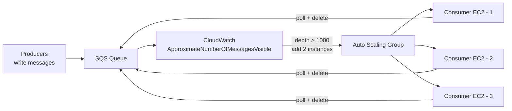
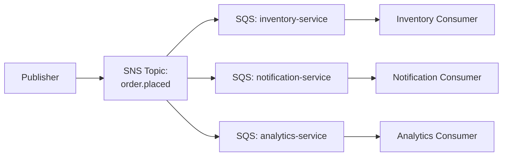
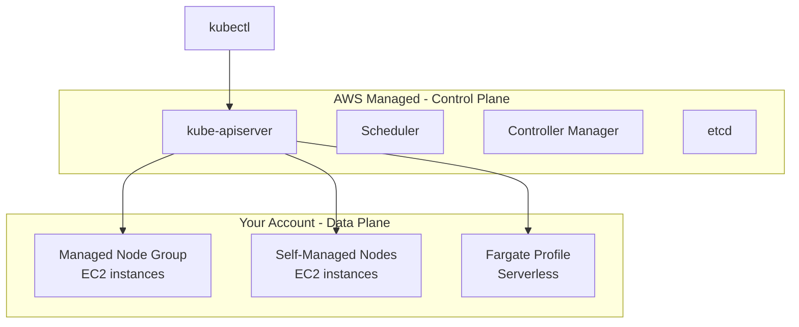
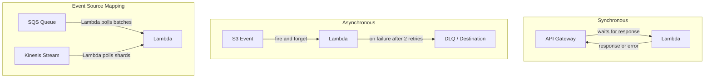

# Messaging, Containers & Serverless
## Mid-Level SRE/DevOps/Platform Interview Notes

---

## 1. SQS — Simple Queue Service

### The Core Mental Model

SQS is a durable, distributed message queue. A producer writes a message to the queue. A consumer polls the queue, processes the message, and deletes it. Until the consumer explicitly deletes the message, SQS considers it unprocessed and will make it available again. This design means SQS is at-least-once delivery — the same message can be delivered more than once, and your consumer must be idempotent (processing the same message twice should produce the same result as processing it once).

Standard queues offer unlimited throughput but do not guarantee ordering and may deliver duplicates. This is a deliberate tradeoff for scale — strict ordering requires coordination across distributed nodes, which limits throughput.

### Visibility Timeout — The Most Important Operational Detail

When a consumer polls a message, SQS does not delete it. Instead it makes the message invisible to all other consumers for the **visibility timeout** period (default 30 seconds). This window is the time the consumer has to process and delete the message. If the consumer finishes and calls `DeleteMessage`, the message is gone. If the consumer crashes, times out, or fails to call `DeleteMessage` within the visibility timeout, the message becomes visible again and another consumer can pick it up.

The operational trap: if your processing consistently takes longer than the visibility timeout, you get duplicate processing. A Lambda that takes 35 seconds will release the message at 30 seconds, another consumer picks it up, and now two consumers are processing the same message. The fix is either increasing the visibility timeout to match your processing time, or calling `ChangeMessageVisibility` mid-processing to extend the window dynamically.

### Long Polling vs Short Polling

Short polling returns immediately — even if the queue is empty, it returns an empty response and you are billed for that API call. Long polling waits up to 20 seconds for a message to arrive before returning. If a message arrives at second 7, it returns immediately. Long polling reduces empty responses, reduces cost, and reduces CPU spin on the consumer. It is almost always the right choice. Enable it by setting `WaitTimeSeconds` to a value between 1 and 20.

### Dead Letter Queue (DLQ)

A DLQ is a separate SQS queue where messages are sent after failing to be processed successfully a configured number of times (`maxReceiveCount`). Each time a message is received and not deleted (visibility timeout expires), its receive count increments. Once the receive count exceeds `maxReceiveCount`, SQS moves the message to the DLQ automatically.

DLQs are essential for operational visibility. Without one, poison pill messages — messages your consumer cannot process due to a bug, malformed payload, or dependency failure — loop forever, consuming consumer capacity and blocking progress. With a DLQ, they are quarantined and you can inspect, alert on, and replay them once the underlying issue is fixed.

```
Normal flow:
Producer → SQS Queue → Consumer (processes + deletes) ✓

Poison pill without DLQ:
Producer → SQS Queue → Consumer (fails) → message reappears → Consumer (fails) → loops forever

Poison pill with DLQ (maxReceiveCount=3):
Producer → SQS Queue → Consumer (fails, count=1)
                     → Consumer (fails, count=2)
                     → Consumer (fails, count=3)
                     → SQS moves message to DLQ
                     → Alert fires → Engineer investigates
```

DLQs should themselves have a long retention period (14 days) so messages are not lost before you can investigate.

### FIFO Queues

FIFO queues guarantee exactly-once processing and strict ordering within a **message group**. A message group ID is a tag you assign to a message; all messages with the same group ID are processed in the order they were sent, and no two messages from the same group are processed simultaneously.

The throughput cost is real: standard queues have unlimited throughput, FIFO queues are capped at 300 messages/second (3,000 with batching). Use FIFO only when ordering genuinely matters — financial transactions, sequential state machine steps, ordered event logs. Do not default to FIFO because it "feels safer."

Message deduplication in FIFO queues is handled by a deduplication ID. If two messages are sent with the same deduplication ID within a 5-minute window, the second is discarded. This is how exactly-once delivery is achieved.

### SQS + ASG Scaling Pattern

This is a core SRE architecture pattern. Instead of scaling your consumer fleet based on CPU, you scale based on queue depth — the number of messages waiting to be processed. A CloudWatch metric (`ApproximateNumberOfMessagesVisible`) measures queue backlog. An ASG scaling policy increases the number of consumer EC2 instances or ECS tasks as the backlog grows and decreases them as it drains.



The advantage over CPU-based scaling: CPU reflects what is happening now. Queue depth reflects work that is waiting — it is a leading indicator. Scaling on queue depth means your fleet grows before consumers are overwhelmed, not after.

---

## 2. SNS — Simple Notification Service

### The Pub/Sub Model

SNS is a publish/subscribe messaging service. A producer publishes one message to an SNS topic. SNS pushes that message to all subscribers simultaneously — the producer does not know or care who the subscribers are. Subscribers can be SQS queues, Lambda functions, HTTP/HTTPS endpoints, email addresses, or SMS.

The key operational difference from SQS: SQS is pull-based (consumers poll for messages), SNS is push-based (SNS delivers to subscribers). SNS does not persist messages — if a subscriber is unavailable when a message is published, the message is lost for that subscriber unless the subscriber is an SQS queue (which buffers the message).

### SQS vs SNS

SQS is a queue where messages sit until a single worker picks them up and processes them — great for distributing work across consumers. SNS is a pub/sub system that instantly pushes every message to all subscribers simultaneously — great for broadcasting events. The key difference: in SQS each message is processed once by one consumer, in SNS every subscriber gets every message.

### Fan-Out Pattern — SNS + SQS

The fan-out pattern combines SNS and SQS to deliver one event to multiple independent downstream systems, each with their own queue and processing rate.



Each downstream service processes at its own pace. If the analytics service is slow, its SQS queue backs up — but inventory and notifications are unaffected. If you published directly from the producer to three separate queues, adding a fourth consumer would require changing the producer. With SNS in the middle, you add a new SQS subscriber to the topic without touching the producer.

### Message Filtering

By default, every SQS subscriber to an SNS topic receives every message. Message filtering lets each subscriber define a filter policy — a JSON document specifying which messages it wants based on message attributes. SNS evaluates the filter and only delivers matching messages to that subscriber.

```json
// Subscription filter policy on the inventory SQS queue
// Only receive messages where order_type is "physical" — ignore digital orders
{
  "order_type": ["physical"]
}
```

Without filtering, every consumer receives every message and must implement its own "should I process this?" logic, wasting compute. With filtering, SNS does the routing at the messaging layer.

---

## 3. Kinesis Data Streams

### The Core Model

Kinesis Data Streams is a real-time data streaming service. Data is written to a **stream**, which is divided into **shards**. Each shard provides fixed throughput: 1 MB/second write, 2 MB/second read. A producer assigns a **partition key** to each record; Kinesis hashes the key to determine which shard the record goes to. All records with the same partition key go to the same shard, and records within a shard are strictly ordered.

Consumers read from shards in real time. Records can be replayed — Kinesis retains data for 24 hours by default, up to 365 days with extended retention. This replay capability is the defining feature that SQS does not have.

### Kinesis vs SQS — The Decision Framework

This comparison is asked directly at SRE interviews. They are often conflated but solve different problems.

```
                    SQS                         Kinesis Data Streams
─────────────────────────────────────────────────────────────────────────────
Ordering           No (Standard)               Yes, per shard (per partition key)
                   Yes (FIFO, limited)

Delivery           At-least-once               At-least-once

Consumers          One message, one consumer   Multiple consumers, same data
                   (competing consumers)       (fan-out at stream level)

Replay             No — deleted after          Yes — configurable retention
                   consumption                 up to 365 days

Throughput unit    No provisioning needed      Shard = 1MB/s write, 2MB/s read
                                               You provision shards

Latency            Milliseconds                ~200ms real-time

Retention          4 days – 14 days            24 hours – 365 days

Primary use case   Task queues, job            Real-time analytics, event
                   distribution,               sourcing, log aggregation,
                   async decoupling            ML feature pipelines

Message size       Up to 256 KB                Up to 1 MB
```

The decision heuristic: if multiple independent consumers need to read the same data simultaneously, or if you need to replay historical data, use Kinesis. If you need to distribute work across competing workers where each message is done once, use SQS.

A concrete scenario interviewers use: "You are ingesting clickstream events from a mobile app. The data science team needs to build a real-time dashboard, the fraud team needs to score each event, and the data engineering team needs to load events into the warehouse." Three consumers, same data, in real time — Kinesis. If the requirement were simply "process each order exactly once," SQS would be the answer.

---

## 4. ECS — Elastic Container Service

### The Mental Model

ECS is AWS's container orchestration service. You define what your container looks like (Task Definition), tell ECS how many copies to run and how to expose them (Service), and ECS schedules and maintains those containers on the compute you provide (Cluster).

A **Task Definition** is a blueprint — it specifies the Docker image, CPU and memory allocation, port mappings, environment variables, IAM role, and volume mounts. A **Task** is a running instance of a task definition. A **Service** maintains a desired number of running tasks, integrates with load balancers, and replaces failed tasks automatically.

### Launch Types — EC2 vs Fargate

**EC2 launch type** runs containers on EC2 instances that you provision and manage in the cluster. You are responsible for the instance fleet — patching, sizing, scaling the underlying nodes. The ECS Agent runs on each EC2 instance and communicates with the ECS control plane to receive scheduling decisions.

**Fargate** is serverless compute for containers. You define the task (CPU, memory, image) and ECS runs it without you managing any underlying instances. Fargate is more expensive per compute unit but eliminates node management entirely. The operational tradeoff is explicit: Fargate costs more, EC2 gives you more control and lower cost at scale.

### IAM Roles — Two Distinct Roles

This distinction is consistently asked and consistently confused.

The **EC2 Instance Profile** is attached to the EC2 instance (not the task) and is used by the **ECS Agent** — the daemon running on the node. It needs permissions to register with the ECS control plane, pull task definitions, send logs to CloudWatch, and manage ENIs. This role is about the node's relationship with AWS services.

The **ECS Task Role** is defined in the task definition and is assumed by the **application running inside the container**. If your container needs to read from S3, call DynamoDB, or publish to SNS, those permissions belong in the Task Role. This follows the same principle as EC2 Instance Profiles — never embed credentials in your container image.

```
EC2 Node
  └── EC2 Instance Profile (ECS Agent permissions)
       └── ECS Agent → registers node, manages tasks

Container (Task)
  └── ECS Task Role (application permissions)
       └── App code → reads S3, writes DynamoDB
```

### Deployment Strategies

**Rolling update** replaces tasks gradually. ECS terminates a batch of old tasks and starts new ones, continuing until all tasks are on the new version. You configure `minimumHealthyPercent` (how far below desired count you can go during deployment) and `maximumPercent` (how far above desired count you can go). The risk: if the new version is broken, some traffic hits the broken version before you can roll back.

**Blue/Green deployment** (via CodeDeploy) runs the new version alongside the old version. Traffic is shifted from the old (blue) to the new (green) environment using one of three strategies: all-at-once, canary (small percentage first, then all), or linear (incrementally). If the new version fails health checks, CodeDeploy rolls back automatically by shifting traffic back to blue. This is the safer pattern for production services because the old version is live throughout the deployment.

### ECS Auto Scaling

ECS Service Auto Scaling adjusts the desired task count. It uses Application Auto Scaling and supports the same policies as EC2 ASG: Target Tracking, Step Scaling, and Scheduled Scaling. Common metrics are `ECSServiceAverageCPUUtilization`, `ECSServiceAverageMemoryUtilization`, and ALB `RequestCountPerTarget`.

The critical distinction: **task-level scaling** (adjusting desired task count) is independent of **instance-level scaling** (adjusting the EC2 node fleet in the cluster). If you scale tasks up but have no capacity on the underlying nodes, tasks remain in PENDING state. For EC2 launch type, you need both ECS Service Auto Scaling and EC2 ASG configured. Fargate eliminates this problem — capacity is managed by AWS.

---

## 5. EKS — Elastic Kubernetes Service

### Control Plane vs Data Plane

This distinction is the foundation of understanding EKS and is always asked.

The **control plane** is the brain of Kubernetes — it runs the API server, scheduler, controller manager, and etcd (the cluster state database). In EKS, AWS owns and manages the control plane entirely. It runs in AWS-managed accounts, is replicated across multiple AZs, and is what you pay the EKS cluster fee for (~$0.10/hour). You do not see or access the control plane nodes.

The **data plane** is where your actual application containers run. These are the worker nodes. In EKS you manage the data plane — you choose between EC2 node groups or Fargate. AWS manages the Kubernetes software on the control plane; you manage the compute your workloads run on.



### Node Types

**Managed Node Groups** are EC2 instances provisioned and lifecycle-managed by EKS. EKS handles node provisioning, AMI updates, and draining nodes before termination. You define the instance type and scaling bounds; EKS handles the rest. This is the most common choice.

**Self-Managed Nodes** are EC2 instances you register with the cluster yourself. You manage AMIs, patching, and node lifecycle. Use when you need instance types or configurations not supported by managed node groups.

**Fargate** eliminates node management entirely for EKS. Each pod runs in its own isolated compute environment. The constraint: Fargate does not support DaemonSets (since there are no nodes to run daemons on) and stateful workloads requiring local storage. Use for bursty or stateless workloads.

### ALB Ingress Controller

In Kubernetes, an Ingress resource defines HTTP routing rules — "route `/api/*` to service A, route `/web/*` to service B." An Ingress Controller is the component that implements those rules using actual infrastructure.

The **AWS Load Balancer Controller** (formerly ALB Ingress Controller) watches for Kubernetes Ingress resources and automatically provisions an ALB in your AWS account. It translates Kubernetes routing rules into ALB listener rules and target groups. Each path in your Ingress spec becomes an ALB routing rule. This is the standard way to expose EKS services to the internet.

```yaml
# A Kubernetes Ingress resource
# The ALB controller reads this and creates an ALB with two routing rules
apiVersion: networking.k8s.io/v1
kind: Ingress
metadata:
  annotations:
    kubernetes.io/ingress.class: alb          # Use AWS ALB Ingress Controller
    alb.ingress.kubernetes.io/scheme: internet-facing
spec:
  rules:
  - host: api.myapp.com
    http:
      paths:
      - path: /api
        pathType: Prefix
        backend:
          service:
            name: api-service                 # Route /api/* to this K8s service
            port: { number: 80 }
      - path: /web
        pathType: Prefix
        backend:
          service:
            name: web-service                 # Route /web/* to this K8s service
            port: { number: 80 }
```

### ECS vs EKS — The Operational Decision

```
                    ECS                         EKS
──────────────────────────────────────────────────────────────
Complexity         Low — AWS-native,           High — full Kubernetes
                   simpler mental model        learning curve

Portability        AWS-only                    Portable — runs anywhere
                                               Kubernetes runs

Ecosystem          AWS integrations only       Vast CNCF ecosystem
                   (CloudWatch, ALB, IAM)      (Prometheus, Istio, Argo)

Networking         AWS VPC native              CNI plugins, more complex

Use when           AWS-only, team new          Multi-cloud plans,
                   to containers,              strong K8s expertise,
                   simpler workloads           complex service mesh needs
```

At Swiggy/Razorpay scale, EKS is the common choice because of ecosystem maturity and the ability to use battle-tested Kubernetes tooling for observability, deployment, and networking.

---

## 6. AWS Lambda

### Invocation Models — The Most Important Lambda Concept

Lambda can be invoked in three fundamentally different ways, and the behaviour of retries, errors, and concurrency differs across them.

**Synchronous invocation** — the caller waits for Lambda to finish and return a response. API Gateway, ALB, and direct SDK calls use synchronous invocation. If Lambda throttles or errors, the error is returned directly to the caller. There are no automatic retries — the caller is responsible for retry logic.

**Asynchronous invocation** — the caller hands the event to Lambda and does not wait. Lambda queues the event internally and processes it. If the function fails, Lambda automatically retries twice (with exponential backoff). After all retries are exhausted, the event can be sent to a configured **Dead Letter Queue** (SQS or SNS) or a **Lambda Destination**. S3 event notifications, SNS, and EventBridge use async invocation.

**Event Source Mapping (ESM)** — Lambda polls a source (SQS, Kinesis, DynamoDB Streams) on your behalf. Lambda reads batches of records and invokes your function with the batch. For SQS, if the function fails, the batch returns to the queue and is retried. For Kinesis, if the function fails, Lambda retries the same batch until it succeeds or the data expires — meaning a broken record can block the entire shard. This is a critical operational difference.



### Cold Starts

When Lambda receives an invocation and no warm execution environment exists, it must provision compute, initialise the runtime, and download and execute your initialisation code (everything outside the handler function). This is a cold start and adds latency — typically 100ms–1s depending on runtime and package size.

The factors that increase cold start duration: larger deployment package size, compiled languages with heavy initialisation (Java is worse than Python/Node.js), and Lambda running inside a VPC (discussed below).

Code outside the handler runs once per cold start, not per invocation. Initialising SDK clients, database connection pools, and loading configuration outside the handler means subsequent warm invocations reuse those resources. This is not just a performance pattern — it is the correct Lambda programming model.

```python
import boto3

# This runs ONCE per cold start — reused across warm invocations
s3_client = boto3.client('s3')
db_connection = create_db_connection()   # expensive — do this outside handler

def handler(event, context):
    # This runs on EVERY invocation
    # s3_client and db_connection are already initialised — no overhead
    return s3_client.get_object(Bucket='my-bucket', Key=event['key'])
```

### Provisioned Concurrency

Provisioned Concurrency pre-initialises a configured number of Lambda execution environments so they are always warm and ready to handle requests. It eliminates cold starts for those environments entirely. The cost is that you pay for the provisioned environments continuously, even when idle. Use it for latency-sensitive user-facing functions where cold start latency is unacceptable.

### Lambda in VPC

By default, Lambda runs in an AWS-managed network and cannot reach resources in your VPC (RDS, ElastiCache, internal services). To give Lambda VPC access, you configure it with a VPC, subnets, and a security group. Lambda creates ENIs (Elastic Network Interfaces) in your subnets to connect to VPC resources.

The historical cold start problem: Lambda used to create a new ENI per cold start, and ENI creation took several seconds. This made VPC Lambda cold starts significantly worse than non-VPC Lambda. AWS resolved this in 2019 by pre-creating and sharing ENIs across functions in the same VPC. Cold starts for VPC Lambda are now comparable to non-VPC Lambda — but this context is still asked in interviews to test whether you understand the historical evolution.

If your Lambda in a VPC needs internet access (to call an external API, for example), you must route it through a NAT Gateway in a public subnet. A Lambda in a private subnet without a NAT Gateway has no internet access, even if it has VPC access. This is the same VPC networking model as EC2.

### Lambda + SQS via Event Source Mapping

This is the standard pattern for queue-driven async processing. Lambda polls the SQS queue, receives batches of messages, and invokes your function with the batch. On success, Lambda deletes the messages from the queue. On failure, messages return to the queue and are retried up to `maxReceiveCount` before going to the DLQ.

```yaml
# Lambda event source mapping configuration
EventSourceMapping:
  EventSourceArn: !GetAtt MyQueue.Arn    # SQS queue Lambda polls
  FunctionName: !GetAtt MyFunction.Arn
  BatchSize: 10                           # Process up to 10 messages per invocation
  MaximumBatchingWindowInSeconds: 5       # Wait up to 5s to fill a batch
  FunctionResponseTypes:
    - ReportBatchItemFailures             # Report partial failures — only failed
                                          # messages return to queue, not the whole batch
```

The `ReportBatchItemFailures` setting is operationally important. Without it, if 9 of 10 messages in a batch succeed and 1 fails, the entire batch is retried — 9 messages are processed twice. With `ReportBatchItemFailures`, your function returns the IDs of failed messages and only those are retried.

---

## 7. API Gateway

### What It Does

API Gateway is a fully managed service that sits in front of your backend and handles everything a production API needs: request routing, authentication, rate limiting, SSL termination, request/response transformation, and monitoring. It is the standard front door for Lambda-based APIs.

Without API Gateway, invoking Lambda over HTTP requires either an ALB (which only does basic HTTP routing with no auth or rate limiting) or the Lambda function URL feature (which also lacks built-in rate limiting and usage plans). API Gateway gives you a production-grade API layer without writing infrastructure code.

### Integration Types

**Lambda Proxy integration** passes the full HTTP request (headers, body, path, query params) to Lambda as a structured event and returns Lambda's response directly to the caller. This is the most common integration — your Lambda function handles all the routing logic. The `event` object Lambda receives contains the full request context.

**HTTP integration** proxies requests to an HTTP backend — an ALB, an EC2 instance, or any HTTP endpoint. API Gateway acts as a managed reverse proxy with auth and rate limiting in front of your existing HTTP service.

**AWS Service integration** lets API Gateway call AWS services directly without a Lambda intermediary. A common pattern: `POST /orders` → API Gateway → SQS (enqueue the order directly). No Lambda needed for simple write-and-acknowledge patterns.

### API Gateway vs ALB

This comparison is asked when the interview covers Lambda or serverless architectures.

```
                    API Gateway                 ALB
──────────────────────────────────────────────────────────────
Primary use         Managed API layer for       HTTP/HTTPS load
                    Lambda and HTTP backends    balancing for EC2/ECS/EKS

Authentication      Built-in: IAM, Cognito,     None built-in — handled
                    Lambda authorizers          by your application

Rate limiting       Usage plans, API keys,      None built-in
                    per-client throttling

Request transform   Can modify requests and      No transformation
                    responses in flight

Cost model          Pay per request             Pay per hour + LCU

WebSockets          Supported (API GW v2)       Supported

Latency overhead    Adds ~10-50ms               Minimal overhead

Use when            Public API, need auth/      Internal services,
                    throttling, Lambda          container workloads,
                    backends                    high-throughput APIs
```

The cost model difference matters at scale: API Gateway charges per request, which becomes expensive at high volume. At millions of requests per day, switching to an ALB in front of Lambda (or ECS) is cheaper. This is a real architectural decision at product companies.

---

## 8. Interview Gotchas

### SQS Gotchas

The visibility timeout trap is the most commonly set SQS question. "A message keeps reappearing in your queue even though your consumer is processing it." The answer is that processing takes longer than the visibility timeout. The consumer must either call `ChangeMessageVisibility` to extend it or the timeout must be increased.

Standard queues are not FIFO. If your interviewer gives you a scenario involving ordered processing (debit before credit, step 1 before step 2) and you reach for SQS Standard, that is wrong. Standard queues can deliver messages out of order. FIFO queues guarantee ordering within a message group.

DLQ retention must be longer than the source queue retention. If the source queue has 4-day retention and the DLQ has 1-day retention, messages expire in the DLQ before you can investigate. The standard practice is to set DLQ retention to the maximum (14 days).

SQS is not a replacement for a database. Messages are deleted after consumption. If you need to query, filter, or replay historical messages, SQS is the wrong tool — Kinesis or an event store is correct.

### SNS Gotchas

SNS does not persist messages. If a subscriber (HTTP endpoint, Lambda) is unavailable when a message is published, that message is lost. For reliability, always subscribe an SQS queue to SNS — the queue buffers messages until the consumer is ready. Subscribing Lambda directly to SNS risks message loss if Lambda is throttled.

Message filtering is evaluated at the SNS subscription level, not at the publisher. The publisher sends one message with attributes; SNS handles the fan-out filtering. A common wrong design is publishing different message types to different SNS topics to achieve filtering — this works but creates operational overhead. One topic with filter policies is the cleaner approach.

### Kinesis Gotchas

Hot shards are the most common Kinesis production problem. If your partition key has low cardinality (for example, using a boolean flag or a small set of user types), most records hash to the same shard, and that shard hits its 1 MB/s write limit while others are idle. The fix is high-cardinality partition keys — user IDs, order IDs, UUIDs.

A failed Lambda processing a Kinesis shard blocks the entire shard until the failure is resolved or the data expires. Unlike SQS where failed messages go to a DLQ and processing continues, Kinesis halts shard progress on failure. The fix is configuring `BisectBatchOnFunctionError` (Lambda splits the failing batch in half to isolate the bad record) and setting `DestinationConfig` with an on-failure SQS or SNS target.

### ECS Gotchas

Task scaling and instance scaling are independent and both must be configured. A common production incident: ECS scales tasks up (desired count increases) but tasks stay in PENDING because the EC2 node fleet has no remaining CPU/memory capacity. The fix for EC2 launch type is a Cluster Auto Scaling policy or switching to Fargate for the affected service.

The ECS Task Role and EC2 Instance Profile are two different roles solving two different problems. The most common confusion: attaching S3 read permissions to the Instance Profile instead of the Task Role. It works — but it gives all tasks on that node S3 access, not just the task that needs it. Least-privilege means using Task Roles.

### EKS Gotchas

EKS does not automatically scale nodes. Adding more pods does not provision more EC2 nodes — pods go Pending until you scale the node group manually or configure the **Cluster Autoscaler** (or Karpenter, the newer alternative). A common interview mistake is saying "EKS scales automatically" — the control plane is managed, but node scaling requires explicit configuration.

Fargate on EKS does not support DaemonSets. DaemonSets run one pod per node, but Fargate abstracts nodes away. If your architecture requires DaemonSets (common for log collectors, monitoring agents, security scanners), those workloads must run on EC2 nodes, not Fargate.

### Lambda Gotchas

Lambda concurrency is account-wide. If one function consumes all 1,000 default concurrent executions, every other Lambda in the account is throttled. The fix is **Reserved Concurrency** — allocating a fixed concurrency budget to specific functions to prevent one function from starving others. The operational implication: a batch job that spikes to 1,000 concurrency will throttle your user-facing API Lambdas. Always set reserved concurrency on critical functions.

The handler is not the right place for initialisation. SDK clients, database connections, and configuration loading done inside the handler run on every invocation. Outside the handler, they run once per cold start and are reused. This is both a performance issue and a cost issue — unnecessary compute time is billed.

Lambda in a VPC without a NAT Gateway cannot reach the internet. A function that calls an external payment API from a private subnet with no NAT will time out silently. This is one of the most common Lambda debugging scenarios in interviews — "my Lambda works locally but times out in production." Check VPC, subnet, and NAT Gateway configuration.

### API Gateway Gotchas

API Gateway has a hard 29-second timeout. If your Lambda takes longer than 29 seconds (or your backend HTTP integration), API Gateway returns a 504 Gateway Timeout to the client. Lambda's own max timeout is 15 minutes, but API Gateway will cut the connection at 29 seconds regardless. For long-running operations, use async invocation: API Gateway enqueues the request to SQS, returns a 202 Accepted immediately, and the client polls for the result.

API Gateway becomes expensive at high volume compared to ALB. The break-even point is roughly 700 million requests per month — above that, an ALB in front of your Lambda or container fleet is cheaper. This is a real architectural decision that interviewers at product companies probe.
