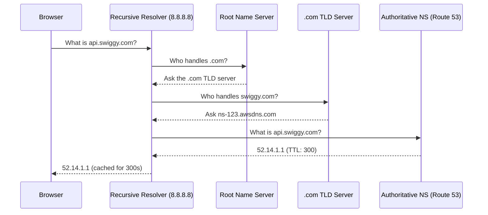
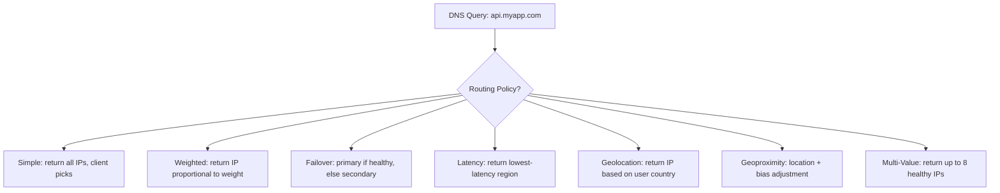

# DNS, Route 53, S3 (Additions), CloudFront & Global Accelerator
## Mid-Level SRE/DevOps/Platform Interview Notes

---

## 1. DNS Fundamentals — How Resolution Actually Works

### Why This Matters for SREs

DNS is the first thing that breaks during an incident and the last thing people check. Understanding the resolution chain — not just "DNS translates names to IPs" — is what separates candidates who can debug a live outage from those who cannot.

### The Resolution Journey

When you type `api.swiggy.com` into a browser, the following happens in order. First, the OS checks its local cache. If a record is cached and the TTL has not expired, resolution stops here and returns the cached IP. If not cached, the query goes to the **Recursive Resolver** — typically your ISP's DNS server or a public resolver like `8.8.8.8`. The recursive resolver does the heavy lifting on your behalf.

The recursive resolver first asks a **Root Name Server** (there are 13 sets worldwide): "who is responsible for `.com`?" The root server returns the address of the `.com` **TLD Name Server**. The recursive resolver then asks the TLD server: "who is responsible for `swiggy.com`?" The TLD server returns the address of Swiggy's **Authoritative Name Server** — the server that actually holds the DNS records. Finally, the recursive resolver asks the authoritative server for the `api.swiggy.com` A record, gets the IP, caches it for the duration of the TTL, and returns it to your browser.



### TTL — The Operational Lever SREs Must Understand

TTL (Time To Live) is the number of seconds a resolver is allowed to cache a DNS record. Once cached, the resolver will not ask the authoritative server again until TTL expires — it will serve the cached answer to everyone who asks.

This has a direct operational consequence: if you change an A record in Route 53 from IP `1.1.1.1` to `2.2.2.2`, users whose resolvers have cached the old record will continue hitting `1.1.1.1` until their cache expires. If your TTL is 86400 (24 hours), some users may be unreachable for up to 24 hours after the change.

The SRE practice is: **lower your TTL before a planned migration**. Drop it to 60 seconds 24–48 hours before the change. After the change is stable, raise it back to a higher value. High TTLs reduce DNS query load and cost; low TTLs give you faster propagation and rollback capability. The tradeoff is explicit.

---

## 2. Route 53

### Record Types

An **A record** maps a hostname to an IPv4 address. An **AAAA record** maps to IPv6. A **CNAME** maps a hostname to another hostname — the resolver follows the chain until it reaches an A or AAAA record. An **NS record** delegates a zone to a set of name servers. An **MX record** routes email. A **TXT record** stores arbitrary text, commonly used for domain ownership verification and SPF/DKIM email authentication.

### CNAME vs Alias — The Route 53 Distinction

This is asked at almost every interview involving Route 53.

A **CNAME** is a standard DNS record type defined in RFC 1034. It maps one hostname to another. The critical constraint: a CNAME cannot be created at the zone apex (the root domain itself). You cannot create a CNAME for `swiggy.com` — only for subdomains like `api.swiggy.com`. This is because the zone apex must have NS and SOA records, and DNS does not allow a CNAME to coexist with other record types at the same name.

An **Alias** is a Route 53-specific extension, not a standard DNS record type. It maps a hostname directly to an AWS resource (ALB, CloudFront distribution, S3 website endpoint, API Gateway, etc.) and works at both the zone apex and subdomains. Route 53 resolves the AWS resource's current IPs and returns them directly — no CNAME chain, no extra round-trip for the client. Alias records are free (Route 53 does not charge for Alias queries to AWS resources), whereas CNAME queries are billed.

```
Scenario: You want myapp.com (root domain) to point to an ALB.
CNAME → Cannot do this. CNAME at zone apex is invalid DNS.
Alias → Can do this. Route 53 handles it natively.

Scenario: You want api.myapp.com to point to another hostname outside AWS.
CNAME → Use this.
Alias → Cannot point to non-AWS resources.
```

### Routing Policies

Routing policies define how Route 53 responds to DNS queries. The policy does not route network traffic — it controls which IP address(es) Route 53 returns in the DNS response.

**Simple** returns one or more values for a record. If multiple values are configured, Route 53 returns all of them and the client picks one at random. No health checks are evaluated — Route 53 will return a dead IP if the resource is down.

**Weighted** distributes queries across multiple resources proportionally. A record with weight 70 gets 70/(70+30) = 70% of queries. Weight 0 means no traffic is sent to that resource. The SRE use case is canary deployments: set the new version to weight 5 and the old version to weight 95, monitor error rates, then gradually shift weight.

**Failover** requires a primary and a secondary record, each with a health check. Route 53 returns the primary record when it is healthy. If the health check fails, Route 53 automatically returns the secondary. This is active-passive failover at the DNS layer.

**Latency-based** measures network latency from the user's resolver to each configured AWS region and returns the record for the lowest-latency region. It does not measure geographic distance — it measures actual network latency, which can differ.

**Geolocation** routes based on the geographic location of the user's DNS resolver. You define rules like "users from India get this IP, users from the US get that IP." You should always define a default record for users who don't match any specific location rule — without a default, Route 53 returns NXDOMAIN for unmatched users, which breaks your service for anyone in an unconfigured region.

**Geoproximity** routes based on geographic location but also allows you to shift traffic toward or away from a region using a **bias** value. A positive bias expands the geographic area that routes to a region; a negative bias shrinks it. This gives you fine-grained control over traffic distribution during regional migrations. Geoproximity requires Route 53 Traffic Flow (a visual editor for complex routing) and is more expensive.

**Multi-Value** is similar to Simple but evaluates health checks and returns only healthy records (up to 8). It is not a replacement for a load balancer — it is client-side load balancing at the DNS level. The client receives multiple IPs and picks one; if one is unhealthy, the client can try another.



### Health Checks

Route 53 health checks are independent of EC2 or ALB health checks. They are performed by Route 53's global health checkers hitting your endpoint from multiple locations. A resource is considered healthy when a configured threshold of checkers (default: 18 out of ~200) report it as healthy.

Health checks can monitor an HTTP/HTTPS/TCP endpoint, the status of another health check (calculated health checks — useful for combining multiple checks into one), or a CloudWatch alarm (allowing you to make routing decisions based on any metric, not just endpoint reachability).

Health checks are what give Failover and Multi-Value routing policies their ability to avoid dead endpoints. Without a health check attached to a record, those policies cannot detect failure.

---

## 3. S3 — Additions

*(Core S3 — storage classes, versioning, bucket policies, presigned URLs — is covered in Part 1. This section covers what was not included there.)*

### Replication — CRR and SRR

S3 replication asynchronously copies objects from a source bucket to a destination bucket. **Cross-Region Replication (CRR)** replicates to a bucket in a different AWS region. Use cases: lower read latency for geographically distributed users, cross-region disaster recovery, meeting data residency requirements. **Same-Region Replication (SRR)** replicates within the same region. Use cases: aggregating logs from multiple buckets into one, maintaining a live copy in a separate account for security isolation.

Replication requires versioning to be enabled on both source and destination buckets. Replication only applies to new objects written after replication is configured — existing objects are not automatically replicated (you would use S3 Batch Operations to copy them). Delete markers are not replicated by default (you must explicitly enable delete marker replication), meaning a delete in the source does not propagate to the destination.

### Encryption

S3 offers four encryption options that interviewers distinguish between:

**SSE-S3** (Server-Side Encryption with S3-managed keys) — AWS manages everything. The key is owned and rotated by S3. You get encryption at rest with zero operational overhead. This is the default since January 2023 — all new objects are encrypted with SSE-S3 unless you specify otherwise.

**SSE-KMS** (Server-Side Encryption with KMS-managed keys) — You use a KMS key (either AWS-managed or customer-managed) to encrypt objects. The advantage is auditability: every encryption and decryption operation is logged in CloudTrail via KMS API calls. You can also control who can use the key via KMS key policies. The operational trap: at high request rates, S3 SSE-KMS can hit KMS API throttling limits (default 5,500–30,000 requests/second depending on region). For high-throughput buckets, this is a real production problem.

**SSE-C** (Server-Side Encryption with Customer-provided keys) — You provide the encryption key with every request. AWS performs the encryption/decryption but never stores your key. Requires HTTPS (AWS rejects SSE-C over HTTP). You are entirely responsible for key management and rotation. Rarely used — the operational burden is high.

**Client-Side Encryption** — You encrypt the data before sending it to S3. AWS never sees plaintext. You manage keys and the encryption process entirely. Used when regulatory requirements mandate that the cloud provider never has access to plaintext, even transiently.

```
Operational decision tree for S3 encryption:

Need auditability of key usage?         → SSE-KMS (customer-managed key)
Need simplest setup, no audit req?      → SSE-S3 (default)
Regulatory: cloud must never see key?   → Client-Side Encryption
Bringing your own key, no AWS storage?  → SSE-C
```

### Event Notifications

S3 can publish events (object created, object deleted, object restore from Glacier, replication failure) to three destinations: **SNS** (fan-out to multiple subscribers), **SQS** (queue for async processing), or **Lambda** (direct function invocation). Event notifications are eventually consistent and near-real-time (typically sub-second, but not guaranteed).

The SRE use case: trigger a Lambda when a new log file lands in S3 to parse and index it, or send an SQS message when an upload completes to kick off a processing pipeline. Event notifications are the glue between S3 and your data processing layer.

EventBridge is the newer, more powerful alternative — it provides filtering, routing, and replay capabilities that S3's native notifications don't have. For complex event routing needs, prefer EventBridge.

### S3 Object Lock and Glacier Vault Lock

**S3 Object Lock** enforces WORM (Write Once, Read Many) at the object level. Once an object is locked, it cannot be deleted or overwritten for the duration of the retention period, even by the root account. There are two retention modes: **Governance mode** (users with special IAM permissions can override the lock) and **Compliance mode** (no one — including root — can delete or modify the object during the retention period). Compliance mode is used for financial and healthcare regulatory requirements.

**Glacier Vault Lock** is the equivalent for Glacier vaults. Once a vault lock policy is confirmed (there is a 24-hour confirmation window), it cannot be changed or deleted. It is immutable by design.

### S3 Access Points

An Access Point is a named network endpoint attached to a bucket, with its own access policy. Rather than managing one increasingly complex bucket policy that handles every team's access requirements, you create a separate Access Point per team or application, each with a scoped policy.

The mental model: one S3 bucket holds data for the analytics team, the ML team, and the data engineering team. Instead of one bucket policy with conditional logic for three teams, you create three Access Points. Each team's applications connect to their Access Point ARN, and the Access Point policy grants them exactly the permissions they need on the relevant prefixes.

```
Bucket: company-data-lake
    │
    ├── Access Point: analytics-ap  → policy: read-only on prefix /analytics/
    ├── Access Point: ml-ap         → policy: read/write on prefix /ml-features/
    └── Access Point: de-ap         → policy: read/write on prefix /raw/
```

---

## 4. CloudFront

### The Edge Caching Model

CloudFront is AWS's CDN. It has over 450 edge locations worldwide. When a user requests content, CloudFront routes the request to the nearest edge location. If the edge has the content cached, it returns it immediately — the request never reaches your origin. If not cached, the edge fetches the content from the origin (S3, ALB, EC2, or any HTTP server), caches it, and returns it to the user.

The operational effect is twofold: latency drops because the response travels a shorter physical distance to the user, and origin load drops because repeated requests for the same content are served from the edge cache.

### Origin Access Control (OAC) — Locking S3 to CloudFront

A common architecture is S3 as the origin behind CloudFront. The problem: if your S3 bucket is publicly readable, users can bypass CloudFront and access your content directly from S3, defeating caching and any CloudFront-level security (geo-restriction, signed URLs, WAF).

**OAC (Origin Access Control)** is the solution. You configure the S3 bucket to deny all public access and grant read permission only to the CloudFront distribution's service principal. All access to S3 must now flow through CloudFront.

```
Without OAC:
User → CloudFront → S3 ✓   (cached, fast)
User → S3 directly  ✓   (bypasses CloudFront — bad)

With OAC:
User → CloudFront → S3 ✓   (only path that works)
User → S3 directly  ✗   (403 Forbidden — bucket denies direct access)
```

OAC is the replacement for the older OAI (Origin Access Identity). OAI still works but OAC is the current recommendation because it supports SSE-KMS encrypted buckets and all S3 regions.

### Cache Behaviours

A CloudFront distribution can have multiple **cache behaviours**, each matching a URL path pattern and routing to a different origin or applying different cache settings. This is the mechanism for serving a mixed application from one CloudFront distribution.

```
Distribution: cdn.myapp.com

Path Pattern       Origin              TTL     Notes
/api/*          →  ALB (dynamic)       0s      Never cache API responses
/static/*       →  S3 bucket           86400s  Cache static assets for 24h
/images/*       →  S3 bucket           604800s Cache images for 7 days
/* (default)    →  ALB                 0s      Everything else is dynamic
```

### CloudFront Signed URLs vs Signed Cookies

Both restrict access to CloudFront content to authorised users. The distinction is in scope.

**Signed URLs** grant access to a single specific object. Use when you want to give a user access to exactly one file — a purchased video, a specific report, a private download. Each URL embeds the expiry, the allowed IP range (optional), and a cryptographic signature.

**Signed Cookies** grant access to multiple objects matching a pattern. Use when a user should access a collection of content — a subscriber who can watch all videos in a library, a user who has paid for access to an entire directory of files. One cookie grants access to `videos/*` for 24 hours, for example. You don't need to generate individual URLs for each object.

```
Use Signed URL when:   User purchases/downloads one specific file
Use Signed Cookies when: User subscribes and gets access to many files
```

Note the distinction from S3 Presigned URLs: S3 Presigned URLs grant direct S3 access, bypassing CloudFront. CloudFront Signed URLs/Cookies are for content served through CloudFront. If you have OAC configured (S3 only accessible via CloudFront), you must use CloudFront Signed URLs/Cookies — S3 Presigned URLs will not work because direct S3 access is blocked.

### Cache Invalidation

When you update content at the origin, CloudFront edge caches continue serving the old version until TTL expires. Cache invalidation forces edge locations to discard cached copies of specified paths immediately.

You can invalidate a specific file (`/images/logo.png`) or an entire path recursively (`/static/*`). Invalidations are not free beyond the first 1,000 paths per month. The production pattern is to use versioned file names instead of invalidations — `main.v2.js` instead of `main.js` — so the new file has a cache miss naturally and the old file expires on its own TTL without manual invalidation.

### Geo-Restriction

CloudFront allows you to whitelist or blacklist specific countries. Requests from blocked countries receive a 403 response at the edge — they never reach your origin. Used for content licensing compliance, export restrictions, or regulatory requirements.

---

## 5. AWS Global Accelerator

### What It Actually Does

Global Accelerator gives you two static Anycast IP addresses that serve as fixed entry points to your application. When a user connects to one of these IPs, their traffic enters the AWS global backbone network at the nearest AWS edge location — not the public internet — and is routed internally to your application endpoint (ALB, NLB, EC2, or EIP) in the optimal AWS region.

The key insight is where traffic leaves the public internet. Without Global Accelerator, a user in Mumbai connecting to your application in us-east-1 travels over the public internet for the entire journey — unpredictable routing, variable latency, potential packet loss. With Global Accelerator, the user's traffic enters AWS's private network at the Mumbai edge location (a short hop) and travels the rest of the way on AWS's controlled, optimised backbone.

Global Accelerator also provides instant failover across regions. Because the Anycast IPs are global, traffic is automatically redirected to the next healthy region if one becomes unhealthy — typically in under 30 seconds.

### Global Accelerator vs CloudFront

This comparison is asked directly. They look similar (both use the AWS edge network, both improve performance for global users) but solve fundamentally different problems.

```
                    CloudFront              Global Accelerator
────────────────────────────────────────────────────────────────
What it does      Caches content at edge  Routes traffic over AWS
                  locations               backbone to your origin

Content type      Static & dynamic        Any TCP/UDP application
                  HTTP/HTTPS

Caching?          Yes — core feature      No — no caching at all

Protocols         HTTP, HTTPS,            TCP, UDP (any protocol)
                  WebSocket

IP addresses      Dynamic (changes)       Static Anycast IPs
                                          (never change)

Use case          CDN for websites,       Gaming (UDP), IoT,
                  APIs, video             VoIP, non-HTTP apps,
                                          multi-region failover

Client IP         X-Forwarded-For         Preserved natively
preservation      header needed

Health & failover Regional failover       Sub-30s global failover
                  not built-in            across regions
```

The interview question framed as a scenario: "Your gaming company needs low latency globally and the traffic is UDP." — Global Accelerator. "Your e-commerce site has static product images that load slowly in Southeast Asia." — CloudFront.

---

## 6. Interview Gotchas

### DNS & TTL Gotchas

The most common production incident DNS gotcha: changing a DNS record and expecting instant propagation. TTL is the answer every time. Candidates who say "DNS changes take time to propagate" without explaining TTL as the mechanism are giving an incomplete answer. The correct answer names TTL, explains that resolvers cache for the TTL duration, and explains the pre-migration TTL-lowering practice.

The difference between authoritative and recursive resolvers is asked to verify depth. A recursive resolver (like `8.8.8.8`) does not hold DNS records — it queries authoritative servers on behalf of clients and caches results. An authoritative server (like Route 53) holds the actual records. When someone says "I'll just flush `8.8.8.8`'s cache," they cannot — you can only flush your own local resolver or wait for TTL to expire.

### Route 53 Gotchas

Geolocation vs Geoproximity is the most reliable trap. Geolocation routes by the user's country/continent — it is binary, you are either in India or not. Geoproximity routes by physical distance from AWS regions and allows you to expand or shrink a region's traffic catchment area using a bias value. If the interviewer asks "how do you shift 20% of European traffic from eu-west-1 to eu-central-1 gradually?" — the answer is Geoproximity with a bias adjustment, not Geolocation.

Multi-Value routing is not a load balancer. It returns multiple IPs and the client picks one, but there is no connection draining, no health-check-driven weight adjustment, no session persistence. Do not describe Multi-Value as a substitute for an ALB.

Forgetting the default record in Geolocation routing will cause NXDOMAIN for users not matching any rule. This is a silent failure — your DNS works for Indian and US users but returns "domain not found" for a user in Brazil with no matching rule.

### S3 Encryption Gotchas

SSE-KMS at high request rates causes KMS throttling. If your application reads and writes thousands of S3 objects per second, each operation makes a KMS API call. KMS has a service quota, and at high enough rates, S3 requests will fail with `SlowDown` or KMS will return throttling errors. The fix is to request a KMS quota increase or use S3 Bucket Keys — a feature that generates a short-lived data key per bucket rather than calling KMS per object, drastically reducing KMS API calls.

SSE-C requires HTTPS for every request. If you send an SSE-C request over HTTP, AWS rejects it with a 400 error. This is by design — transmitting your encryption key over plaintext HTTP would defeat the purpose.

Replication does not replicate existing objects. Teams that enable replication expecting their entire bucket to sync are surprised to find only new objects move. The fix for existing objects is S3 Batch Operations.

### CloudFront Gotchas

OAI vs OAC: OAI does not support SSE-KMS encrypted S3 buckets. If your bucket uses a customer-managed KMS key, OAI will fail to read objects — CloudFront's OAI service principal does not have KMS decrypt permissions. OAC solves this because you can explicitly grant the CloudFront principal KMS permissions. This is a real production failure mode.

CloudFront Signed URLs bypass S3 Presigned URLs when OAC is configured. A common mistake is generating an S3 Presigned URL for content that sits behind CloudFront with OAC — the URL will return 403 because the S3 bucket no longer accepts direct access. You must use CloudFront Signed URLs instead.

Invalidations are not free at scale. At 1,000+ invalidation paths per month, you are charged per path. Teams that deploy frequently and invalidate `/*` on every deploy accumulate significant costs. Versioned filenames (content-addressed assets) eliminate this cost entirely and are the industry-standard practice.

Cache behaviour path matching is longest-prefix wins, not first-match. If you have `/api/*` and `/api/health`, a request to `/api/health` matches `/api/health` first. This matters when debugging unexpected cache behaviour.

### Global Accelerator Gotchas

Global Accelerator is not a CDN and does not cache anything. A common wrong answer to "how do you improve global performance?" is to say "use Global Accelerator for caching." It accelerates the network path to your origin — your origin still processes every request.

The static IP addresses are the primary operational differentiator from CloudFront. If a customer's firewall whitelist requires fixed IPs, Global Accelerator's Anycast IPs are the answer. CloudFront IP ranges are large, dynamic, and impractical to whitelist.

Global Accelerator health checks operate at the endpoint level, not the application level. It detects that your ALB is unreachable but does not know whether your application behind the ALB is returning 500 errors. Pair it with Route 53 health checks or CloudWatch alarms for application-layer failure detection.
