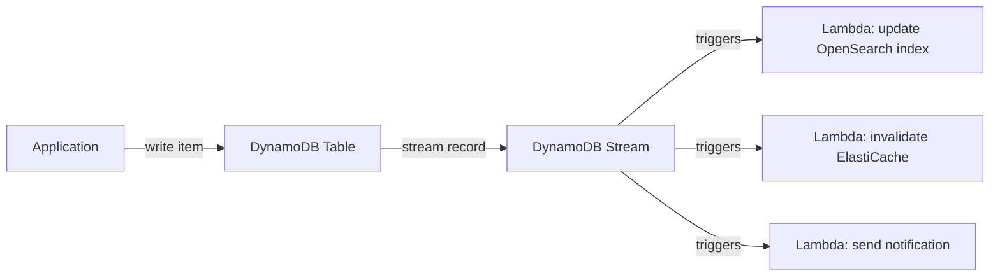
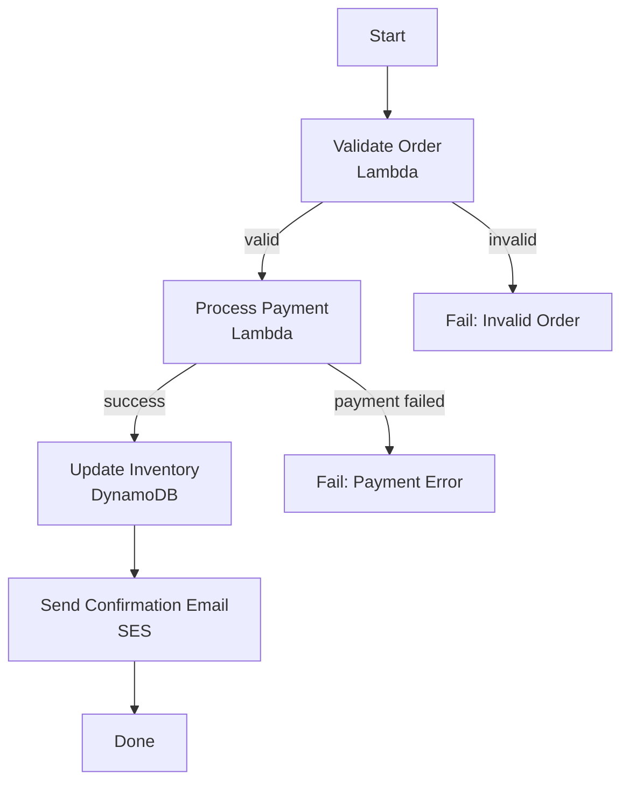
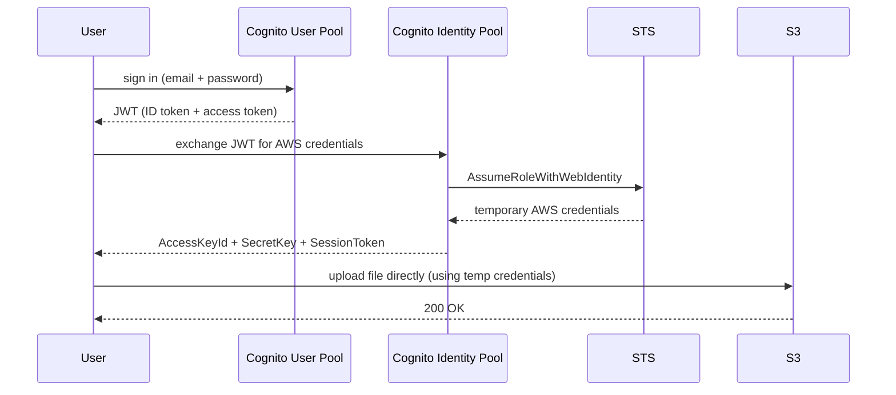
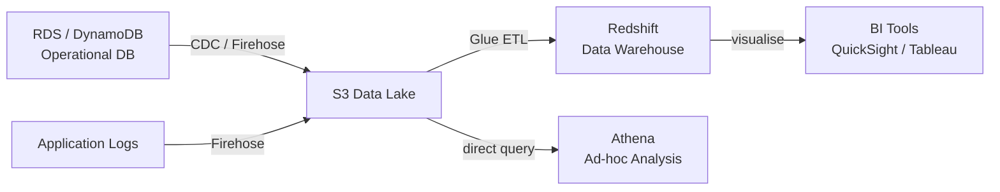

# DynamoDB, Serverless Orchestration, Messaging & Database Selection
## Mid-Level SRE/DevOps/Platform Interview Notes

---

## 1. DynamoDB

### The Mental Model

DynamoDB is a fully managed, serverless key-value and document database built for applications that need single-digit millisecond latency at any scale. Unlike relational databases where you design a normalised schema and let the query planner figure out access patterns, DynamoDB forces you to design your data model around your access patterns upfront. This is the fundamental shift in thinking — and the source of most interview questions.

### Data Model

A DynamoDB table has a **primary key** that uniquely identifies each item. The primary key is either a simple partition key alone, or a composite key consisting of a partition key and a sort key.

The **partition key** determines which physical partition stores the item. DynamoDB hashes the partition key value and uses the hash to distribute items across partitions. All items with the same partition key are stored together (on the same partition), ordered by sort key if one exists.

The **sort key** (optional) orders items within a partition and enables range queries — "give me all orders for user X placed in the last 30 days." Without a sort key, you can only look up exact partition key matches.

Each item can have any attributes beyond the primary key — DynamoDB is schemaless per item. One item can have a `score` field, another in the same table can omit it entirely. The maximum item size is 400KB, which is a real design constraint — large blobs belong in S3 with a reference stored in DynamoDB.

### Partition Key Design — The Most Important DynamoDB Concept

DynamoDB distributes data and traffic across partitions using the partition key hash. Each partition has a throughput limit: 3,000 Read Capacity Units and 1,000 Write Capacity Units per second. If too many requests hit the same partition key, you exceed that partition's limit and requests are throttled — this is the **hot partition problem**.

A hot partition happens when your partition key has low cardinality or when access is skewed toward a small number of keys. Classic examples: using a `status` field with values like `PENDING`/`COMPLETE` as the partition key (most traffic goes to `PENDING`), using a `date` field at day granularity (all today's writes hit one partition), or using a single `tenantId` for a large tenant in a multi-tenant system.

The fix is high-cardinality partition keys. User IDs, order IDs, and UUIDs distribute traffic evenly. For time-series data where you must partition by time, add a random suffix to the key (write sharding) and query all shards on read.

```
Bad partition key design (hot partition):
  PK: "status"    SK: orderId
  → All PENDING orders (90% of traffic) hit one partition

Good partition key design:
  PK: userId      SK: orderTimestamp
  → Traffic distributed evenly across all users
  → Can query "all orders for user X, sorted by time"
```

### GSI vs LSI — The Index Question

Interviewers ask this directly because candidates routinely confuse the two.

A **Local Secondary Index (LSI)** shares the same partition key as the base table but uses a different sort key. It must be defined at table creation time and cannot be added later. An LSI lets you query items within a single partition using a different attribute for ordering and filtering. The constraint: LSI queries are scoped to a single partition — you cannot query across partition keys. LSIs share the provisioned throughput of the base table.

A **Global Secondary Index (GSI)** has a completely different partition key and optional sort key from the base table. It can be added or deleted at any time. A GSI projects a subset of item attributes and has its own independent provisioned throughput. GSIs enable access patterns that the base table's primary key cannot support.

```
Base table: Orders
  PK: orderId    SK: timestamp

Access pattern: "Find all orders for a given customer"
  → orderId is not customer-scoped, can't query this with base table
  → Add GSI: PK = customerId, SK = timestamp
  → Now you can query all orders for a customer, sorted by time

Access pattern: "Find all orders with status SHIPPED today"
  → Add GSI: PK = status, SK = timestamp  (but watch for hot partitions on status)
```

A key operational difference: GSI updates are eventually consistent — writes to the base table propagate to GSIs asynchronously. If you read from a GSI immediately after a write, you may get stale data. LSI reads can be strongly consistent (same as the base table).

### Consistency Models

DynamoDB offers two read consistency options. **Eventually consistent reads** (the default) may return stale data — the read may reflect a write that has not yet propagated across all replicas. **Strongly consistent reads** always return the most recent committed write, but consume twice the Read Capacity Units and have slightly higher latency.

The practical rule: use eventually consistent reads by default for most application reads (cheaper, faster). Use strongly consistent reads only when your application correctness depends on reading the latest value immediately after a write — inventory checks, financial balances, anything where stale data causes a business problem.

### Read/Write Capacity Modes

**Provisioned mode** requires you to specify Read Capacity Units (RCUs) and Write Capacity Units (WCUs) upfront. One RCU supports one strongly consistent read per second (or two eventually consistent reads) for items up to 4KB. One WCU supports one write per second for items up to 1KB. Provisioned mode is cheaper for predictable, steady workloads but requires capacity planning. You can enable Auto Scaling to adjust provisioned capacity based on utilisation.

**On-demand mode** scales instantly to any traffic level with no capacity planning. You pay per request. It is more expensive per operation but eliminates the risk of throttling during unexpected spikes. Use it for new tables with unknown traffic patterns or highly variable workloads.

### DAX — DynamoDB Accelerator

DAX is an in-memory cache specifically designed for DynamoDB. It sits between your application and DynamoDB, intercepts read requests, and serves cached results at microsecond latency. It is a write-through cache — writes go to both DAX and DynamoDB simultaneously. Because it is DynamoDB-native, adding DAX requires no application code changes (unlike ElastiCache, which requires you to add cache-aside logic). The tradeoff: DAX only works with DynamoDB, while ElastiCache can cache anything.

### DynamoDB Streams — Change Data Capture

DynamoDB Streams captures a time-ordered sequence of item-level modifications in a table. Each stream record contains the item's state before the change, after the change, or both. Records are retained for 24 hours.

The canonical use case is **Change Data Capture (CDC)**: trigger a Lambda function on every write to propagate changes to other systems — update a search index in OpenSearch, invalidate a cache entry in ElastiCache, send a notification, or replicate to another table. This is the DynamoDB equivalent of PostgreSQL's WAL (Write-Ahead Log) used for replication.



### Global Tables

Global Tables replicate a DynamoDB table across multiple AWS regions with multi-master writes — your application can write to any region and DynamoDB handles replication and conflict resolution automatically. Last-writer-wins conflict resolution is used. This enables active-active multi-region architectures with sub-second replication lag, giving users in each region low-latency reads and writes without a single global primary.

---

## 2. Step Functions

### What Problem It Solves

When a business process requires calling multiple AWS services in sequence — validate input, charge payment, update inventory, send email — the naive implementation chains Lambda functions together: Lambda A calls Lambda B, which calls Lambda C. This creates tight coupling, makes error handling complex (what if step 3 fails after step 2 succeeded?), makes the workflow invisible, and makes retries manual.

Step Functions replaces Lambda-chaining with a managed state machine. Each step is a state; the state machine defines transitions, retry logic, parallel execution, and error handling declaratively. The workflow is visual, auditable, and retryable from any failed step.



### Standard vs Express Workflows

**Standard workflows** support executions up to one year in duration. Every state transition is durably logged and exactly-once execution is guaranteed. They are priced per state transition. Use for long-running business processes — order fulfilment, approval workflows, multi-day pipelines.

**Express workflows** support executions up to five minutes. They are priced per execution duration and number of executions, making them far cheaper for high-frequency, short-duration workflows. They offer at-least-once execution (not exactly-once). Use for high-volume event processing, IoT data pipelines, or any workflow triggered thousands of times per second where cost matters.

```
Standard:    Long-running (up to 1 year), exactly-once, expensive, auditable
Express:     Short-lived (up to 5 min), at-least-once, cheap, high-throughput
```

---

## 3. Cognito

### The Core Distinction: User Pools vs Identity Pools

This is the single most asked Cognito question and the most commonly confused concept. They solve entirely different problems.

**User Pools** are a managed user directory. They handle sign-up, sign-in, password management, MFA, and federated login (Google, Facebook, SAML). When a user authenticates successfully, Cognito User Pools issues a JWT — specifically an ID token and an access token. User Pools answer the question: "who is this user, and are their credentials valid?"

**Identity Pools** (Federated Identities) exchange an identity token (from a User Pool, Google, Facebook, or any OIDC provider) for temporary AWS credentials (via STS AssumeRoleWithWebIdentity). Identity Pools answer the question: "given that this user is authenticated, what AWS resources can they access directly?"

The most common architecture combines both: User Pool authenticates the user and issues a JWT, Identity Pool exchanges that JWT for AWS credentials scoped to an IAM role, and the user can then call AWS services (S3, DynamoDB, Lambda) directly from their browser or mobile app without routing everything through your backend.



### Cognito + API Gateway

The simpler and more common pattern for web APIs: User Pool authenticates the user, the frontend includes the JWT in every API request (`Authorization: Bearer <token>`), and API Gateway validates the JWT against the User Pool directly — no Lambda authorizer needed, no backend involvement. This is the standard serverless auth pattern.

---

## 4. Kinesis Data Firehose

### What It Does

Firehose is a fully managed delivery pipeline. It ingests streaming data and automatically buffers, optionally transforms (via Lambda), and delivers it to a destination: S3, Redshift, OpenSearch, or Splunk. You do not manage consumers, shards, or checkpoints — Firehose handles everything. You pay for the volume of data ingested.

### Kinesis Data Streams vs Firehose

This comparison is asked whenever either service comes up.

```
                    Kinesis Data Streams        Kinesis Data Firehose
──────────────────────────────────────────────────────────────────────
Purpose            Real-time stream             Delivery pipeline to
                   processing                   storage/analytics

Consumer           You build consumers          AWS manages delivery
management         (Lambda, KCL apps)           automatically

Processing         Custom, real-time            Optional Lambda
                   <200ms latency               transform; buffer
                                                latency of 60s–900s

Replay             Yes — up to 365 days         No replay

Destinations       Any custom consumer          S3, Redshift,
                                                OpenSearch, Splunk

Scaling            Manual shard management      Fully automatic
                   or on-demand mode

Use when           Multiple consumers need      You need to land
                   same data, real-time         streaming data in
                   processing, replay needed    S3/Redshift/OpenSearch
                                                with no consumer code
```

The decision is usually clear: if you need to process and react to events in real time with custom logic, use Kinesis Data Streams. If you need to reliably deliver a stream of data to a storage or analytics destination, use Firehose. They are often used together — Kinesis Data Streams feeds into Firehose for archival while also feeding Lambda for real-time processing.

---

## 5. Amazon MQ

### When It Exists

Amazon MQ is a managed message broker running Apache ActiveMQ or RabbitMQ. It exists for one specific reason: when you are migrating an existing application that already uses a standard messaging protocol (JMS, AMQP, STOMP, MQTT) to AWS and cannot rewrite the messaging layer. The application speaks JMS, Amazon MQ speaks JMS — you point it at Amazon MQ instead of your on-premise broker and the migration is complete.

For any greenfield application on AWS, SQS and SNS are the right choices — they are serverless, cheaper, and scale without any broker management. Amazon MQ has fixed broker instance sizing, is more expensive, and requires you to think about broker availability and failover. It is a lift-and-shift tool, not a design-forward choice.

```
Choosing a messaging service:

New application on AWS?              → SQS (queues) or SNS (pub/sub)
Fan-out to multiple consumers?       → SNS + SQS
Existing app using JMS/AMQP/MQTT?    → Amazon MQ (migration path)
Real-time stream processing?         → Kinesis Data Streams
Deliver stream to S3/Redshift?       → Kinesis Firehose
```

---

## 6. Choosing the Right Database

### The Interview Approach

Database selection questions at SRE interviews are always scenario-based. The interviewer describes an application and asks which database you would use. The right answer is never a single database name — it is a brief articulation of the workload characteristics followed by the choice and the key reason. What follows is the decision framework in the form of the scenarios interviewers actually use.

### Scenario: "You're building the user accounts and transaction system for a payments product."

Relational database — PostgreSQL on RDS or Aurora PostgreSQL. Payments require ACID transactions (atomicity, consistency, isolation, durability). A debit and credit must succeed or fail together. The data is structured, the schema is stable, and the relationships between users, accounts, and transactions are well-defined. Aurora PostgreSQL with Multi-AZ gives you the managed operational experience with production-grade availability.

### Scenario: "You're building a product catalogue for an e-commerce platform. Items have different attributes — a shirt has size and colour, a laptop has RAM and storage."

DynamoDB. The schema varies per item type, the access pattern is simple key lookups (`GET /products/{id}`), the scale can be unpredictable, and single-digit millisecond read latency matters for a product page. A relational table with hundreds of nullable columns for different product types, or an EAV model, is the anti-pattern here. DynamoDB's flexible item attributes are the right fit.

### Scenario: "You need to serve user session data and cache database query results with sub-millisecond latency."

ElastiCache with Redis. Sessions and caches are ephemeral, structured as key-value pairs, require TTL-based expiry, and need the lowest possible read latency. Redis also supports atomic operations (increment a counter, add to a set) and pub/sub, making it useful beyond simple caching.

### Scenario: "You're building a search feature — users need to search products by name, description, and tags with fuzzy matching and ranking."

OpenSearch (Amazon's managed Elasticsearch). Full-text search with fuzzy matching, scoring, and faceted filtering is what search engines are built for. The pattern is to keep the primary data in RDS or DynamoDB (source of truth) and sync it to OpenSearch via DynamoDB Streams + Lambda or a CDC pipeline. OpenSearch is the secondary index, not the primary store.

### Scenario: "Your BI team needs to run complex SQL analytics over 3 years of order history — aggregations, joins, trend analysis."

Amazon Redshift. Redshift is a columnar data warehouse optimised for analytical queries over large datasets. It is entirely separate from your operational database — you never run analytics on your production RDS instance. The operational pattern is an ETL pipeline (AWS Glue or Firehose) that loads data from your transactional systems into Redshift for the BI team.

### Scenario: "Your team needs to query logs stored in S3 without setting up any infrastructure."

Amazon Athena. Athena runs SQL queries directly against S3 data — Parquet, JSON, CSV — using a serverless query engine. There is no database to provision or maintain. You define the schema in the Glue Data Catalog, point Athena at the S3 path, and run queries. You pay per terabyte of data scanned, so partitioning your S3 data (by date, by service) is critical to keeping costs manageable.

### Athena vs Redshift

Both run SQL on large datasets. The distinction is the operational model and the use case.

```
                    Athena                      Redshift
──────────────────────────────────────────────────────────
Data location      Stays in S3                 Loaded into Redshift
Infrastructure     Serverless, zero mgmt       Managed cluster or
                                               Serverless option
Query latency      Seconds to minutes          Seconds (with good
                   (depends on data size)      distribution/sort keys)
Cost model         Per TB scanned              Per hour (cluster) or
                                               per query (serverless)
Best for           Ad-hoc queries on           Regular BI queries,
                   S3 data lakes,              dashboards, repeated
                   log analysis                analytical workloads
```

The analytics pipeline at a product company typically looks like:



---

## 7. Interview Gotchas

### DynamoDB Gotchas

The hot partition problem is the most frequently set DynamoDB scenario question. "Your DynamoDB table is getting throttled even though you have enough provisioned capacity overall." The answer is that a single partition is being overloaded — not the total table capacity. Overall capacity being sufficient does not prevent per-partition throttling. The fix is partition key redesign or adding a random suffix for write sharding.

GSI updates are eventually consistent. A write to the base table does not immediately appear in a GSI query. If your application writes an item and immediately queries a GSI to find it, it may not be there yet. This is a common source of "data not found" bugs in applications that mix writes and GSI reads in the same request path.

LSIs cannot be added after table creation. This is an irreversible design decision. If you need a new local secondary index on an existing table, you must create a new table and migrate the data. This is why access pattern analysis must happen before table creation, not after.

DynamoDB transactions span up to 100 items across multiple tables but consume twice the RCUs and WCUs of non-transactional operations. Using transactions for every operation when only some require atomicity is an unnecessary cost amplifier.

The 400KB item size limit is a design constraint. Storing large JSON documents, images, or file contents in DynamoDB items is wrong. Store the large payload in S3 and store the S3 key as a DynamoDB attribute. Hitting the 400KB limit in production means the data model was never reviewed.

### Step Functions Gotchas

Standard vs Express workflow choice has cost implications in both directions. Using Standard workflows for high-frequency, short-lived executions (thousands per second) is extremely expensive because you pay per state transition and every execution is durably logged. Using Express workflows for long-running business processes risks losing execution history — Express logs are less durable and executions are capped at 5 minutes.

Step Functions is not a replacement for a message queue. It orchestrates a fixed sequence of steps for a single execution. It does not fan out work to competing consumers, buffer high-volume events, or handle the patterns SQS is designed for. A common wrong answer to "how do you process 10,000 orders in parallel" is Step Functions — the answer is SQS with multiple consumers.

### Cognito Gotchas

User Pools and Identity Pools are different services solving different problems. User Pools = authentication and user directory. Identity Pools = exchange any identity token for AWS credentials. Confusing them is the most reliable Cognito interview failure. The precise question interviewers ask: "A mobile app user needs to upload a photo directly to S3. How do you handle auth?" The answer requires both: User Pool authenticates the user, Identity Pool gives them temporary S3-scoped AWS credentials.

Cognito JWTs have a fixed expiry. The access token expires after 1 hour by default. If your application does not implement token refresh (using the refresh token), users are silently logged out or receive 401 errors after an hour. Token refresh logic is the application's responsibility, not Cognito's.

### Firehose Gotchas

Firehose has a minimum buffer time of 60 seconds. Data is not delivered to S3 or Redshift in real time — it is batched and delivered after the buffer interval. If your use case requires sub-second data availability, Firehose is the wrong tool. Use Kinesis Data Streams with a real-time consumer.

Firehose can invoke a Lambda for transformation but this adds latency and cost to every record. A failed Lambda transformation causes Firehose to send the raw (untransformed) record to an error S3 prefix. Teams that do not monitor this error prefix silently accumulate malformed records in their data lake.

### Database Selection Gotchas

The most common wrong answer in database selection questions is defaulting to RDS for everything or DynamoDB for everything. RDS is wrong when the schema is highly variable, the scale is unpredictable, or the access pattern is pure key lookup with no joins. DynamoDB is wrong when you need ad-hoc queries, complex filtering, or transactions across many items.

Athena cost scales with data scanned. An unpartitioned S3 bucket containing 3 years of logs means every Athena query scans the entire dataset. Teams that discover this in production face unexpectedly large Athena bills. The fix — partition data by date and filter on the partition column in every query — must be designed in from the start.

OpenSearch is a secondary index, not a primary database. Running your application with OpenSearch as the only store means you lose the ability to replay or recompute your search index if OpenSearch data is corrupted or if you need to add a new field. Always have a primary source of truth (RDS, DynamoDB) and treat OpenSearch as a derived, rebuildable view.
