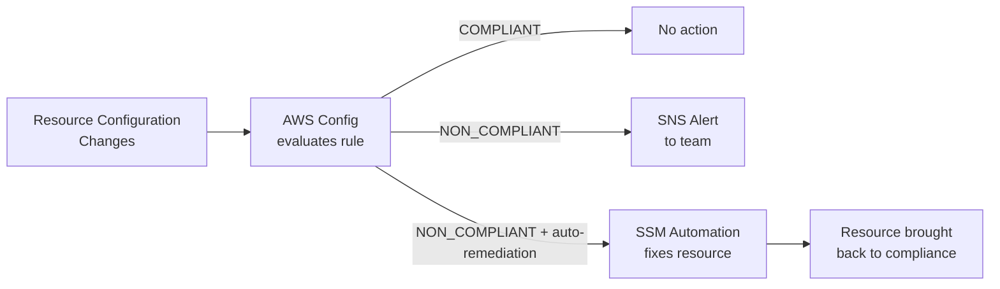
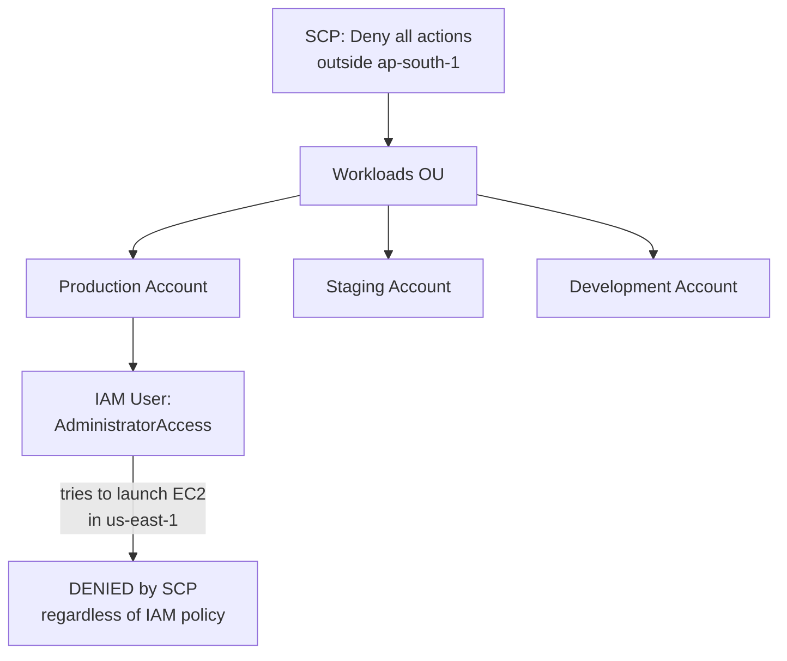
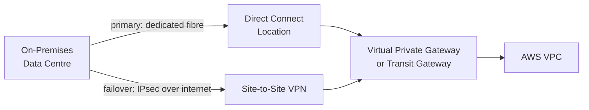

# AWS Config, Organizations, VPC Deep Dive & Security Services
## Mid-Level SRE/DevOps/Platform Interview Notes

---

## 1. AWS Config

### What It Solves

CloudTrail tells you who made an API call and when. CloudWatch tells you what your infrastructure metrics look like right now. Neither tells you whether your current resource configurations comply with your security and operational standards, or what a resource's configuration looked like six months ago. AWS Config fills this gap — it is a configuration state recorder and compliance evaluator for AWS resources.

### Configuration History

AWS Config continuously records the configuration of every supported AWS resource in your account — EC2 instances, S3 buckets, security groups, IAM roles, RDS instances, and more. Every time a configuration changes, Config records a new configuration item. This creates a full timeline: you can look at any resource and see exactly what its configuration was at any point in time.

The operational use case: an incident happens at 2am. Your first question is "what changed?" AWS Config lets you answer that precisely — "this security group had port 22 closed at 1:50am and open at 1:55am." Without Config, you would have to reconstruct this from CloudTrail API logs, which is much harder.

### Config Rules

Config Rules define the desired configuration state for your resources. Config evaluates each resource against the rule and marks it as **COMPLIANT** or **NON_COMPLIANT**. Rules run either continuously (triggered on every configuration change) or periodically (on a schedule).

AWS provides hundreds of managed rules out of the box. You can also write custom rules using Lambda for any compliance requirement not covered by managed rules.

```
Examples of managed Config Rules:

s3-bucket-public-read-prohibited     → Flags any S3 bucket with public read ACL
ec2-instances-in-vpc                 → Flags EC2 instances not inside a VPC
iam-root-access-key-check            → Flags if root account has active access keys
restricted-ssh                       → Flags security groups allowing SSH from 0.0.0.0/0
rds-instance-public-access-check     → Flags RDS instances with public accessibility enabled
cloudtrail-enabled                   → Flags if CloudTrail is not enabled in the account
```

### Auto-Remediation

Config Rules can be paired with **remediation actions** — when a resource is marked NON_COMPLIANT, Config can automatically trigger an SSM Automation document to fix it. This closes the loop from detection to correction without human intervention.



A concrete example: the rule `s3-bucket-public-read-prohibited` fires when a bucket becomes public. The remediation action runs an SSM document that removes the public ACL automatically. The bucket is made private within seconds of being opened, without an engineer needing to act.

The distinction between AWS Config and CloudTrail is worth being precise about. CloudTrail records the API call ("who ran `s3:PutBucketAcl` at 14:32"). Config records the resulting configuration state ("this bucket's ACL became public at 14:32") and evaluates whether that state violates a rule. You need both for a complete security posture.

---

## 2. AWS Organizations & SCPs

### The Multi-Account Strategy

A single AWS account for everything — dev, staging, production, security tooling, data — is an anti-pattern at any company beyond a small startup. Blast radius, cost attribution, and security isolation all suffer. AWS Organizations enables a structured multi-account setup managed from a single management account.

The standard pattern at product companies is to separate accounts by environment and function: a production account, a staging account, a development account, a security/audit account (where CloudTrail logs and Config data aggregate), and a shared services account (for DNS, CI/CD tooling, shared AMIs). Each account is isolated — a misconfiguration or breach in the dev account cannot affect production.

### Organizational Units

Accounts are grouped into **Organizational Units (OUs)**, which are logical containers. OUs can be nested. A typical structure:

```
Root
├── Infrastructure OU
│   ├── Network Account (VPCs, Transit Gateway)
│   └── Shared Services Account (CI/CD, DNS)
├── Workloads OU
│   ├── Production Account
│   ├── Staging Account
│   └── Development Account
└── Security OU
    ├── Audit Account (CloudTrail, Config aggregation)
    └── Security Tooling Account (GuardDuty master, Security Hub)
```

Policies applied to an OU are inherited by all accounts within it. A policy on the Workloads OU applies to Production, Staging, and Development accounts simultaneously.

### Service Control Policies — The Correct Mental Model

SCPs define the **maximum permissions** available to any identity in a member account — including that account's root user. An SCP does not grant permissions; it sets a ceiling. Even if an IAM user in a member account has `AdministratorAccess`, an SCP that denies `ec2:*` in that account means no one in that account can use EC2, regardless of their IAM policy.

SCPs apply to all principals in member accounts. They do not apply to the management account itself — the management account is always exempt from SCPs, which is why it should be used exclusively for organization management and never for running workloads.



Common SCP use cases at product companies: restricting resource creation to specific regions (data residency compliance), preventing anyone from disabling CloudTrail or Config, blocking high-risk services in non-production accounts, and preventing root account usage.

### IAM Policy Evaluation Logic — Critical Correction

Your original notes had this wrong. The correct evaluation order is:

1. **Explicit Deny** — if any policy (SCP, resource policy, identity policy, permissions boundary) explicitly denies the action, the request is **denied**. An explicit deny cannot be overridden by any allow.
2. **Explicit Allow** — if a relevant policy explicitly allows the action and no deny applies, the request is **allowed**.
3. **Implicit Deny** — if there is neither an explicit deny nor an explicit allow, the request is **denied by default**.

The default in AWS is **deny**, not allow. This is the most important thing to internalise. A new IAM user with no policies attached cannot do anything — not because they are denied, but because there is no allow. There is no such thing as an "implicit allow" in AWS.

```
Is there an explicit DENY anywhere? ──── YES ──→ DENY (final, cannot be overridden)
         │
         NO
         │
Is there an explicit ALLOW? ──────────── YES ──→ ALLOW
         │
         NO
         │
         ▼
    IMPLICIT DENY (default)
```

For cross-account access, both the identity policy in the calling account and the resource policy (or role trust policy) in the target account must have explicit allows. Either side being absent results in a deny.

---

## 3. VPC Deep Dive

### Transit Gateway vs VPC Peering at Scale

VPC Peering connects two VPCs in a one-to-one relationship. It is non-transitive — if VPC A peers with VPC B, and VPC B peers with VPC C, VPC A cannot reach VPC C through B. For a small number of VPCs (2–3), peering is simple and cheap. For a large number of VPCs, peering becomes a mesh of connections: 10 VPCs require 45 peering connections, each of which must be individually maintained, routed, and have security group rules updated.

**Transit Gateway** is a regional network hub that acts as a central router. Every VPC connects to the Transit Gateway with a single attachment. The Transit Gateway's route tables handle routing between all connected VPCs. 10 VPCs require 10 Transit Gateway attachments instead of 45 peering connections. Transit Gateway also supports VPN and Direct Connect attachments, making it the single hub for hybrid connectivity.

```
VPC Peering (5 VPCs = 10 connections):        Transit Gateway (5 VPCs = 5 attachments):

  A ──── B                                         A
  │╲    /│                                         │
  │  ╲╱  │                                    B ── TGW ── C
  │  ╱╲  │                                         │
  │╱    ╲│                                         D
  C ──── D                                         │
    ╲  ╱                                           E
      E
```

Transit Gateway is not free — you pay per attachment per hour and per GB of data processed. For very small numbers of VPCs with low traffic, peering can be cheaper. The crossover point where Transit Gateway wins on operational simplicity is around 4–5 VPCs.

### VPC Endpoints — Interface vs Gateway

VPC Endpoints allow your VPC resources to reach AWS services privately without traffic leaving the AWS network. There are two types with meaningfully different implementations.

**Gateway Endpoints** work only with S3 and DynamoDB. They add an entry to your route table directing traffic for those services to the endpoint instead of the internet. They are free and require no changes to your application — just a route table entry and an endpoint policy.

**Interface Endpoints** (powered by AWS PrivateLink) work with almost every other AWS service — SQS, SNS, Kinesis, CloudWatch, Secrets Manager, ECR, and more. They provision an ENI with a private IP in your subnet. Your application resolves the service's regional DNS name to this private IP rather than to the public endpoint. Interface Endpoints cost money per hour per AZ and per GB of data processed.

The operational motivation: without VPC Endpoints, a Lambda or EC2 in a private subnet calling the S3 API must go through a NAT Gateway. NAT Gateway charges per GB of data processed. For high-volume S3 traffic, replacing NAT with a free Gateway Endpoint eliminates that cost entirely.

```
Without S3 Gateway Endpoint:
Private EC2 → NAT Gateway ($$$ per GB) → Internet → S3

With S3 Gateway Endpoint:
Private EC2 → Gateway Endpoint (free) → S3 (stays on AWS network)
```

### PrivateLink

AWS PrivateLink is the underlying technology that powers Interface Endpoints. Beyond accessing AWS services, PrivateLink enables you to expose your own services privately to other VPCs or other AWS accounts without VPC peering or internet exposure. A service provider creates a PrivateLink-powered endpoint service; consumers create Interface Endpoints that connect to it. Traffic never leaves the AWS network.

The use case at product companies: a platform team runs a shared service (authentication, feature flags, internal APIs) and exposes it via PrivateLink to all product team VPCs. Product team VPCs don't need peering with the platform VPC — they just create an Interface Endpoint.

### Direct Connect + VPN — Redundancy Pattern

Direct Connect provides a dedicated private connection between your on-premises data centre and AWS. It gives consistent low latency and high bandwidth that the public internet cannot guarantee. But Direct Connect is a physical circuit — if the physical link fails, connectivity is lost.

The production pattern for hybrid connectivity is **Direct Connect as the primary path with Site-to-Site VPN as the failover**. Both terminate on the same Virtual Private Gateway or Transit Gateway. Under normal conditions, all traffic uses Direct Connect. If Direct Connect fails, BGP routing automatically shifts traffic to the VPN tunnel over the internet. This gives you private, consistent connectivity with internet-based resilience.



### Network Firewall Placement

AWS Network Firewall is placed in a dedicated firewall subnet in each AZ, typically between the Internet Gateway and your application subnets. Traffic is routed through the firewall for inspection before reaching your workloads. It provides stateful and stateless rules, intrusion prevention, and domain-based filtering — capabilities that Security Groups and NACLs do not offer.

The canonical placement pattern for internet-facing workloads: Internet → IGW → Network Firewall (inspects and filters) → ALB subnet → Application subnet. For egress filtering (controlling what your private instances can reach on the internet): Private subnet → Network Firewall → NAT Gateway → IGW → Internet.

---

## 4. Security Services

### AWS WAF

WAF operates at Layer 7 and filters HTTP/HTTPS requests before they reach your application. It can be attached to CloudFront, ALB, API Gateway, or AppSync. Rules can block requests based on IP address, geographic origin, HTTP headers, URI patterns, request body content, or known malicious signatures (SQL injection patterns, XSS strings).

WAF uses **Web ACLs** (Access Control Lists) containing ordered rules. Each rule either allows, blocks, or counts matching requests. Rules are evaluated in order; the first matching rule's action applies. AWS Managed Rules provide pre-built rule groups for common threats — OWASP Top 10, known bad inputs, Amazon IP reputation lists — that you can enable without writing rules yourself.

WAF rate-based rules are the standard defence against brute force and credential stuffing: "block any IP that sends more than 1,000 requests in 5 minutes."

### AWS Shield

Shield protects against DDoS attacks. **Shield Standard** is automatically enabled for every AWS customer at no cost. It provides protection against the most common network and transport layer DDoS attacks (SYN floods, UDP reflection attacks) on CloudFront, Route 53, and ELBs.

**Shield Advanced** is a paid tier (~$3,000/month) that adds protection for EC2, ELBs, CloudFront, Global Accelerator, and Route 53. It provides real-time attack visibility, access to the AWS DDoS Response Team (DRT) during attacks, and — critically — **DDoS cost protection**: if a DDoS attack causes your AWS bill to spike (Auto Scaling adding instances, NAT Gateway processing extra traffic), Shield Advanced reimburses those costs. For any customer-facing application at scale, Shield Advanced's cost protection alone often justifies the price.

### AWS GuardDuty

GuardDuty is a threat detection service that continuously analyses VPC Flow Logs, CloudTrail management and data events, and DNS query logs using machine learning and threat intelligence to detect suspicious activity. It does not sit in the traffic path — it analyses logs after the fact.

GuardDuty findings are categorised by threat type: reconnaissance (port scanning, failed login attempts), instance compromise (EC2 communicating with known C2 servers, crypto-mining), account compromise (unusual API calls from unexpected geographies, root credential usage), and data exfiltration (S3 data accessed from anomalous IPs).

The operational workflow: GuardDuty finding → EventBridge rule → SNS notification to security team → investigation. For automated response, EventBridge can trigger a Lambda that isolates a compromised EC2 instance by replacing its security group with one that blocks all traffic.

### AWS Inspector

Inspector automatically scans your workloads for software vulnerabilities and unintended network exposure. It scans EC2 instances for CVEs in installed packages, container images in ECR for known vulnerabilities, and Lambda functions for vulnerable dependencies. Inspector integrates with ECR to scan images on push and continuously re-evaluates findings as new CVEs are published — a container image that was clean yesterday can become vulnerable today when a new CVE is disclosed.

The distinction from GuardDuty: Inspector is proactive vulnerability management (find weaknesses before attackers exploit them). GuardDuty is reactive threat detection (detect active exploitation or compromise).

### AWS Macie

Macie uses machine learning to automatically discover and classify sensitive data stored in S3 — PII (names, email addresses, credit card numbers, passport numbers), credentials, and other sensitive content. It alerts when sensitive data is found in buckets that are unexpectedly public, unencrypted, or shared with external accounts.

At product companies handling user data (payment platforms, food delivery, healthcare), Macie is part of the data governance layer. It answers "do we have any S3 buckets containing PII that should not?" automatically rather than requiring manual audits.

### AWS Security Hub

Security Hub is the aggregation and normalisation layer across all AWS security services. It collects findings from GuardDuty, Inspector, Macie, AWS Config, IAM Access Analyzer, and third-party tools, normalises them into a standard format (ASFF — Amazon Security Finding Format), and provides a unified dashboard with a security score.

In a multi-account Organisation, Security Hub in a central security account aggregates findings from all member accounts. Instead of logging into 20 accounts to check GuardDuty findings, the security team has one place to see the organisation's security posture.

```
Account 1: GuardDuty ──┐
Account 1: Inspector ──┤
Account 2: GuardDuty ──┼──→ Security Hub (central security account)
Account 2: Macie ──────┤         │
Account N: Config ─────┘         ├── Unified findings dashboard
                                  ├── Security score per account
                                  └── EventBridge → automated response
```

---

## 5. Shared Responsibility Model

### The Core Principle

AWS and the customer share security responsibility. The boundary is: **AWS is responsible for security OF the cloud; you are responsible for security IN the cloud.** This is not just a theoretical framework — it defines exactly what you are operationally responsible for as an SRE and what you can assume AWS handles.

### What AWS Owns

AWS is responsible for the physical infrastructure: data centres, physical servers, networking hardware, and the hypervisor layer. AWS is also responsible for the managed services it provides — the underlying OS, patches, and availability of RDS, Lambda, DynamoDB, S3, and other managed services. When you use RDS, you do not patch the database engine — AWS does.

### What You Own

You are responsible for everything you put on top of AWS infrastructure.

For **EC2 and IaaS services**: the guest OS (patching, hardening), the runtime and application installed on it, firewall rules (security groups, NACLs), data encryption at rest and in transit, IAM configuration, and network topology.

For **managed services like RDS**: you own the database configuration (parameter groups, encryption settings), the data inside the database, access control (IAM, database users), and the network controls around it (security groups, subnet placement). AWS owns the engine patching and underlying infrastructure.

For **serverless services like Lambda and S3**: you own the application code, IAM permissions, data classification and encryption choices, and access policies. AWS owns the underlying compute, runtime patching, and infrastructure availability.

```
Layer                  AWS Responsibility        Your Responsibility
─────────────────────────────────────────────────────────────────────
Physical hardware      ✓ Full ownership          —
Hypervisor / Host OS   ✓ Full ownership          —
Network infrastructure ✓ Full ownership          —

EC2 Guest OS           —                         ✓ Patch, harden
EC2 Application        —                         ✓ Secure, maintain
Security Groups/NACLs  —                         ✓ Configure correctly
IAM Users/Roles        —                         ✓ Least privilege
Data encryption        —                         ✓ Enable and manage

RDS engine patching    ✓ AWS patches engine      —
RDS availability/HA    ✓ Multi-AZ, backups       —
RDS data inside DB     —                         ✓ Your data, your risk
RDS network access     —                         ✓ SGs, subnet config

S3 durability          ✓ 11 9s guaranteed        —
S3 bucket policies     —                         ✓ Your configuration
S3 data encryption     —                         ✓ Your choice to enable
```

The SRE-relevant implication: when you move from EC2 (IaaS) to RDS (PaaS) to Lambda (serverless), the amount of security responsibility that shifts to AWS increases. But you never fully hand over responsibility — IAM, data classification, network access, and application security remain yours regardless of how managed the service is.

---

## 6. Interview Gotchas

### AWS Config Gotchas

AWS Config records configuration state, not API calls. If an interviewer asks "how do you find out who deleted an S3 bucket policy?" the answer is CloudTrail (who made the API call), not Config. Config would tell you that the policy is now missing compared to its previous state, but not who removed it. You need both services together for the complete picture.

Config Rules evaluate compliance but do not enforce it by default. A rule marking a resource NON_COMPLIANT does not fix the resource — it only alerts. Auto-remediation must be explicitly configured. A common wrong answer: "I'll add a Config rule to prevent public S3 buckets." Config detects non-compliance; prevention requires SCPs, bucket policies, or S3 Block Public Access settings.

### Organizations & SCP Gotchas

SCPs do not apply to the management account. Any action you want to restrict organisation-wide must be enforced through other means in the management account itself (IAM policies, Config rules). Running workloads in the management account is an anti-pattern precisely because SCPs cannot protect it.

An SCP that allows `s3:*` does not grant S3 permissions to anyone — it only allows up to S3 permissions. The IAM policy in the account still needs an explicit allow. This is the most common SCP misunderstanding: candidates think attaching an allow SCP grants access. It does not.

The IAM policy evaluation order correction is critical: the default is implicit deny, not implicit allow. A new role with no policies cannot do anything. Write this down and memorise it — "default deny" is the answer to any "what happens if there's no matching policy?" question.

### VPC Deep Dive Gotchas

Transit Gateway is not free. At scale, Transit Gateway attachments and data processing charges can be significant. For two VPCs with low traffic, VPC peering is simpler and cheaper. Recommending Transit Gateway for a two-VPC setup is over-engineering and interviewers will call it out.

Interface Endpoints cost money; Gateway Endpoints are free. A common mistake is recommending Interface Endpoints for S3 and DynamoDB — the correct answer for those two services is always Gateway Endpoints. Interface Endpoints are for everything else.

Direct Connect alone is not enough for production hybrid connectivity. A single Direct Connect circuit is a single point of failure. Production patterns require either redundant Direct Connect circuits or Direct Connect + VPN failover. An interviewer describing a hybrid architecture and asking about resilience expects you to raise this.

VPC Peering is non-transitive — this is asked in almost every VPC networking question that involves three or more VPCs. The word "transitive" is the signal: if the interviewer uses it, the answer involves Transit Gateway or PrivateLink, not more peering connections.

### Security Services Gotchas

GuardDuty, Inspector, and Macie are complementary, not overlapping. GuardDuty = active threat detection in your account. Inspector = vulnerability scanning of your workloads. Macie = sensitive data discovery in S3. A common interview trap is asking you to choose between them — the correct answer is that they solve different problems and are typically all enabled together.

Shield Standard does not protect EC2 instances directly. Standard covers CloudFront, Route 53, and ELBs. If your architecture has EC2 instances directly exposed to the internet (which is itself a bad practice), Standard does not protect them. Shield Advanced does.

WAF is not a substitute for application-level security. WAF blocks known attack patterns at the HTTP layer. It does not fix insecure code, broken authentication, or business logic vulnerabilities. WAF is a defence-in-depth layer, not a replacement for secure development practices.

Security Hub requires GuardDuty, Inspector, and Macie to be enabled in each member account to aggregate their findings. Enabling Security Hub in the central account without enabling the source services in member accounts results in an empty dashboard. This is a common misconfiguration in multi-account setups.
