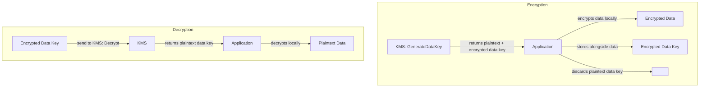
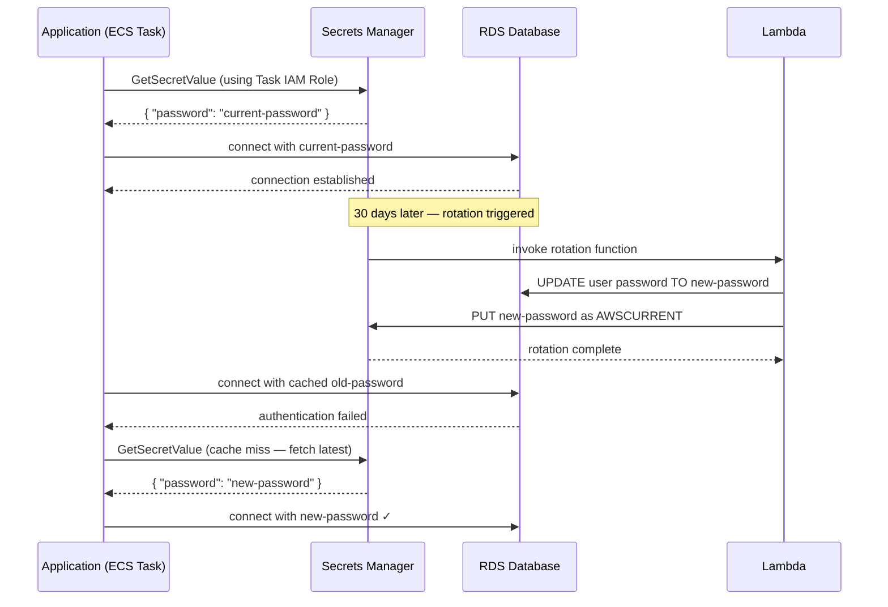
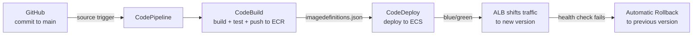

# KMS, Secrets Management, CI/CD & Cost Optimisation
## Mid-Level SRE/DevOps/Platform Interview Notes

---

## 1. AWS KMS — Key Management Service

### Why KMS Exists

Every encryption service in AWS — EBS volume encryption, S3 SSE-KMS, RDS encryption, Secrets Manager, CloudTrail log encryption — ultimately uses KMS to manage the cryptographic keys. Understanding KMS is not optional; it is the foundation of AWS encryption. Without it, you cannot reason about how data at rest is protected, who controls the keys, or what happens when you need to rotate or revoke access.

### Key Types

**AWS-managed keys** are created and managed entirely by AWS on your behalf. When you enable S3 SSE-KMS without specifying a key, or enable RDS encryption without choosing a key, AWS creates an AWS-managed key for that service in your account. You can see these keys in KMS (they have aliases like `aws/s3`, `aws/rds`, `aws/ebs`) but you cannot manage their policies, rotate them manually, or share them across accounts. AWS rotates them automatically every year.

**Customer-managed keys (CMKs)** are keys you create in KMS. You control the key policy, rotation schedule, who can use the key, and who can manage it. You can share them across accounts, use them in cross-account encryption, and audit every use via CloudTrail. Customer-managed keys cost $1/month per key plus $0.03 per 10,000 API calls. Use CMKs whenever you need audit trails of key usage, cross-account encryption, or the ability to immediately revoke access by disabling the key.

**Custom key stores** use AWS CloudHSM as the backing hardware for your keys. Used only for regulatory requirements mandating that keys never leave a hardware security module you control. Niche — not asked at mid-level interviews beyond knowing it exists.

### Envelope Encryption — The Core Concept

This is the concept most candidates skip and most interviewers probe. You cannot encrypt large amounts of data directly with a KMS key — KMS API calls have a 4KB data limit and every KMS call has latency and cost. Instead, AWS uses envelope encryption.

The process: KMS generates a **data key** — a short-lived symmetric key. The data key is used locally (in memory, without calling KMS) to encrypt the actual data. The data key itself is then encrypted by your KMS key (the key-encrypting key) and stored alongside the encrypted data. To decrypt, you call KMS to decrypt the data key, then use the plaintext data key locally to decrypt the data. KMS never sees your data — it only ever encrypts and decrypts the data key.



Every AWS encryption service (S3 SSE-KMS, EBS, RDS, Secrets Manager) uses envelope encryption under the hood. You interact with the service API and never call KMS directly — but this is what is happening internally.

### Key Policies

Every KMS key has a **key policy** — a resource-based policy that controls who can use and manage the key. Unlike most AWS resources where IAM policies alone are sufficient, KMS requires that the key policy explicitly grants access. An IAM policy allowing `kms:Decrypt` is not enough on its own — the key policy must also allow the principal.

The critical operational rule: a key policy must include a statement giving the AWS account root access, otherwise the key becomes unmanageable — you cannot update the policy or schedule the key for deletion. This is the one scenario where AWS support cannot help you recover.

```json
{
  "Statement": [
    {
      // This statement is mandatory — without it, only the key creator
      // can manage the key and it can become permanently inaccessible
      "Effect": "Allow",
      "Principal": { "AWS": "arn:aws:iam::123456789012:root" },
      "Action": "kms:*",
      "Resource": "*"
    },
    {
      // Grant a specific role permission to use the key for encryption/decryption
      // but NOT to manage it (no kms:DeleteKey, kms:PutKeyPolicy etc.)
      "Effect": "Allow",
      "Principal": { "AWS": "arn:aws:iam::123456789012:role/app-role" },
      "Action": ["kms:Decrypt", "kms:GenerateDataKey"],
      "Resource": "*"
    }
  ]
}
```

### Key Rotation

AWS-managed keys rotate automatically every year. For customer-managed keys, you can enable automatic annual rotation — KMS generates new key material and uses it for all new encryption operations, while retaining old key material to decrypt data encrypted with previous versions. The key ID and ARN do not change — applications do not need to be updated.

Manual rotation (creating a new key and updating all references) is required if you need rotation more frequently than annually or if you need to rotate imported key material.

### KMS in Context — How It Connects to Other Services

```
EBS encryption:     Volume encrypted with a data key; data key encrypted by KMS CMK
S3 SSE-KMS:         Object encrypted with a data key; data key encrypted by KMS CMK
RDS encryption:     Storage encrypted at rest; KMS CMK protects the data key
Secrets Manager:    Secret value encrypted using KMS CMK
CloudTrail logs:    Log files encrypted using KMS CMK for tamper-evident storage
```

The SSE-KMS throttling problem from Part 1 (S3 notes) makes sense now: every S3 object read/write calls KMS to encrypt/decrypt the data key. At high request rates, KMS API quotas become the bottleneck. S3 Bucket Keys solve this by caching the data key at the bucket level, reducing KMS API calls by up to 99%.

---

## 2. Secrets Manager vs SSM Parameter Store

### The Problem Both Solve

Your application needs a database password, an API key, or a TLS certificate. The wrong answer is hardcoding it in source code or baking it into a container image — it ends up in version control, in CI/CD logs, and in every person's local clone. The right answer is storing it in a managed secrets service and fetching it at runtime. Both Secrets Manager and SSM Parameter Store solve this, but they are optimised for different use cases.

### SSM Parameter Store

Parameter Store is a hierarchical key-value store for configuration data and secrets. Parameters are organised in a path hierarchy (`/myapp/production/db-password`), which makes it easy to fetch all parameters for a service in one API call.

Parameters come in three types. **String** stores plaintext values — feature flags, configuration values, non-sensitive settings. **StringList** stores comma-separated values. **SecureString** encrypts the value using a KMS key — this is what you use for passwords, API keys, and any sensitive value.

Parameter Store has two tiers. **Standard** parameters are free, support values up to 4KB, and have no throughput limits beyond the standard AWS API limits. **Advanced** parameters support values up to 8KB, support parameter policies (TTL-based expiry, notifications before expiry), and cost $0.05 per parameter per month.

Parameter Store has no built-in secret rotation. If you need to rotate a database password, you must write the rotation logic yourself — update the password in the database, update the parameter, restart or signal the application.

### Secrets Manager

Secrets Manager is purpose-built for secrets that need rotation. The defining feature is **automatic rotation**: you configure a rotation schedule, Secrets Manager invokes a Lambda function (AWS provides templates for RDS, Redshift, and DocumentDB), the Lambda updates the secret value and the underlying service simultaneously, and your application fetches the latest secret value on the next call. The application does not need to be restarted.

Secrets Manager costs $0.40 per secret per month plus $0.05 per 10,000 API calls. For a large number of configuration parameters, this is significantly more expensive than Parameter Store. For actual secrets requiring rotation, the operational value justifies the cost.

Secrets Manager also supports cross-account secret sharing (another account can be granted access to your secret via resource policy) and replication to multiple regions for multi-region applications.

```
Side-by-side comparison:

                        SSM Parameter Store         Secrets Manager
────────────────────────────────────────────────────────────────────────
Primary use             Config + secrets            Secrets only

Cost                    Free (standard tier)        $0.40/secret/month

Secret rotation         Manual (you build it)       Built-in, automatic
                                                    via Lambda

Value size              4KB (standard)              64KB
                        8KB (advanced)

Cross-account           No native support           Yes, via resource policy

Versioning              Yes                         Yes (AWSCURRENT,
                                                    AWSPREVIOUS labels)

KMS integration         SecureString uses KMS       Always encrypted with KMS

Best for                App configuration,          Database passwords,
                        non-rotating secrets,       API keys, OAuth tokens,
                        feature flags               anything needing rotation
```

### The Interview Answer — "How Does Your App Get Its DB Password?"

This is asked at almost every mid-level SRE interview. The complete answer:

The database password is stored in Secrets Manager. Automatic rotation is configured on a 30-day schedule — Secrets Manager invokes a Lambda that updates the RDS password and the secret value atomically. The application fetches the secret at startup by calling the Secrets Manager API using the IAM role attached to the ECS task or EC2 instance (never hardcoded credentials). The application caches the secret in memory with a TTL. When the cached value expires or when a database authentication failure occurs (which indicates the secret was rotated), the application fetches the latest version from Secrets Manager. This pattern means the application handles rotation transparently without restarts.



---

## 3. CI/CD on AWS

### The Pipeline Mental Model

A CI/CD pipeline automates the path from a code commit to a running deployment. CI (Continuous Integration) covers building and testing code automatically on every commit. CD (Continuous Delivery/Deployment) covers packaging the build artifact and deploying it to target environments. The AWS-native services that implement each stage are CodeCommit, CodeBuild, CodeDeploy, and CodePipeline.

In practice, most product companies use GitHub or GitLab as the source repository rather than CodeCommit, but CodeBuild and CodeDeploy (or their equivalents) are standard. Understanding the pipeline architecture matters more than knowing every CodeCommit API.

### The Four Services

**CodeCommit** is AWS's managed Git repository service. It integrates natively with IAM for access control. Most teams use GitHub/GitLab instead, but CodeCommit is the answer when the interview asks about keeping source code entirely within AWS (compliance, data residency).

**CodeBuild** is a fully managed build service. You define a `buildspec.yml` that specifies the build phases: install dependencies, run tests, compile code, build a Docker image, push to ECR. CodeBuild provisions a temporary compute environment, runs your build, and tears it down. You pay only for build minutes — no idle build servers.

```yaml
# buildspec.yml — CodeBuild build specification
version: 0.2

phases:
  install:
    runtime-versions:
      docker: 20                          # Use Docker 20 runtime
    commands:
      - echo Logging into ECR...
      - aws ecr get-login-password | docker login --username AWS --password-stdin $ECR_REGISTRY

  build:
    commands:
      - echo Building Docker image...
      - docker build -t $IMAGE_NAME:$CODEBUILD_RESOLVED_SOURCE_VERSION .  # Tag with commit SHA
      - docker tag $IMAGE_NAME:$CODEBUILD_RESOLVED_SOURCE_VERSION $ECR_REGISTRY/$IMAGE_NAME:latest

  post_build:
    commands:
      - echo Pushing image to ECR...
      - docker push $ECR_REGISTRY/$IMAGE_NAME:$CODEBUILD_RESOLVED_SOURCE_VERSION
      - docker push $ECR_REGISTRY/$IMAGE_NAME:latest
      - printf '[{"name":"app","imageUri":"%s"}]' $ECR_REGISTRY/$IMAGE_NAME:$CODEBUILD_RESOLVED_SOURCE_VERSION > imagedefinitions.json

artifacts:
  files:
    - imagedefinitions.json               # Passed to CodeDeploy to know which image to deploy
```

**CodeDeploy** handles the actual deployment to EC2, ECS, Lambda, or on-premises servers. It understands deployment strategies — rolling, blue/green, canary — and integrates with ALB to shift traffic. It monitors deployment health and rolls back automatically if alarms fire during deployment.

**CodePipeline** is the orchestration layer. It connects source → build → test → deploy stages into a single automated pipeline. Each stage is a gate — if any stage fails, the pipeline stops. CodePipeline can trigger on a commit to a branch, on a new ECR image, or on a manual approval action.



### ECS Blue/Green Deployment — End to End

Blue/green deployment for ECS is orchestrated by CodeDeploy. The current production version runs as the "blue" environment — a set of ECS tasks behind the ALB's production listener. The new version is deployed as the "green" environment — a new set of ECS tasks registered to a test listener on a different port.

CodeDeploy runs validation tests against the green environment on the test listener. If they pass, traffic is shifted from blue to green on the production listener using one of three strategies. **AllAtOnce** shifts 100% of traffic immediately. **Canary** shifts a small percentage (configurable — e.g., 10%) first, waits for a bake time, monitors alarms, then shifts the remainder. **Linear** shifts traffic incrementally in equal steps over a configured interval.

During the shift, if any CloudWatch alarm enters ALARM state, CodeDeploy stops and rolls back — shifting all traffic back to the blue environment. Once the deployment succeeds and the green environment is stable, the blue tasks are terminated.

```
Stage 1: Initial state
  ALB production listener (port 443) → Blue tasks (v1)
  ALB test listener (port 8080) → (empty)

Stage 2: Deploy new version
  ALB production listener (port 443) → Blue tasks (v1)   ← still serving production
  ALB test listener (port 8080) → Green tasks (v2)       ← validation testing here

Stage 3: Traffic shift (Canary 10%)
  ALB production listener (port 443) → 90% Blue (v1) + 10% Green (v2)
  Monitor CloudWatch alarms for bake period...

Stage 4: Complete shift (if healthy)
  ALB production listener (port 443) → Green tasks (v2)  ← full production
  Blue tasks terminated after stabilisation period
```

### EKS Deployment Patterns

EKS deployments do not use CodeDeploy — they use Kubernetes-native mechanisms. The standard deployment tool at product companies is **ArgoCD** (GitOps) or **Helm** with a CI/CD pipeline.

In a GitOps model, the desired state of the cluster (Kubernetes manifests or Helm chart values) lives in a Git repository. ArgoCD continuously compares the desired state in Git with the actual state in the cluster and reconciles any drift. A deployment is a Git commit — the CI pipeline builds and pushes a new image, updates the image tag in the Git repo, and ArgoCD detects the change and rolls out the new version.

For rolling deployments, Kubernetes replaces old pods with new ones gradually, maintaining `maxUnavailable` pods down and `maxSurge` pods above desired count during the rollout. For blue/green on EKS, two Deployments are maintained simultaneously and a Service selector is switched from blue to green. For canary, a small Deployment runs the new version alongside the main Deployment, with traffic split controlled by the Ingress or a service mesh.

### Deployment Strategy Decision Framework

```
Strategy        Risk        Rollback speed   Resource cost   Use when
──────────────────────────────────────────────────────────────────────
Rolling         Medium      Minutes          1x              Standard deploys,
                            (redeploy old)                   stateless services

Blue/Green      Low         Seconds          2x              User-facing APIs,
                            (flip traffic)                   zero-downtime required

Canary          Lowest      Seconds          ~1.1x           High-risk changes,
                            (shift back)                     data migrations,
                                                             new features on % of users

Recreate        High        Minutes          1x              Dev/staging only,
                (downtime)                                   stateful apps that
                                                             can't run two versions
```

---

## 4. AWS Cost Optimisation

### Why SREs Own Cost

At product companies like Swiggy or Razorpay, AWS bills run into crores per month. Cost optimisation is not a finance team concern — it is an SRE responsibility. Interviewers ask both "how do you reduce cost?" and the more diagnostic "your AWS bill spiked 40% this month, walk me through your investigation."

### EC2 Cost Levers

The biggest lever is commitment-based discounts. On-Demand is the most expensive option and should be used only for truly unpredictable workloads. For any baseline load that runs continuously, you should be on Reserved Instances or Savings Plans.

The decision between Reserved Instances and Savings Plans: Reserved Instances give the deepest discount (up to 72%) but lock you to a specific instance type, region, and OS. Compute Savings Plans give slightly less discount (up to 66%) but apply flexibly across any instance family, size, region, and even ECS Fargate and Lambda. For most teams, Savings Plans are the right choice because they accommodate instance type changes as you right-size or upgrade generations.

Right-sizing is the other major EC2 lever. AWS Compute Optimizer analyses CloudWatch metrics and recommends the optimal instance type for each workload. An `m5.4xlarge` running at 10% CPU is wasting 90% of its compute cost — downsizing to `m5.xlarge` reduces cost by 75% with no performance impact.

Spot Instances for fault-tolerant workloads (batch jobs, data processing, stateless autoscaled tiers) can reduce compute costs by up to 90%. The operational requirement is that your application handles the 2-minute termination notice gracefully.

### RDS Cost Traps

Multi-AZ RDS doubles the cost because a synchronous standby replica is always running. The standby does not serve read traffic — it exists purely for failover. This is the right tradeoff for production, but teams that enable Multi-AZ in development and staging environments unnecessarily double their database costs.

Read replicas add cost proportional to the instance size. Each read replica is a full running instance. If you have 3 read replicas sized at `db.r5.2xlarge`, that is 3x the instance cost in addition to the primary. Size replicas based on the read workload, not by copying the primary instance size.

RDS Reserved Instances work the same way as EC2 — committing to a 1 or 3-year term for a specific instance type and region gives significant discounts over On-Demand pricing.

### NAT Gateway — The Silent Cost Killer

NAT Gateway is the most commonly overlooked cost item at product companies. It charges in two dimensions: per hour ($0.045/hour per NAT Gateway) and per GB of data processed ($0.045/GB). A high-traffic application routing all its S3 reads, ECR image pulls, and external API calls through a NAT Gateway can generate thousands of dollars per month in data processing fees alone.

The fixes are specific to traffic type. Traffic to S3 and DynamoDB should use Gateway Endpoints (free). Traffic to other AWS services (ECR, CloudWatch, Secrets Manager, SQS) should use Interface Endpoints — the endpoint cost is typically lower than NAT Gateway data processing at volume. Traffic that genuinely needs internet access still requires NAT, but high-volume external API calls should be audited.

The investigation approach: go to the NAT Gateway's CloudWatch metrics (`BytesOutToDestination`) and identify which subnets are generating the most traffic. Use VPC Flow Logs to identify the destination IPs. Map those IPs to AWS services (many will be S3 or ECR) and replace NAT with the appropriate endpoint.

### S3 Cost Optimisation

S3 costs come from three sources: storage per GB per month (varies by storage class), requests (PUT, GET, LIST), and data transfer out to the internet.

Lifecycle policies that automatically transition objects to cheaper storage classes are the primary lever. Objects that are frequently accessed in the first 30 days but rarely accessed after should transition to Standard-IA at 30 days and Glacier at 90 days. Objects that are never accessed after a certain period should expire and be deleted.

Versioning silently accumulates cost. Every overwrite creates a new version; deleted objects leave a delete marker. Without lifecycle policies on non-current versions, a versioned bucket grows indefinitely. Always pair versioning with a lifecycle rule that expires non-current versions after a retention period.

Data transfer costs are significant for publicly accessed content. Serving large files (videos, images, software downloads) directly from S3 charges $0.09/GB for transfer out to the internet. Putting CloudFront in front of S3 reduces transfer costs (CloudFront to internet is cheaper, and cache hits generate no origin transfer charges at all) and improves latency.

### The "AWS Bill Spiked" Investigation

This is a scenario question interviewers use to test cost reasoning. The structured approach:

First, go to **AWS Cost Explorer** and break down the cost increase by service — identify which service(s) drove the spike. Then break that service down by region, by resource tag, and by usage type (is it compute, storage, data transfer?).

Common causes by service:

**EC2 spike** — Auto Scaling scaled out and did not scale back in (check ASG activity and scale-in policies), a new instance type was deployed at higher cost, or Spot capacity was unavailable and fell back to On-Demand.

**RDS spike** — A new read replica was added, Multi-AZ was accidentally enabled, or storage auto-scaling expanded (RDS storage only grows, never shrinks automatically).

**NAT Gateway spike** — A new service or job started routing high-volume traffic through NAT instead of VPC Endpoints. Check NAT Gateway bytes processed metrics and VPC Flow Logs.

**S3 spike** — A versioned bucket accumulated non-current versions without a lifecycle policy, a large data transfer out to the internet occurred, or a high-frequency LIST operation is being run (LIST is charged per request and is expensive at scale).

**Data Transfer spike** — Cross-AZ traffic (traffic between resources in different AZs within the same region is charged at $0.01/GB), cross-region replication, or internet egress from EC2 or RDS.

```
AWS Bill Spiked → Investigation Flow:

1. Cost Explorer → which service? which region?
2. Break down by usage type → compute? storage? data transfer?
3. Break down by resource tag → which team/application?
4. For EC2: check ASG activity, instance type changes, On-Demand vs Spot mix
5. For NAT: check BytesOutToDestination → VPC Flow Logs → identify destinations
6. For S3: check storage by class, request counts, data transfer out
7. For RDS: check instance count, Multi-AZ status, storage size, replica count
8. Fix: right instance types, add VPC Endpoints, fix lifecycle policies,
         add Reserved capacity for baseline, move batch to Spot
```

---

## 5. Interview Gotchas

### KMS Gotchas

A KMS key without the account root in the key policy can become permanently inaccessible. If you write a key policy that gives access only to a specific role and that role is deleted, no one — including root — can manage the key. AWS support cannot recover it. Always include the root account in every key policy.

AWS-managed keys cannot be used for cross-account encryption. If your architecture requires encrypting data in one account and decrypting in another, you must use a customer-managed key and grant the other account permission in the key policy. This is a common blocker in multi-account architectures.

Disabling a KMS key does not delete data — it makes it temporarily inaccessible. Any data encrypted with that key cannot be decrypted until the key is re-enabled. Scheduled deletion has a mandatory 7–30 day waiting period precisely because data loss from accidental key deletion is permanent and unrecoverable.

KMS key rotation does not re-encrypt existing data. Old ciphertext can still be decrypted using the old key material (KMS retains it). New data is encrypted with the new key material. If you need to re-encrypt existing data with the new key material, you must do so explicitly.

### Secrets Manager Gotchas

Rotation temporarily makes two versions of a secret valid simultaneously — `AWSCURRENT` (new) and `AWSPREVIOUS` (old). This is intentional: during rotation, some application instances may still hold the old password in their connection pool. Both versions must work until all instances have refreshed their credentials. Applications that invalidate the previous version immediately during rotation will break in-flight connections.

Secrets Manager costs $0.40 per secret per month. For an application with 200 configuration parameters, storing all of them in Secrets Manager costs $80/month versus essentially free in SSM Parameter Store Standard. The right pattern is: use Parameter Store for non-sensitive configuration and use Secrets Manager only for secrets that require rotation or cross-account sharing.

Fetching a secret on every request is wrong. The Secrets Manager SDK caches secrets locally. Applications that call `GetSecretValue` on every database query add ~5ms latency and generate unnecessary API costs. Use the AWS Secrets Manager caching client, which caches the secret in memory and refreshes it periodically or on authentication failure.

### CI/CD Gotchas

Blue/green deployment requires double the compute during the deployment window — both the blue and green task sets are running simultaneously. For large clusters, this is a real cost consideration. The deployment window should be kept short.

CodeDeploy rollback does not undo database migrations. If your deployment includes a schema migration that ran before the traffic shift, rolling back the application does not roll back the schema change. Migrations must be backwards-compatible — the old application version must continue to work with the new schema. This is the most common production incident pattern in blue/green deployments.

Canary deployments require careful metric selection. Canary shifts 10% of traffic and monitors alarms for a bake period. If your alarm threshold is "error rate > 1%" but your canary only handles 10% of traffic, a complete failure of the new version only shows as 0.1% overall error rate — below your threshold. Either use per-deployment-group alarms (monitoring only the canary target group's error rate) or lower thresholds during canary bake periods.

### Cost Optimisation Gotchas

Savings Plans commitment is irrevocable. If you commit to $10/hour in Savings Plans for 3 years and your usage drops, you pay for unused commitment. Model your baseline usage conservatively — commit only to the load that will definitely run 24/7, and use On-Demand or Spot for everything above that.

Cross-AZ data transfer is charged even within the same VPC. Traffic between an EC2 instance in `ap-south-1a` and an RDS instance in `ap-south-1b` is charged at $0.01/GB in each direction. At scale, this is significant. Place compute and data resources in the same AZ for latency-sensitive, high-volume communication — but accept the availability tradeoff (single AZ failure takes both down).

Reserved Instances for RDS do not apply across instance families. A reservation for `db.r5.2xlarge` does not apply if you migrate to `db.r6g.2xlarge`. When AWS releases a new instance generation, your old reservations do not automatically transfer. Plan instance generation upgrades around reservation expiry.

S3 Glacier retrieval is not free. Glacier Instant Retrieval charges a per-GB retrieval fee in addition to storage. Glacier Flexible Retrieval and Deep Archive have even higher retrieval fees and time delays. A team that archives data to Glacier for "cost savings" and then queries it frequently ends up paying more than Standard-IA would have cost. Model retrieval frequency before choosing an archival tier.
